= Compute Instance 생성
:sectnums:

이 연습에서는 Oracle Cloud Infrastructure에서 Ubuntu 운영체제 컴퓨트 인스턴스를 생성하고 외부에서 액세스하는 환경을 만드는 것을 실습합니다. 이 연습은 아래 절차로 진행됩니다.

1. 컴파트먼트(Compartment) 생성
2. 가상 클라우드 네트워크(Virtual Cloud Network - VCN) 생성
3. SSH 키 생성
4. 컴퓨트 인스턴스(Compute Instance 생성)
5. 외부에서 SSH를 사용해 접속

아래 절차를 따릅니다.

== Oracle Cloud Infrastructure에 접속

이 연습에서는 접속이 가능하고, 연습에 충분한 Credit을 가진 OCI 태넌시가 있다는 것을 가정합니다. 아래 절차에 따라 OCI에 로그인합니다.

1. 웹 브라우저를 열고 아래 웹 사이트로 이동합니다.
+
http://cloud.oracle.com

2. 유효한 계정을 사용하여 로그인합니다.
3. 오른쪽 위의 프로필 아이콘을 클릭하여 로그인 정보를 확인하고, 접속된 리전을 확인합니다.
+
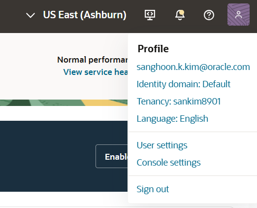

== 컴파트먼트 (Compartment) 생성

이 연습에서 사용하는 모든 리소스를 한 구획(Compartment)에서 사용하기 위해, **compute_instances** 라는 이름의 컴파트먼트를 생성합니다. 아래 절차에 따릅니다.

1. 왼쪽 위의 햄버거 버튼을 클릭하고 **Identity & Security**를 클릭합니다.
+
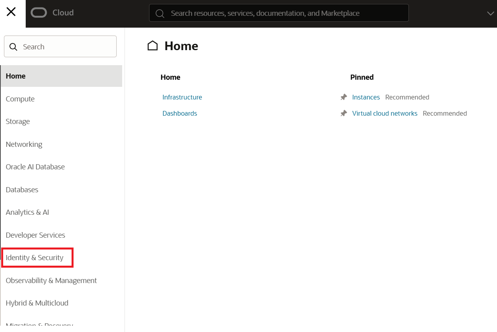

2. Identity & Security 메뉴에서 **Identity** 구역의 **Compartments**를 클릭합니다.
+
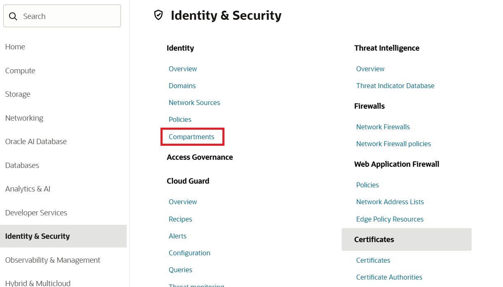

3. **Compartment** 페이지에서 **Create Compartment** 버튼을 클릭합니다.
+
image:./images/image04.png[width=500]

4. **Create Compartment** 페이지에서 아래와 같이 정보를 입력하고 오른쪽 아래의 **Create Compartment** 버튼을 클릭합니다.
+
* **Name**: `compute_instances`
* **Description**: `실습을 위한 컴퓨트 인스턴스`
* **Parent compartment**: _루트 컴파트먼트 (태넌시 이름 (root) 로 표시됨)_

+
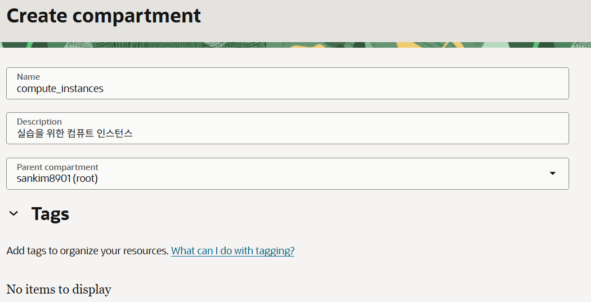

5. 생성된 컴파트먼트를 확인합니다. 루트 컴파트먼트의 Subcompartments 숫자가 하나 증가된 것도 확인합니다.
+
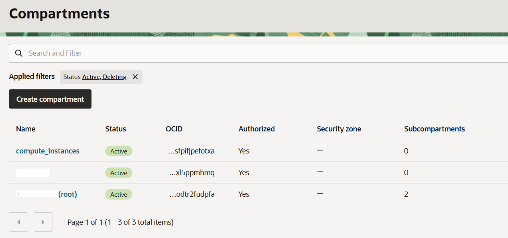

== Virtual Cloud Network (VCN) 생성

여기에서는 컴퓨트 인스턴스가 위치할 가상 클라우드 네트워크(VCN - Virtual Cloud Network)를, VCN 마법사를 사용하여 생성합니다. 아래 절차에 따릅니다.

1. 왼쪽 위의 햄버거 버튼을 클릭하고 **Networking**을 클릭합니다.
+
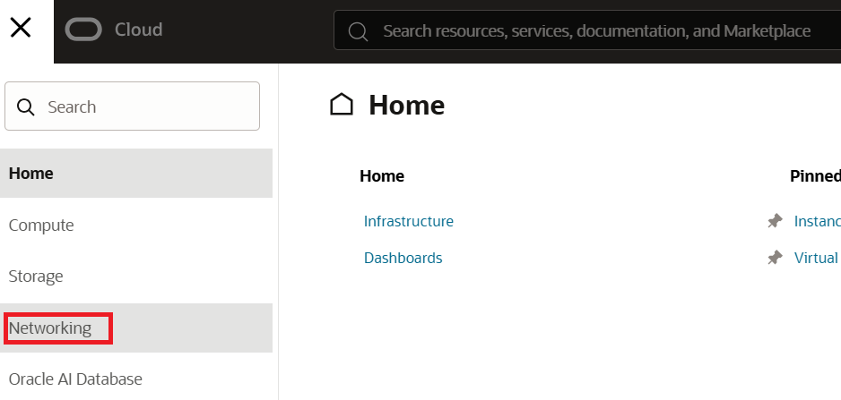

2. **Networking** 페이지에서 **Virtual cloud networks**를 클릭합니다.
+
image:./images/image08.png[width=500]

3. **Virtual Cloud Networks** 페이지에서, Compartment를 클릭하고 위에서 생성한 **compute_instances** 컴파트먼트를 선택합니다.
+
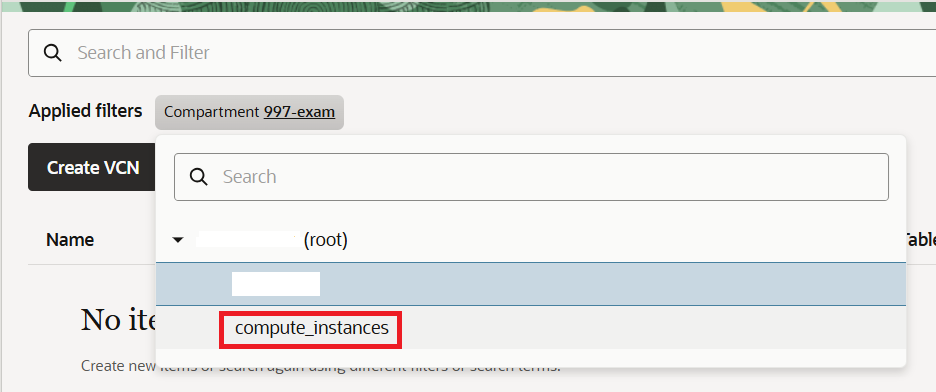

4. Actions 드롭다운 버튼을 클릭하고 **Start VCN Wizard**를 클릭합니다.
+
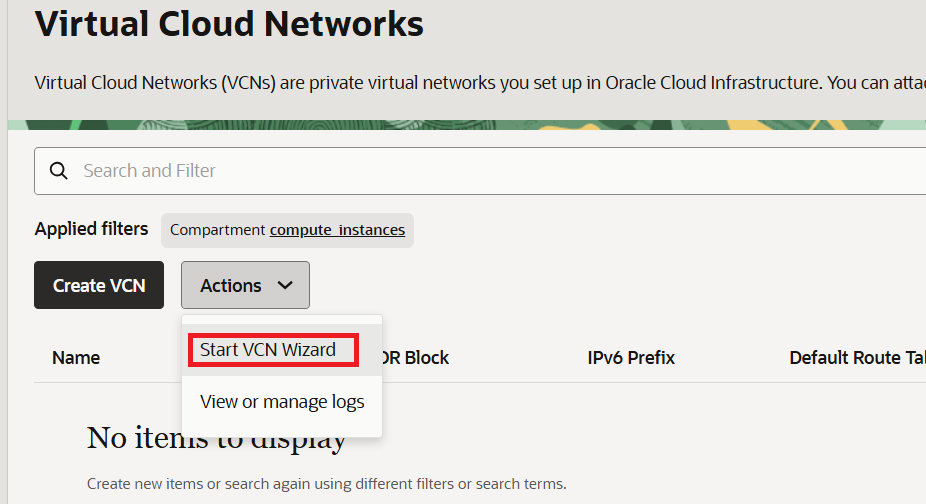

5. **Start VCN Wizard** 페이지에서, **Create VCN with Internet Connectivity**를 선택하고 **Start VCN Wizard** 버튼을 클릭합니다.
+
image:./images/image11.png[width=670]

6. **Create VCN wth internet connectivity** 페이지에서 아래와 같이 정보를 입력하고 **Next** 버튼을 클릭합니다.
* **VCN Name**: `instances_vcn`
* **Compartment**: `compute_instances`
* **Configure public subnet 구역의 IPv4 CIDR block**: `10.0.0.0/24` (기본값)
* **Configure private subnet 구역의 IPv4 CIDR block**: `10.0.1.0/24` (기본값)

+
image:./images/image12.png[width=700]

7. 생성될 VCN 정보를 확인하고 오른쪽 아래의 **Create** 버튼을 클릭합니다.
+
image:./images/image13.png[width=700]

8. VCN이 생성됩니다. 생성이 완료되면, 오른쪽 아래의 **View VCN** 버튼을 클릭합니다.
+
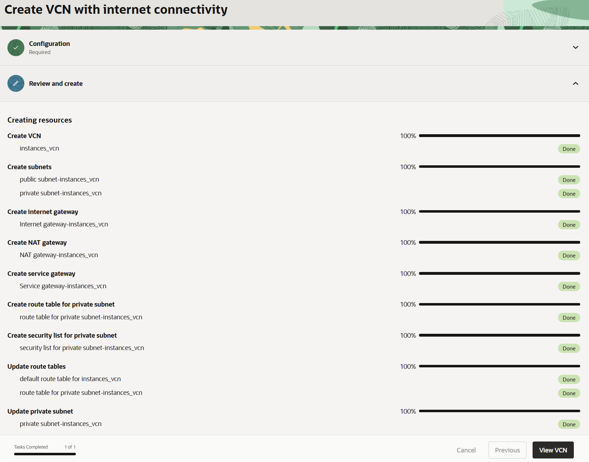

9. 생성된 VCN을 확인합니다.
+
image:./images/image15.png[width=650]

10. **IP Administration** 탭을 클릭하고 VCN에 할당된 IP 정보를 확인합니다.
+
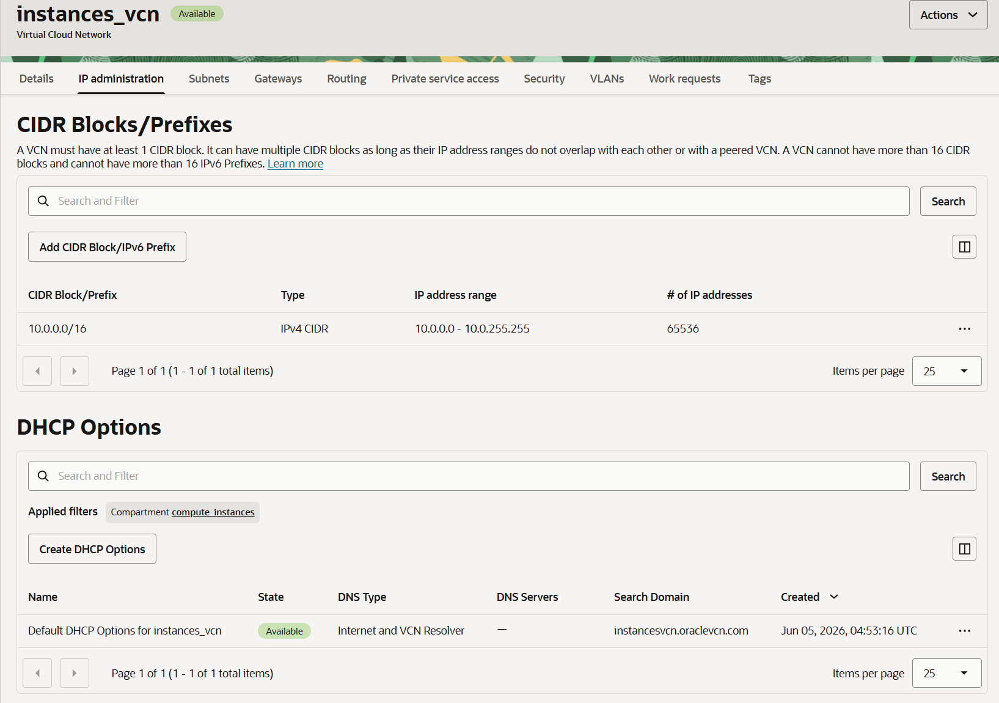

11. **Subnets** 탭을 클릭하고 생성된 Public/Private 서브넷을 확인합니다.
+
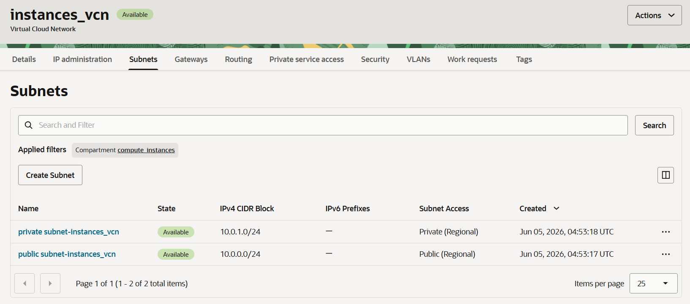

12. **Gateways** 탭을 클릭하고, 아래로 스크롤하여 생성된 Internet Gateway, NAT Gateway 및 Service Gateway를 확인합니다.
+
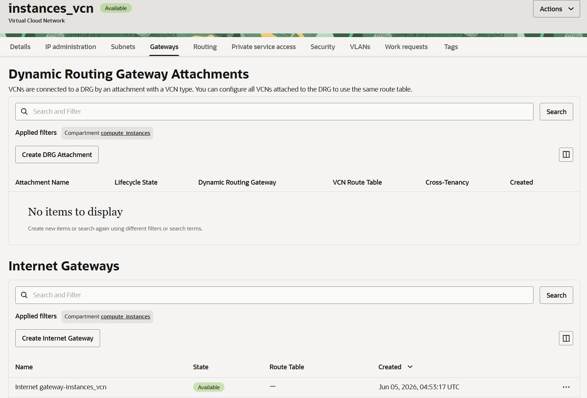

13. **Routing** 탭을 클릭하고, 생성된 두 라우팅 테이블을 확인합니다.
+
image:./images/image19.png[width=700]

14. **Security** 탭을 클릭하고 생성된 Security List를 확인합니다. Network Security Groups에는 항목이 생성되지 않았음도 확인합니다.
+
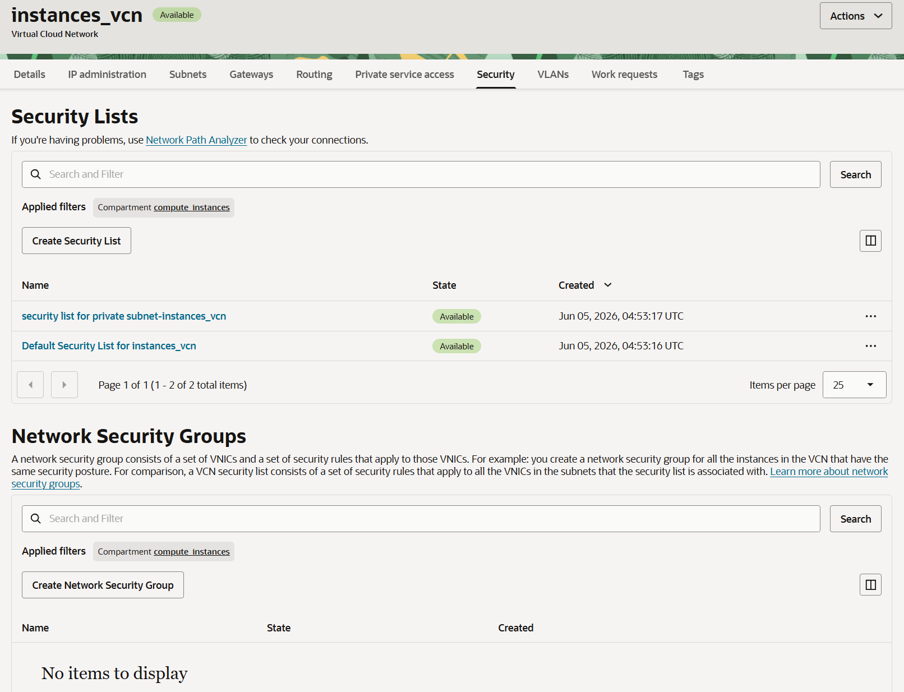

== SSH 키 생성

이 연습에서는 컴퓨트 인스턴스에서 인증을 위해 사용할 SSH 키를 생성합니다. 아래 절차에 따릅니다.

1. 터미널을 실행합니다.
2. 터미널에서 아래 명령을 실행하여 홈 디렉토리로 이동합니다.
* macOS / Linux
+
----
cd ~
----
* Windows
+
----
cd %userprofile%
----

3. .ssh 디렉토리를 확인합니다. 없다면 아래 명령을 실행하여 .ssh 디렉토리를 생성합니다.
+
----
mkdir .ssh
----

4. 아래 명령을 실행하여 .ssh 디렉토리로 이동합니다.
+
----
cd ./.ssh
----

5. 아래 명령을 실행하여 SSH 키를 생성합니다. Key의 이름은 _oci_instances_key 입니다.
+
----
ssh-keygen -t rsa -b 4096 -f oci_instances_key
----
* **Enter passpharse (empty for no passphrase):** 프롬프트에서 아무것도 입력하지 않고 Enter 키를 누릅니다.
* **Enter same passpharse again:** 프롬프트에서 프롬프트에서 아무것도 입력하지 않고 Enter 키를 누릅니다.

6. 생성된 키를 확인합니다.
+
----
oci_instances_key
oci_instances_key.pub
----

7. 개인 키 권한을 제한합니다.
* macOS / Linux에서는 아래 명령을 실행합니다.
+
----
cmhod 600 oci_instances_key
----
* windows에서는 명령 프롬프트에서 아래 명령을 실행합니다.
+
----
icacls oci_instances_key /inheritance:r
icacls oci_instances_key /grant:r "%username%":F
----

== 컴퓨트 인스턴스 생성

여기에서는 Ubuntu Linux 컴퓨트 인스턴스를 생성합니다. 아래 절차에 따릅니다.

1. 왼쪽 위의 햄버거 버튼을 클릭하고 **Compute**를 클릭합니다.
+
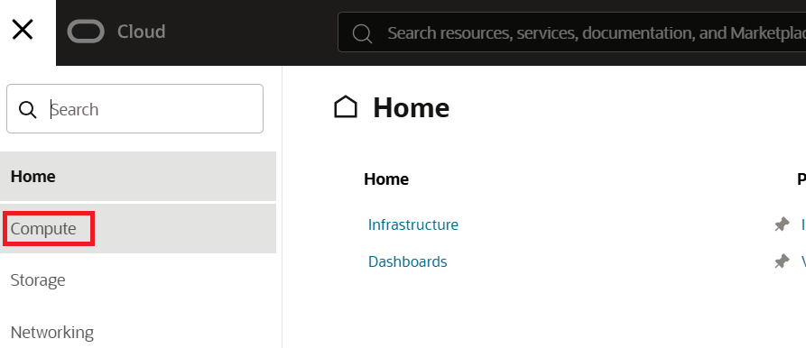

2. **Compute** 페이지에서 **Instances**를 클릭합니다.
+
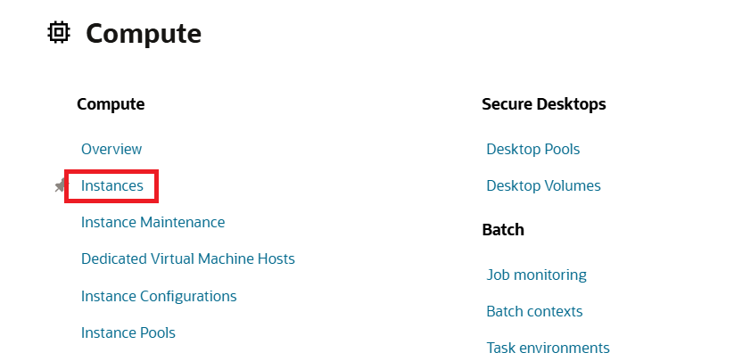

3. **Create Instance** 버튼을 클릭합니다.
+
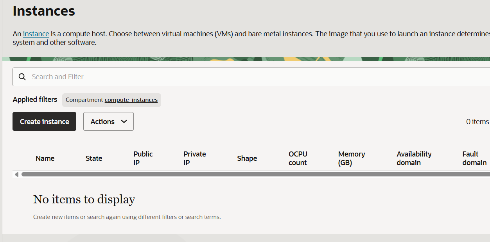

4. **Create compute instance** 페이지에서 아래와 같이 정보를 입력합니다.
* **Name**: `ubuntu-lab-vm`
* **Create in compartment**: `compute_instances`
* **Placement**: 기본 값 사용
* **image**: 
A. **Image and shape** 구역의 **Image** 에서 **Change Image** 버튼을 클릭합니다.
+
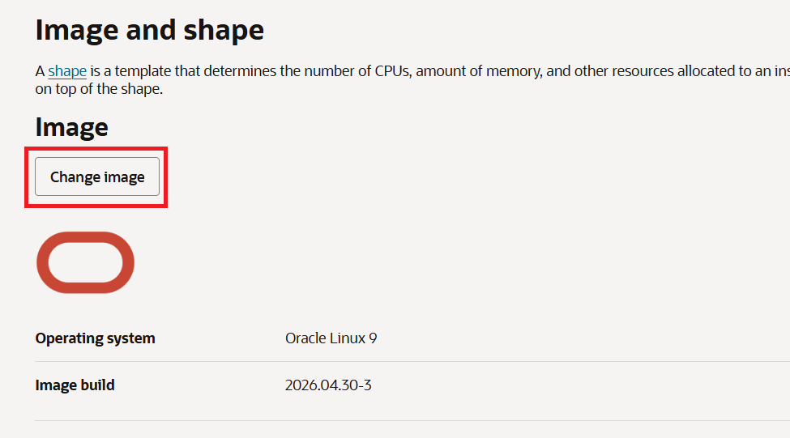
B. **Select an Image**에서 **Ubuntu**를 클릭합니다.
+
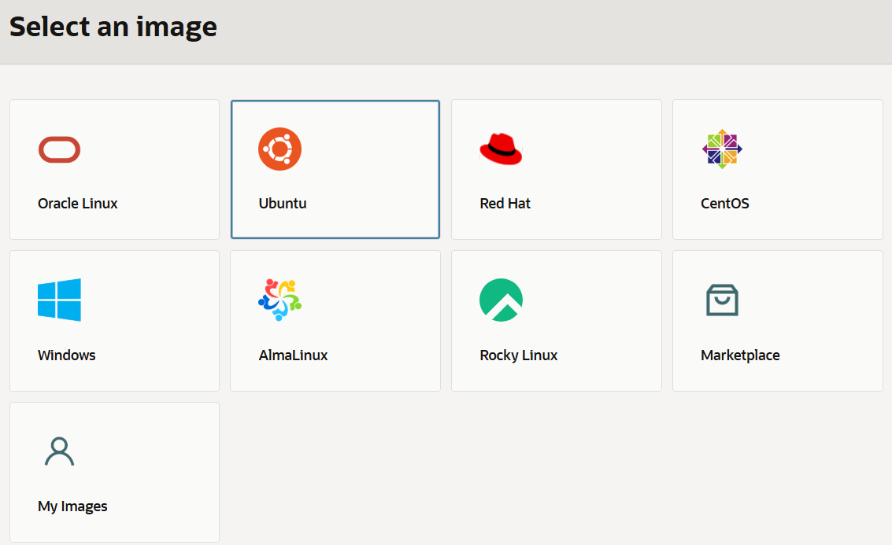
C. Ubuntu를 선택한 후 아래쪽 이미지 목록에서 `Canonical Ubuntu 24.04` 를 선택합니다.
+
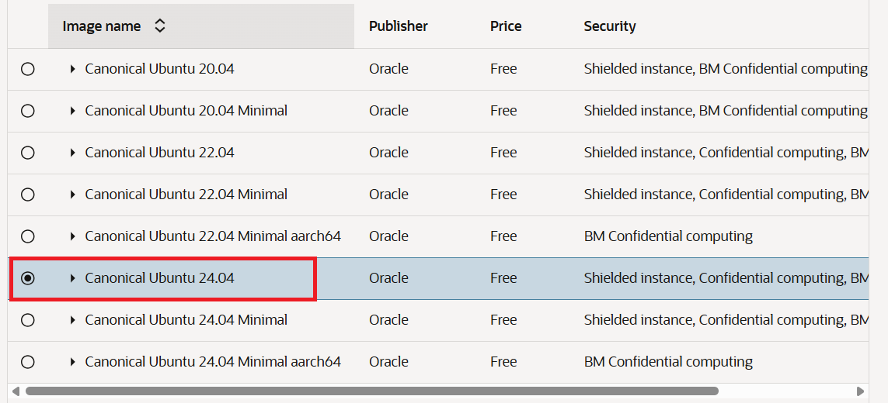
D. 아래쪽의 **Select Image** 버튼을 클릭합니다.

5. Shape에서 사용 가능한 Shape를 선택합니다. **Change Shape** 버튼을 클릭하여 변경할 수 있습니다. +
여기서는 AMD, `VM.Standard.E5.Flex` 를 사용합니다.
+
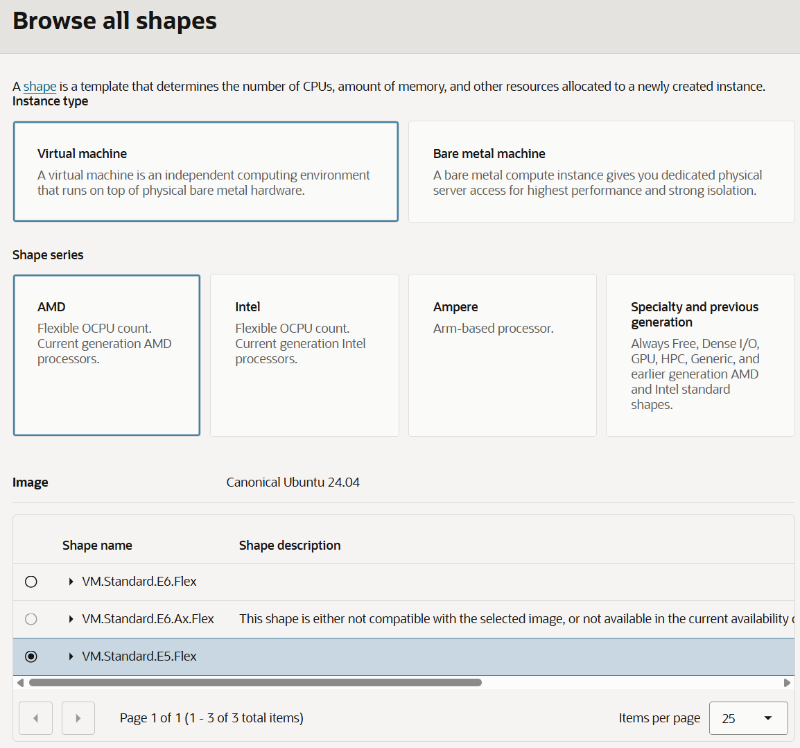
+
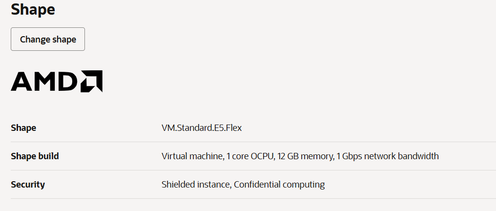

6. 오른쪽 아래에서 **Next** 버튼을 클릭합니다.
7. **Security** 에서 기본 값을 유지하고 오른쪽 아래의 **Next** 버튼을 클릭합니다.
+
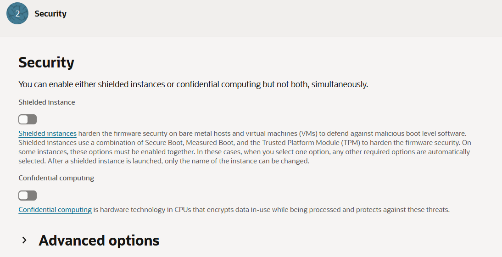

8. **Networking**에서 아래와 같이 설정합니다.
* Primary VNIC
** Primary network
*** **Select existing virtual cloud network**: 선택
*** **Virtual cloud network compartment**: `compute_instances`
*** **Virtual cloud network**: `instance_vcn`
** Subnet
*** **Select existing subnet**: 선택
*** **Virtual cloud network compartment**: `compute_instances`
*** **Virtual cloud network**: `public subnet-instances_vcn (regional)`

+
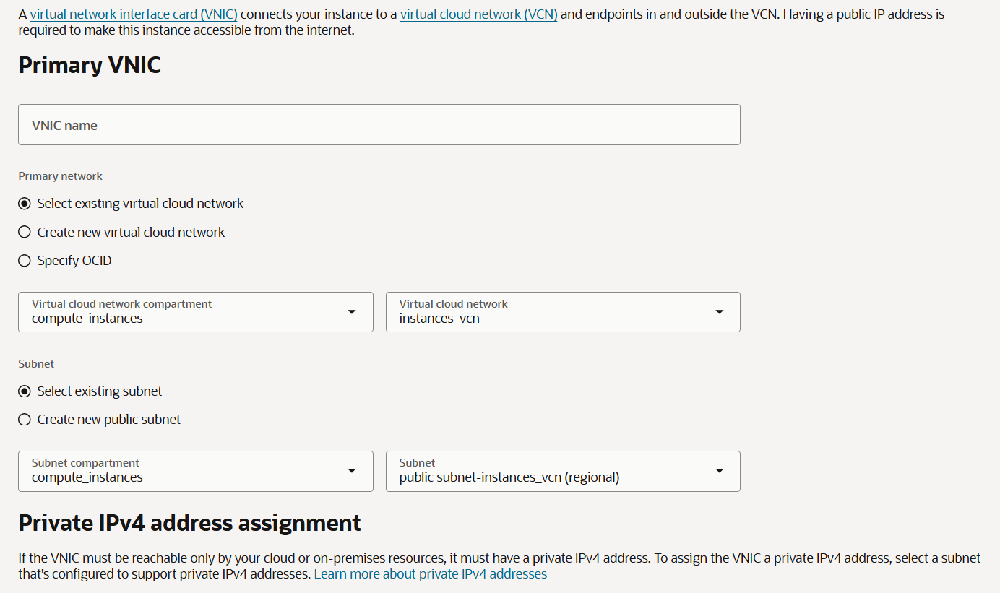

* Private IPv4 address assignment
** **Subnet IPv4 address**: `Automatically assign private IPv4 address` (기본값)
* Public IPv4 address assignment
** **기본값 유지**

+
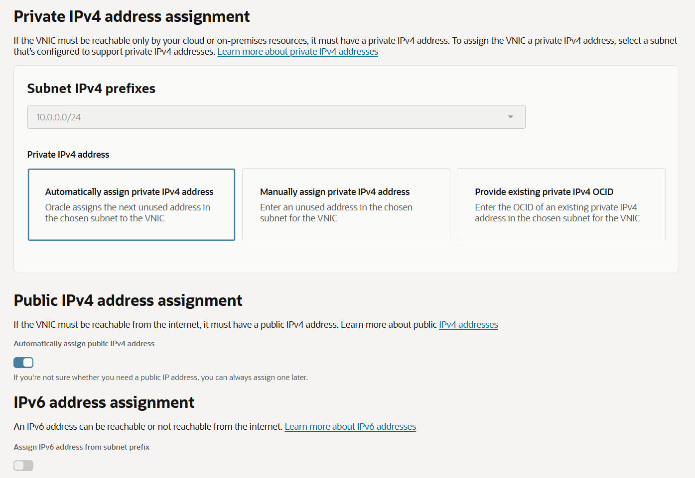

* Add SSH keys
** **Upload public key file (.pub)**: 선택
** **Drop a fiole or select one**을 클릭하고 위에서 생성한 공개 키 파일(`oci_instances_key.pub`) 선택

+
image:./images/image32.png[width=650]

9. 오른쪽 아래의 **Next** 버튼을 클릭합니다.

10. **Boot volume**에서 기본값을 유지하고 오른쪽 아래의 **Next** 버튼을 클릭합니다.
+
image:./images/image33.png[width=650]

11. **Review** 페이지에서 정보를 확인하고 오른쪽 아래의 **Create** 버튼을 클릭합니다.
+
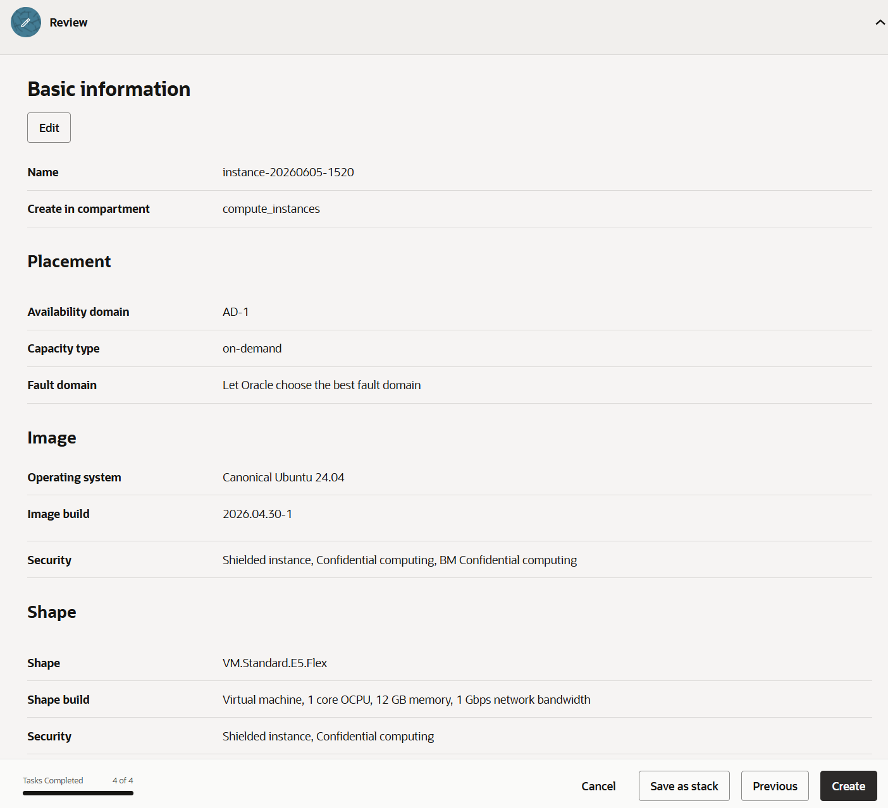

12. 컴퓨트 인스턴스가 생성됩니다. 생성이 완료될 때 까지 기다립니다.
13. 생성이 완료됩니다.
+
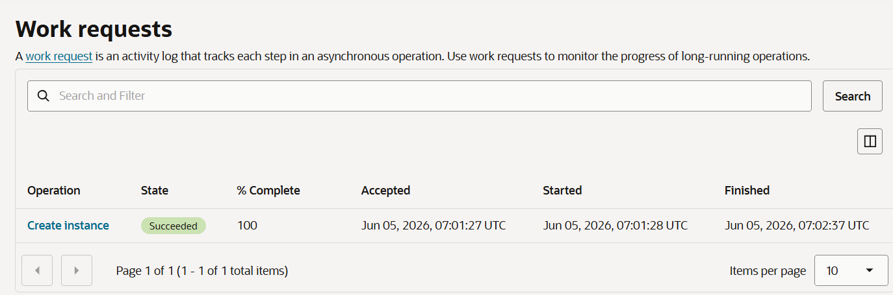

== 클라이언트에서 컴퓨트 인스턴스에 SSH로 접속

여기에서는 생성된 컴퓨트 인스턴스에 클라이언트에서 SSH로 접속합니다. 아래 단계에 따릅니다.

=== 컴퓨트 인스턴스 정보 확인

1. OCI 콘솔에서, 왼쪽 위의 햄버거 메뉴를 클릭합니다.
2. **Compute**를 클릭하고 **Instances**를 클릭합니다.
3. **Instances** 페이지에서 **ubuntu-lab-vm** 인스턴스를 클릭합니다.
4. **Details** 탭에서 생성된 인스턴스의 정보를 확인합니다. **Instance access** 구역에서 **Publuc IP Address**를 복사해서 기억합니다.
+
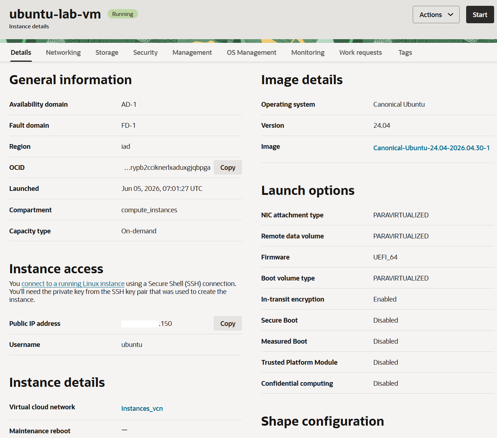

=== Security List에서 SSH 포트 확인

1. 왼쪽 위의 햄버거 메뉴를 클릭합니다.
2. **Networking**을 클릭하고, **Virtual cloud networks**를 클릭합니다.
3. **instance_vcn* 가상 클라우드 네트워크를 클릭합니다.
+
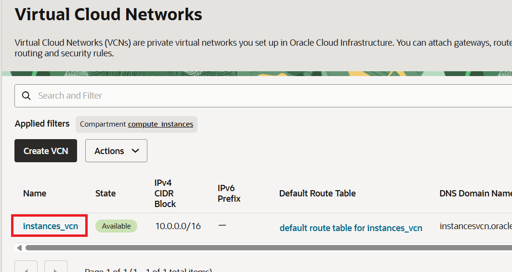

4. **Security** 탭을 클릭합니다.
5. **Security Lists** 구역에서 **Default Security List for instances_vcn**을 클릭합니다.
+
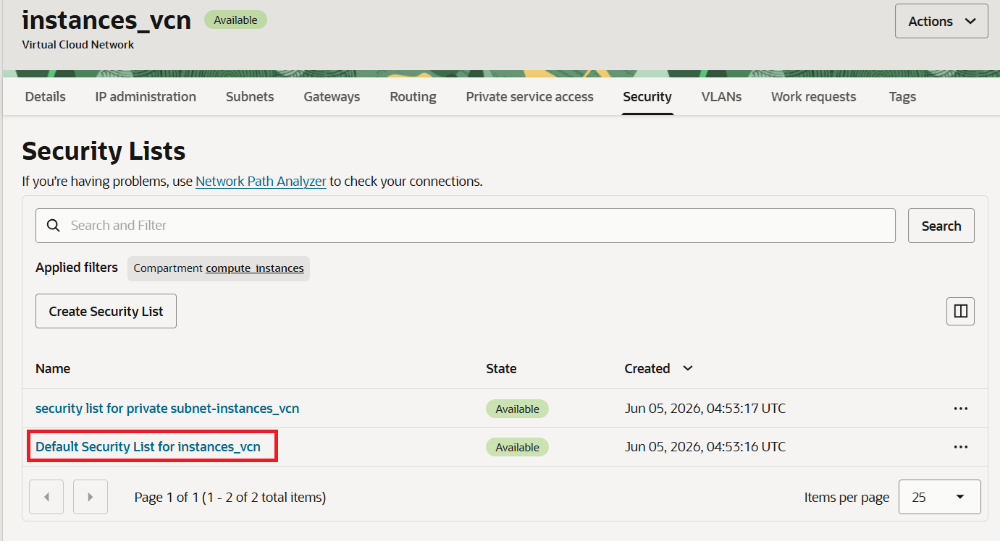

6. **Default Security List for instances_vcn** 페이지에서 **Security rules** 탭을 클릭합니다.
7. **Ingress Rules** 구역에서, 22번 포트(SSH 포트)가 허용된 것을 확인합니다.
+
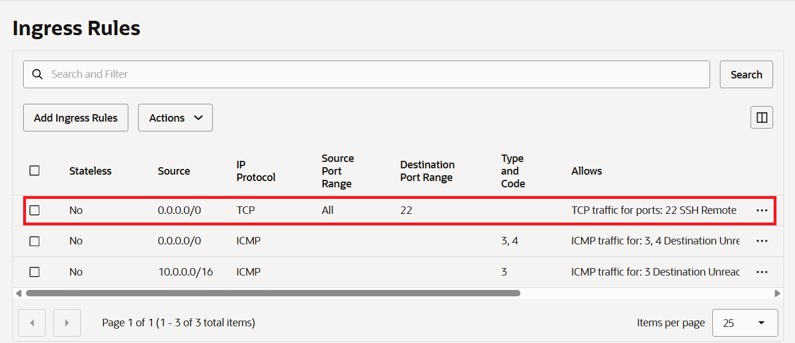

=== 클라이언트에서 접속

1. 클라이언트의 터미널에서, 아래 명령을 입력합니다. 클라이언트의 터미널은 위에서 생성한 SSH 비밀 키(`oci_instances_key`)가 존재하는 폴더이어야 합니다.
+
----
ssh -i ./oci_instances_key ubuntu@<PUBLIC_IP>
----

2. Are you sure you want to continue connecting (yes/no/[fingerprint])? 프롬프트에서, yes를 입력하고 Enter키를 누릅니다.
3. 생성한 인스턴스에 접속됩니다.
4. 아래 명령을 실행하여 OS 정보를 확인합니다.
+
----
ubuntu@ubuntu-lab-vm$ cat /ect/os-release
PRETTY_NAME="Ubuntu 24.04.4 LTS"
NAME="Ubuntu"
VERSION_ID="24.04"
VERSION="24.04.4 LTS (Noble Numbat)"
VERSION_CODENAME=noble
ID=ubuntu
ID_LIKE=debian
HOME_URL="https://www.ubuntu.com/"
SUPPORT_URL="https://help.ubuntu.com/"
BUG_REPORT_URL="https://bugs.launchpad.net/ubuntu/"
PRIVACY_POLICY_URL="https://www.ubuntu.com/legal/terms-and-policies/privacy-policy"
UBUNTU_CODENAME=noble
LOGO=ubuntu-logo
----

== 실습 리소스 삭제

여기에서는 실습에서 생성한 모든 리소스를 삭제합니다. 

* Oracle Cloud Infrastructure에서 더 이상 사용하지 않는 리소스를 삭제하는 것은 비용 낭비를 막고 인프라를 깔끔하게 유지하기 위한 필수 작업입니다. OCI는 엔터프라이즈 환경에 맞추어 설계되었기 때문에, 리소스 간의 종속성과 물리적 삭제 정책이 명확하게 구분되어 있습니다.
* OCI의 가장 중요한 규칙은 "자식 리소스나 연결된 리소스가 남아있으면 리소스를 삭제할 수 없다"는 점입니다.
** **예시(VCN 삭제)**: 가장 네트워크(VCN)를 삭제하고 싶다면, 그 VCN 안에 만들어진 컴퓨트 인스턴스, 로드 밸런서, 서브넷 등을 먼저 전부 삭제해야만 최종적으로 VCN을 삭제할 수 있습니다.
** **강제 삭제 불가**: 부모 리소스를 다 지운다고 해서 하위 리소스들이 자동으로 일괄 삭제(Cascade Delete) 되지 않는 경우가 많습니다. 인프라를 처음부터 하나씩 역순으로 걷어내야 합니다.

OCI에서 리소스 삭제에 대한 개념은 link:../00_concepts/01_delete_oci.adoc[Oracle Cloud Infrastructure에서 리소스 삭제]를 참조하십시오.

이 실습에서 생성한 모든 리소스를 완전히 정리하려면 아래 순서대로 리소스를 삭제해야 합니다.

1. Compute Instance Terminate
2. VCN 삭제
3.. 컴파트먼트 삭제

아래 절차에 따릅니다.

=== Compute Instance와 Boot Volume 삭제

여기에서는 Compute Instance와 Boot Volume을 함께 삭제합니다. 절차에 따릅니다.

1. OCI 콘솔의 왼쪽 위에 있는 햄버거 메뉴를 클릭합니다.
2. **Compute**를 클릭하고 **Instances**를 클릭합니다.
3. 연습에서 생성한 `ubuntu-lab-vm` 인스턴스의 마지막 컬럼에 있는 **...** 메뉴를 클릭하고 **Terminate** 를 클릭합니다.
+
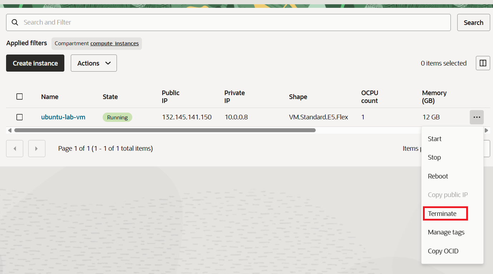

4. **Terminate instance** 경고 상자에서 **Permanetly delete attached boot volume** 체크박스를 선택하고 **Terminate Instance** 버튼을 클릭합니다.
+
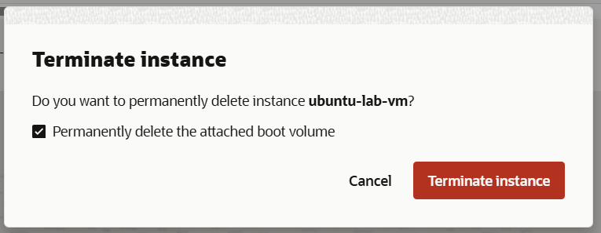

5. 삭제가 진행됩니다.
6. 삭제가 완료되면 인스턴스의 상태가 `Terminated` 로 변경됩니다. 이 인스턴스는 수시간이 지나면 사라집니다.

=== VCN 삭제

여기에서는 VCN을 삭제합니다. 아래 절차에 따릅니다.

1. OCI 콘솔의 왼쪽 위에 있는 햄버거 메뉴를 클릭합니다.
2. **Networking**을 클릭하고 **Virtual cloud networks**를 클릭합니다.
3. 연습에서 생성한 `instances_vcn` VCN의 마지막 컬럼에 있는 **...** 메뉴를 클릭하고 **Delete** 를 클릭합니다.
+
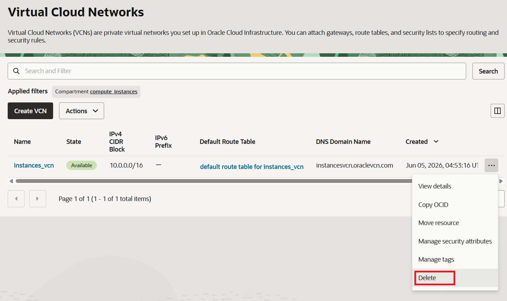
4. **Delete Virtual Cloud Network** 페비이에서, 오른쪽 아래의 **Scan** 버튼을 클릭합니다.
+
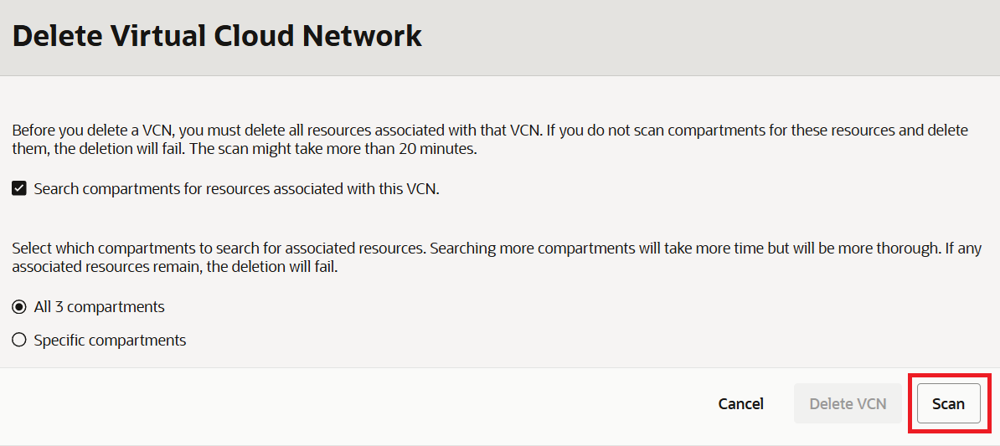
5. 스캔이 완료되면, 오른쪽 아래의 **Delete All** 버튼을 클릭합니다.
+
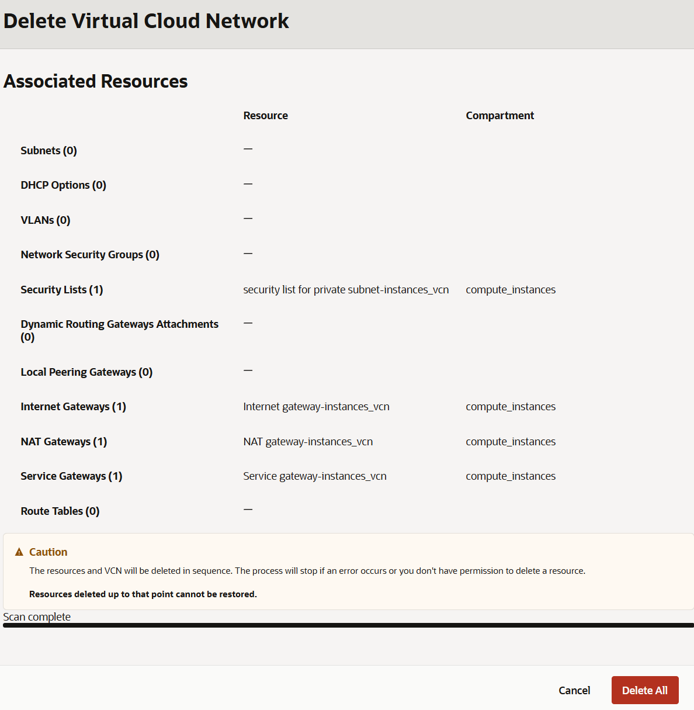
6. VCN이 삭제됩니다.

=== 컴파트먼트 삭제

1. OCI 콘솔의 왼쪽 위에 있는 햄버거 메뉴를 클릭합니다.
2. **Identity & Security**을 클릭하고 **Compartments**를 클릭합니다.
3. 연습에서 생성한 `compute_instances` VCN의 마지막 컬럼에 있는 **...** 메뉴를 클릭하고 **Delete** 를 클릭합니다.
+
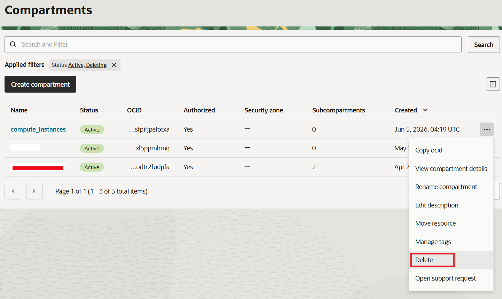
4. **Delete compartment** 경고 상자에서 **Delete** 버튼을 클릭합니다.
5. 삭제가 진행됩니다. (컴파트먼트의 상태가 `Deleting` 으로 변경됩니다.)
6. 삭제가 완료되면 컴파트먼트의 상태가 `Deleted` 로 변경됩니다. 이 컴파트먼트는 수시간이 지나면 사라집니다.