= 연습 1: 가상 클라우드 네트워크 및 컴퓨팅 인스턴스 시작
:sectnums:

이 연습에서는 가상 클라우드 네트워크 및 컴퓨팅 인스턴스를 만듭니다. 아래 절차에 따릅니다.

== 컴파트먼트 (Compartment) 생성

이 연습에서 사용하는 모든 리소스를 한 구획(Compartment)에서 사용하기 위해, **practice_nsg** 라는 이름의 컴파트먼트를 생성합니다. 아래 절차에 따릅니다.

1. 왼쪽 위의 햄버거 버튼을 클릭하고 **Identity & Security**를 클릭합니다.
+
image:./images/01/image01.png[width=700]

2. Identity & Security 메뉴에서 **Identity** 구역의 **Compartments**를 클릭합니다.
+
image:./images/01/image02.png[width=700]

3. **Compartment** 페이지에서 **Create Compartment** 버튼을 클릭합니다.
+
image:./images/01/image03.png[width=500]

4. **Create Compartment** 페이지에서 아래와 같이 정보를 입력하고 오른쪽 아래의 **Create Compartment** 버튼을 클릭합니다.
+
* **Name**: `practice_nsg`
* **Description**: `NSG 실습을 위한 컴파트먼트`
* **Parent compartment**: _루트 컴파트먼트 (태넌시 이름 (root) 로 표시됨)_

+
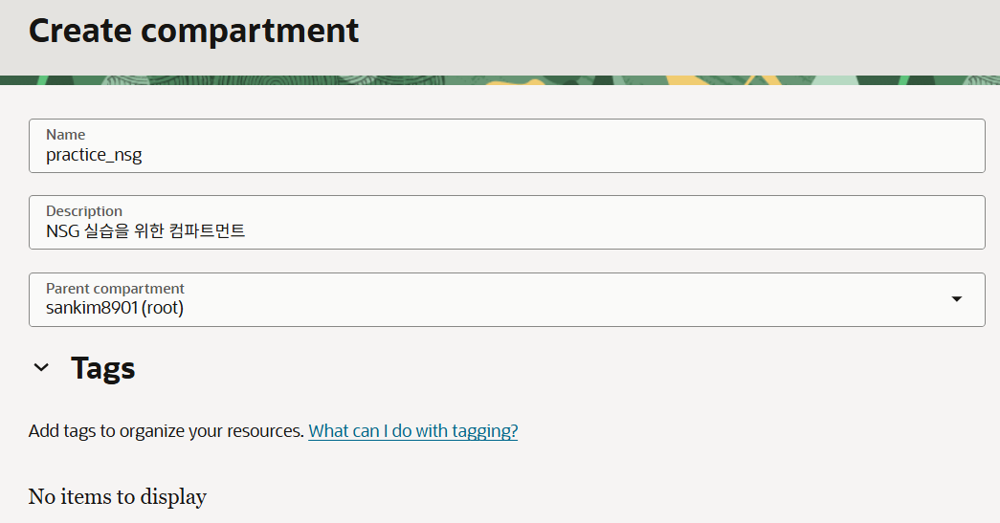

5. 생성된 컴파트먼트를 확인합니다. 루트 컴파트먼트의 Subcompartments 숫자가 하나 증가된 것도 확인합니다.
+
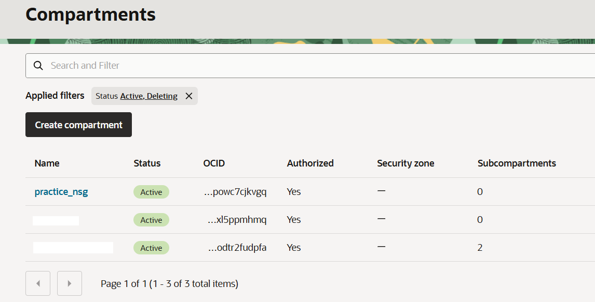

=== VCN Wizard를 사용하여 가상 클라우드 네트워크(Virtual Cloud Network - VCN) 생성

여기에서는 VCN 마법사를 사용하여 Virtual Cloud Network를 생성합니다. 아래 절차에 따릅니다.

1. OCI 콘솔에 로그인합니다.
2. 스크린 위쪽의 콘솔 리본에서, Region 아이콘을 클릭하여 메뉴를 확장하고, 리전을 지정합니다.
3. 왼쪽 위의 햄버거 메뉴에서, **Networking**을 클릭하고, **Virtual Cloud Network**를 클릭합니다.
+
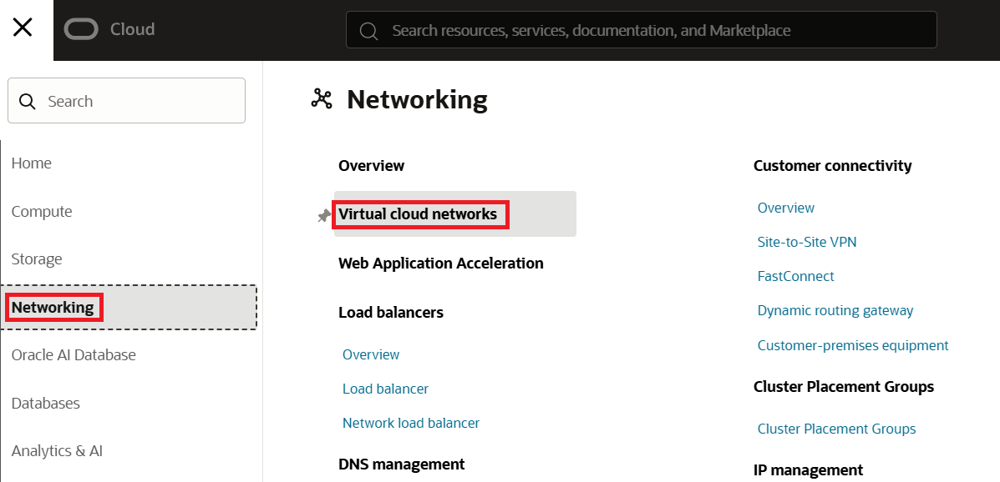

4. **Applied Filters**를 클릭하고, 할당된 컴파트먼트 이름을 지정합니다.
+
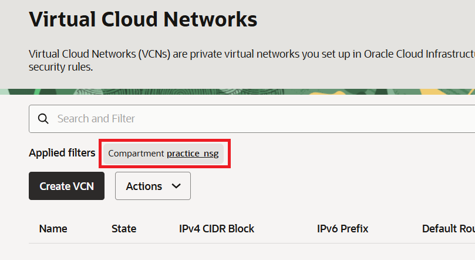

5. **Virtual Cloud Network** 페이지에서, **Actions** 드롭다운 리스트를 클릭하고 **Start VCN Wizard**를 클릭합니다.
+
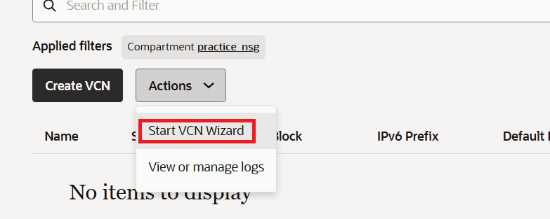

6. **Start VCN Wizard** 페이지에서 VCN Wizard가 시작됩니다.
7. **Create VCN with Internet Connectivity**를 클릭하고 오른쪽 아래의 **Start VCN Wizard** 버튼을 클릭합니다.
+
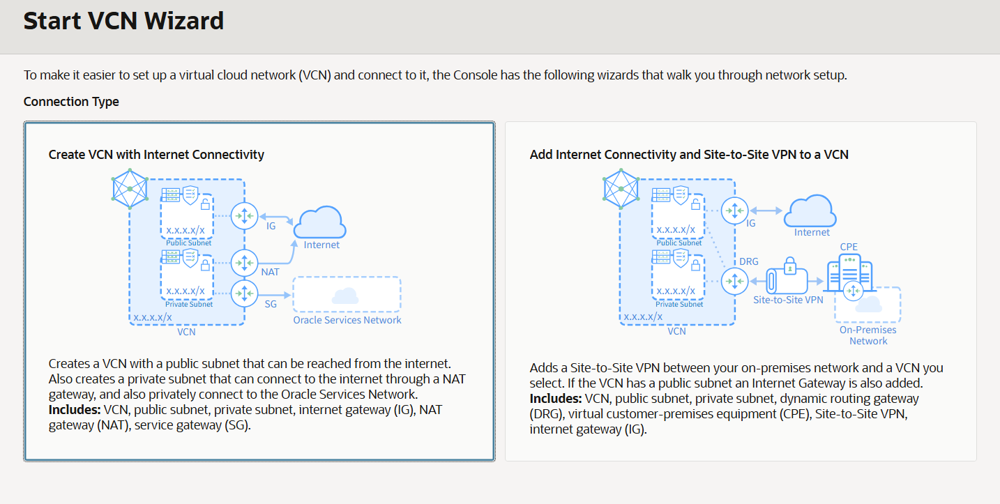

8. 아래 값들을 입력합니다.
* **Name**: `IAD-AP-LAB04-1-VCN-01`
* **VCN IPv4 CIDR Block**: `10.0.0.0/16`
* **Compartment**: `practive_nsg` (기본값)
* **Configure public subnet 구역의 IPv4 CIDR block**: `10.0.0.0/24` (기본값)
* **Configure private subnet 구역의 IPv4 CIDR block**: `10.0.1.0/24` (기본값)
+
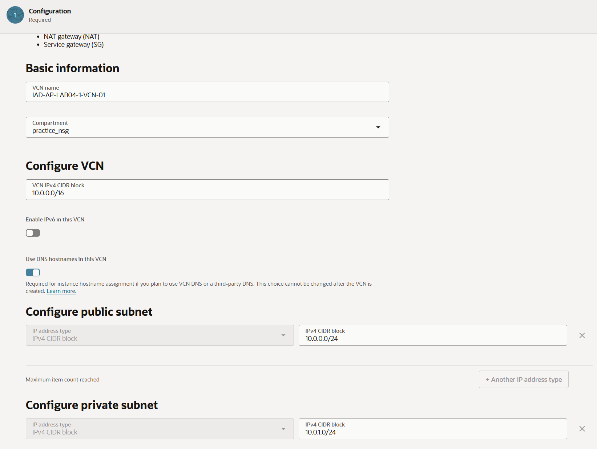

9. 오른쪽 아래의 **Next** 버튼을 클릭합니다.
10. OCI VCN 마법사가 생성할 리소스 목록을 검토하고 이해하십시오. 마법사는 VCN IP 주소와 공용 및 사설 서브넷에 대한 CIDR 블록 범위를 구성합니다. 또한 VCN에 대한 기본 액세스를 활성화하기 위해 보안 목록 규칙과 라우팅 테이블 규칙을 설정합니다.
+
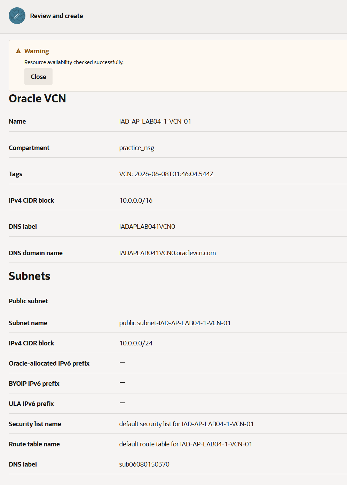

11. **Create** 버튼을 클릭합니다.
12. 생성이 완료되면, **View VCN** 버튼을 클릭합니다.

== 컴퓨트 인스턴스

1. OCI 콘솔의 오른쪽 위 리본에서, 리전이 잘 선택되어 있는지 확인합니다.
2. 왼쪽 위의 햄버거 메뉴를 클릭하고 **Compute**를 클릭한 후 **Instances**를 클릭합니다.
+
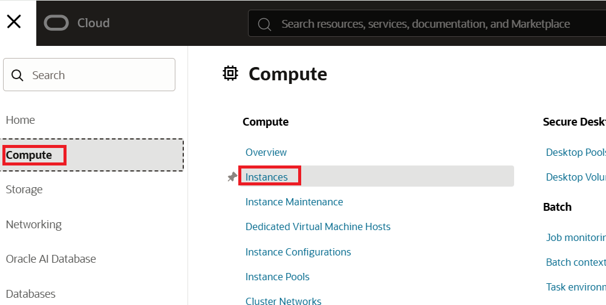

3. **Applied Filter**에서, 컴파트먼트가 `practice_nsg` 로 선택되어 있는 것을 확인합니다.
4. Create Instance 버튼읔 를릭하고 아래와 같이 정보를 입력합니다.
* **Name**: `IAD-AP-LAB04-1-VM-01`
* **Image**: `Oracle Linux 9`
* **Shape**: **Change Shape**를 클릭하고,
** **Instance Type**: Virtual Machine
** **Shape Series**: Ampere
** **Shape Name**: VM.Standard.A1.Flex (1 OCPU, 6 GB Memory)
* **Select Shape** 버튼 클릭
* **Next** 버튼 클릭
* **Security** 페이지에서, **Next** 버튼 클릭
* **Networking**
** **Primary network**: **Select existing virtual cloud network** 선택
** **Virtual cLoud network compartment**: 위에서 생성한 `practice_nsg` 선택
** **Virtual cloud network**: 위에서 생성한 `IAD-AP-LAB04-1-VCN-01` 선택
** **Subnet**에서 **Select existing subnet** 선택
** **Subnet compartment**: 위에서 생성한 `practice_nsg` 선택
* **Subnet**: `public subnet-IAD-AP-LAB04-1-VCN-01` 선택
* **Advanced Options**애서, 가장 편리한 방법으로 SSH 키 선택
* 다른 모든 값은 기본 값으로 설정
* **Create** 버튼 클릭
5. **Boot Volume** 페이지에서 **Next** 버튼을 클릭합니다.
6. **Review** 페이지에서, 생성될 컴퓨트 인스턴스의 정보를 확인하고 **Create** 버튼을 클릭합니다.

같은 절차로, 3개의 VM을 생성합니다.

1. `IAD-AP-LAB04-1-VM-02` (SSH를 추가하고, 가장 편리한 옵션을 선택합니다.)
2. `IAD-AP-LAB04-1-VM-03` (SSH를 추가하고, 가장 편리한 옵션을 선택합니다.)
3. `IAD-AP-LAB04-1-VM-04` (SSH를 사용하지 않고, Private Subnet을 사용합니다.)

== 생성한 VM에 접속

사무실에 있는 개인 컴퓨터에서 세 개의 컴퓨팅 인스턴스의 공용 IP 주소로 ping을 시도해 보세요. 실패할 것입니다. 보안 목록에 ICMP 에코 규칙이 없기 때문입니다. 이제 세 인스턴스 중 하나에 SSH로 접속해 보세요. 기본 보안 목록에 55H 포트 22가 기본적으로 활성화되어 있으므로 성공할 것입니다.

1. 생성한 가상 컴퓨터 `IAD-AP-LAB04-1-VM-01` 의 public ip를 확인합니다.
2. 터미널을 실행합니다.
3. VM에 접속할 ssh 개인 키가 있는 디렉토리로 이동합니다.
4. 아래 명령을 실행하여 `IAD-AP-LAB04-1-VM-01` 가상 컴퓨터에 접속합니다.
+
----
ssh -i <ssh 개인 키 파일> opc@<public ip>
----

5. 접속에 성공합니다. yes를 입력하고 Enter 키를 누릅니다.
6. 아래 명령을 실행하여 운영체제의 버전을 확인합니다.
+
----
cat /etc/os-release
----

7. 아래 명령을 실행하여 접속을 종료합니다.
+
----
exit
----

8. 아래 명령을 실행하여 VM의 IP로 ping을 시도합니다.
+
----
ping <public ip>
----

9. 해당 VM으로 ping이 실패하는 것을 확인합니다.
+
----
요청 시간이 만료되었습니다.
요청 시간이 만료되었습니다.
요청 시간이 만료되었습니다.
요청 시간이 만료되었습니다.
----

10. IAD-AP-LAB04-1-VM-02, IAD-AP-LAB04-1-VM-03 VM에 대해 같은 절차를 수행하고 SSH 접속에는 성공하지만 Ping에는 실패하는 것을 확인합니다.

== Network Security Group (NSG) 생성

여기에서는 Network Security Group (NSG)을 생성합니다. 아래 절차에 따릅니다.

1. OCI 콘솔에서 태넌시와 컴파트먼트에 로그인합니다.
2. Ashburn 리전에 접속한 것을 확인합니다.
3. 왼쪽 위의 햄버거 메뉴를 클릭하고, **Networking**을 클릭한 후 **Virtual cloud networks**를 클릭합니다.
4. 위에서 생성한 `IAD-AP-LAB04-1-VCN-01` VCN을 클릭합니다.
+
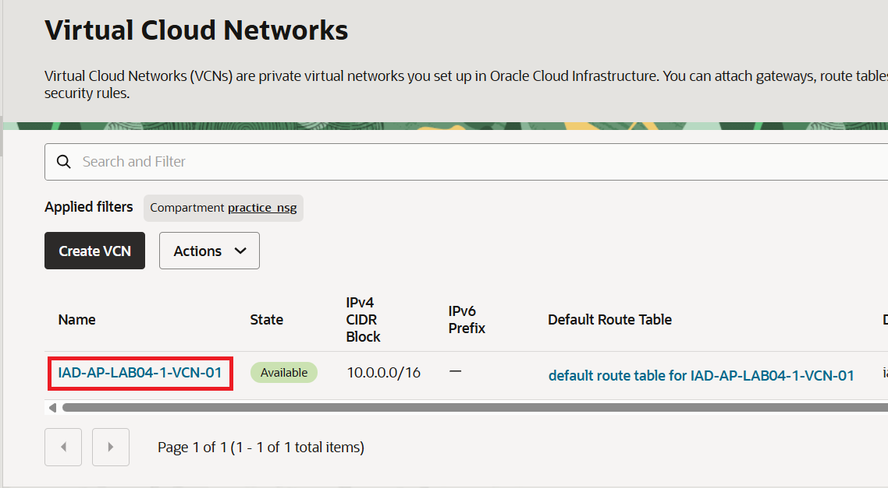

5. **VCN Information** 페이지에서, **Security** 탭을 클릭합니다.
+
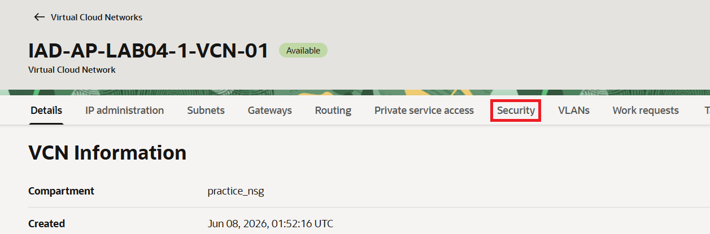

6. **Network Security Groups** 구역에서, **Create Network Security Group**을 클릭합니다.
+
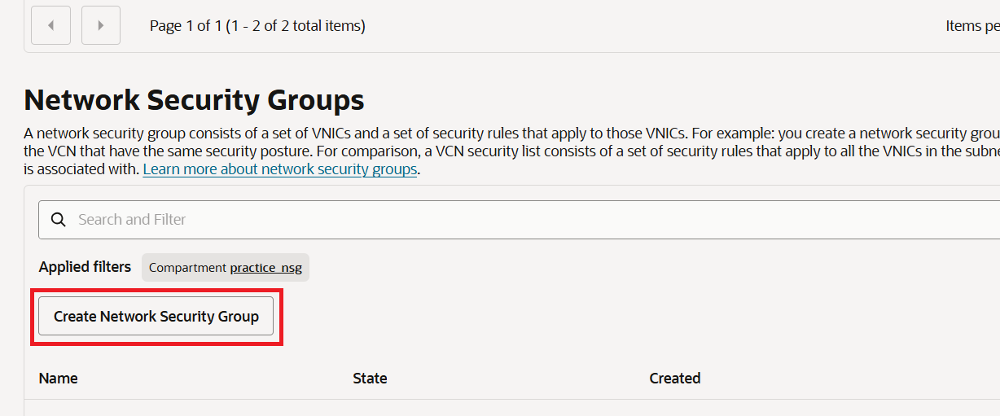

7. 아래와 같이 정보를 입력합니다.
* **Name**: `IAD-AP-LAB04-1-NSG-01`
* **Create In Compartment**: 위에서 생성한 `practice_nsg`
* **Rule** 구역에서:
** **Direction**: `Ingress`
** **Source Type**: `CIDR`
** **Source CIDR**: 0.0.0.0/0
** **IP Protocol**: ICMP
** **Type**: `8`
** **Code**: 기본값 (비워둠)

+
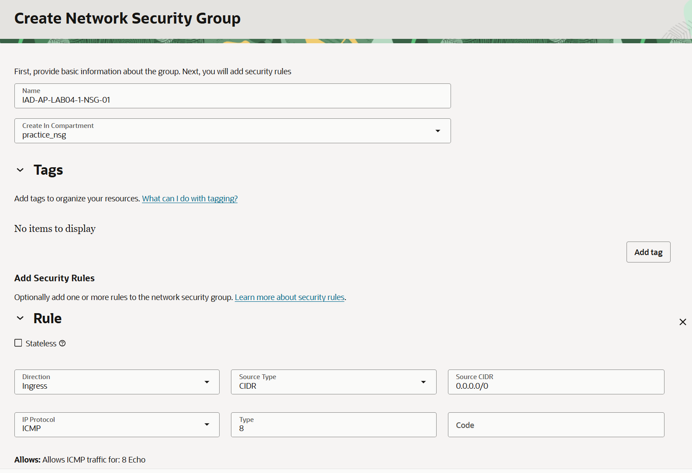

8. **Create** 버튼을 클릭합니다.

9. 왼쪽 위의 햄버거 메뉴를 클릭하고, **Compute**을 클릭한 후 **Instances**를 클릭합니다.
10. `IAD-AP-LAB04-1-VM-03` 을 클릭합니다.
11. `Networking` 탭을 클릭합니다.
+
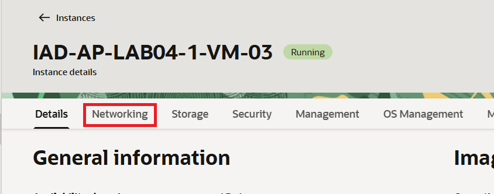

12. **Attached VNICs** 구역에서, 생성되어 있는 VNIC을 클릭합니다.
+
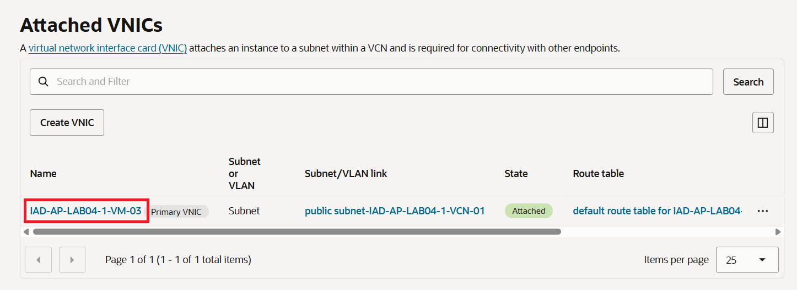

13. **Primary IP Information** 구역의 **Network Security Groups** 에서 **Edit** 버튼을 클릭합니다.
+
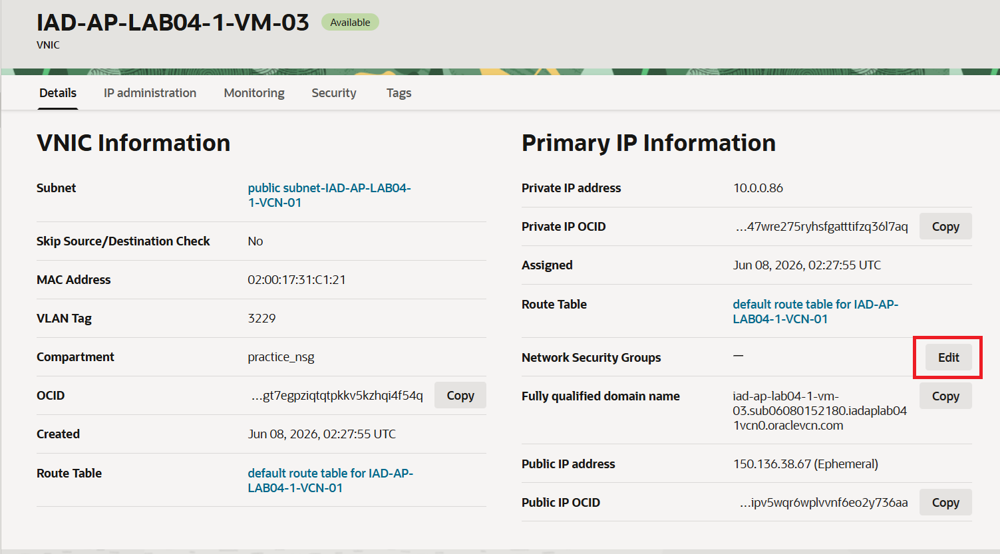

14. **Network Security Group**에서 위에서 생성한 `IAD-AP-LAB04-1-NSG-01`을 선택합니다.
+
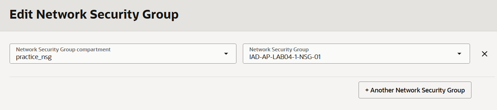

15. **Save Changes** 버튼을 클릭합니다.

== 테스트

실습 중 하나를 완료 했습니다. 여기서는 테스트를 수행합니다. 아래 절차에 따릅니다.

1. OCI 콘솔에서, 왼쪽 위의 햄버거 메뉴를 클릭합니다.
2. **Compute**를 클릭하고, **Instances**를 클릭합니다.
3. 세 개의 public IP를 기록해 놓습니다.
4. 로컬 컴퓨터에서, 세 public IP에 ping을 시도합니다.
5. `IAD-AP-LAB04-1-VM-03` 에만 ping이 성공하는 것을 확인합니다.

---

다음: link:./02_nested_nsg.adoc[Nested Network Security Group 생성]