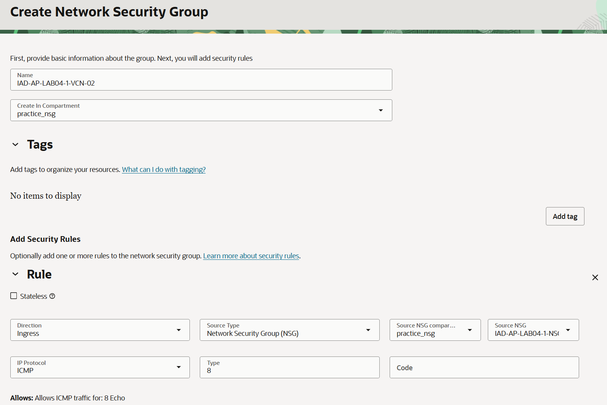

= 연습 2: Nested Network Security Group 생성

이제 다시 SSH를 통해 세 개의 컴퓨트 인스턴스에 접속하고, 각 인스턴스에서 IAD-AP-LAB04-VM-04의 개인 IP 주소로 ping을 실행해 보세요. ping이 실패할 것입니다. 이제 중첩된 NSG를 생성해 보겠습니다.

1. OCI 콘솔에서 태넌시와 컴파트먼트에 로그인합니다.
2. Ashburn 리전에 접속한 것을 확인합니다.
3. 왼쪽 위의 햄버거 메뉴를 클릭하고 **Networking**을 클릭한 후 **Virtual Cloud Networks** 버튼을 클릭합니다.
4. 이전 연습에서 생성한 `IAD-AP-LAB04-VCN-01` 버튼을 클릭합니다.
5. **VCN Information** 페이지에서, **Security** 탭을 클릭합니다.
6. **Network Security Groups** 구역에서, **Create Network Security Group** 버튼을 클릭하고 아래와 같이 정보를 입력합니다.
* **Name**: `IAD-AP-LAB04-1-VCN-02`
* **Create In Compartment**: 이전 연습에서 생성한 `practice_nsg`
* **Rule** 구역에서:
** **Direction**: `Ingress`
** **Source Type**: `Network Security Group (NSG)`
** **Source NSG in Compartnent**: 이전 연습에서 생성한 `practice_nsg`
** **Source NSG**: 이전 연습에서 생성한 `IAD-AP-LAB04-1-NSG-01`
** **IP Protocol** `ICMP`
** **Type**: `8`
** **Code**: 기본값 (비워둠)

+

7. **Create** 버튼을 클릭합니다.
8. 왼쪽 위의 햄버거 메뉴를 클릭합니다.
9. **Compute**을 클릭한 후 **Instances** 버튼을 클릭합니다.
10. `IAD-AP-LAB04-1-VM-04` VM을 클릭합니다.
11. **Networking** 탭을 클릭합니다.
12. **Attached VNICs** 구역에서, 생성되어 있는 VNIC을 클릭합니다.
13. **Primary IP Information** 구역의 **Network Security Groups** 에서 **Edit** 버튼을 클릭합니다.
14. **Network Security Group**에, 위에서 생성한 `IAD-AP-LAB04-1-VCN-02` 을 선택합니다.
15. **Save Changes** 버튼을 클릭합니다.

이제 세 개의 컴퓨트 인스턴스에 다시 SSH로 접속하여 각 인스턴스에서 IAD-AP-LAB04-1-VM-04의 개인 IP 주소로 ping을 시도해 보세요. IAD-AP-LAB04-1-VM-03만 성공합니다!

이는 컴퓨트 인스턴스 IAD-AP-LAB04-1-VM-04의 VNIC가 기본 보안 목록의 규칙 외에도 NSG IAD-AP-LAB04-1-NSG-02의 규칙에 의해 바인딩되어 있기 때문입니다. 또한 NSG IAD-AP-LAB04-1-NSG-02가 소스 NSG로 IAD-AP-LAB04-1-NSG-01을 사용하고 있기 때문인데, 이 NSG는 IAD-AP-LAB04-1-VM-03의 vNIC에 추가한 NSG입니다.

이제 보유하고 있는 두 개의 NSG를 사용하여 이 실습을 직접 진행해 볼 수 있습니다. 컴퓨팅 인스턴스 IAD-AP-LAB04-1-VM-01의 VNIC에 올바른 항목을 할당하십시오.

1. `IAD-AP-LAB04-1-VM-01` 로 이동하고, **Networking** 탭을 클릭합니다.
2. **Primary IP Information** 구역에서, **Network Security Group**의 **Edit** 버튼을 클릭합니다.
3. **Network Security Group**에서, `IAD-AP-LAB04-NSG-02` (Private IP에 대한 ICMP를 허용하는 Nested NSG)을 선택하고 **Save Changes** 버튼을 클릭합니다.
4. 로컬 컴퓨터의 터미널에서, `IAD-AP-LAB04-1-VM-01` 의 Public IP로 ping을 시도합니다.
5. 실패하는 것을 확인합니다.
6. 로컬 컴퓨터의 터미널에서, `IAD-AP-LAB04-1-VM-01` 에 SSH로 접속합니다.
7. `IAD-AP-LAB04-1-VM-04` 의 private IP로 ping을 시도햡니다.
8. 실패하는 것을 확인합니다.

9. `IAD-AP-LAB04-1-VM-01` 의 **Network Security Group**에서, `IAD-AP-LAB04-NSG-01` (public IP에 대한 ICMP 허용)을 선택하고 **Save Changes** 버튼을 클릭합니다.
10. 로컬 컴퓨터의 터미널에서, `IAD-AP-LAB04-1-VM-01` 의 Public IP로 ping을 시도합니다.
11. 성공하는 것을 확인합니다.
12. `IAD-AP-LAB04-1-VM-04` 의 private IP로 ping을 시도햡니다.
13. 성공하는 것을 확인합니다.

14. 실습이 종료되었습니다.

---

다음: link:./03_env_clear.adoc[실습 리소스 삭제]

