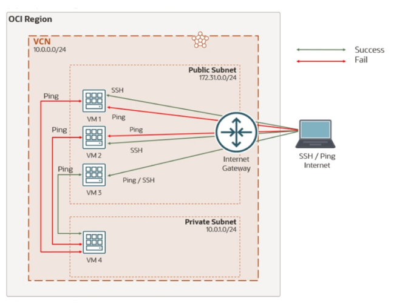

= Lab 02: IP 대역(CIDR) 대신 다른 NSG를 소스(Source)로 지정하여 인그레스 규칙을 적용하는 네트워크 보안 그룹(NSG) 설정

이 실습에서는 두 개의 네트워크 보안 그룹(NSG)을 생성합니다. 첫 번째 NSG는 두 번째 NSG의 소스가 됩니다. NSG의 강력한 기능을 시연하기 위해 네 개의 컴퓨팅 인스턴스를 생성합니다. 처음 세 개는 공용 서브넷에, 나머지 하나는 사설 서브넷에 배치합니다. 공용 서브넷에 있는 세 인스턴스는 모두 SSH가 활성화되어 있으며, 이는 보안 목록의 기본 규칙입니다. 세 번째 인스턴스에 대해서만 NSG를 통해 ICMP 에코를 활성화합니다. 사무실의 개인 컴퓨터에서 세 개의 컴퓨팅 인스턴스에 SSH로 접속을 시도해 볼 수 있습니다. 기본 보안 목록에서 SSH 접속이 허용되므로 성공할 것입니다. 그런 다음 세 개의 컴퓨팅 인스턴스의 공용 IP 주소로 ping을 시도해 봅니다. NSG에서 ICMP 에코를 활성화했기 때문에 세 번째 인스턴스만 응답을 보낼 것입니다.

이제 첫 번째 NSG를 소스로 하는 두 번째 NSG를 생성합니다. 이 두 번째 NSG에서도 ICMP 에코를 활성화합니다. 그리고 이 두 번째 NSG를 사설 서브넷에 있는 컴퓨팅 인스턴스에 할당합니다.

이 기능을 사용하면 세 번째 컴퓨트 인스턴스에서 프라이빗 서브넷에 있는 컴퓨트 인스턴스로 ping을 성공적으로 보낼 수 있지만, 첫 번째 또는 두 번째 인스턴스에서는 보낼 수 없습니다. SSH를 사용하여 세 번째 컴퓨트 인스턴스에 접속한 다음 첫 번째 컴퓨트 인스턴스에 접속하면 이를 확인할 수 있습니다. ping을 실행한 상태에서 첫 번째 컴퓨트 인스턴스를 첫 번째 NSC(네트워크 보안 그룹)에 추가하면 첫 번째 컴퓨트 인스턴스에서 ping이 즉시 작동하는 것을 볼 수 있습니다.

NSG(네트워크 보안 그룹)는 컴퓨트 인스턴스 및 기타 리소스에 대한 가상 방화벽 역할을 합니다. NSG는 단일 VCN(가상 네트워크) 내에서 사용자가 선택한 vNLC 집합에만 적용되는 인바운드 및 아웃바운드 보안 규칙 집합으로 구성됩니다(예: VCN 내 다중 계층 애플리케이션의 웹 계층에서 웹 서버 역할을 하는 컴퓨트 인스턴스).

보안 목록과 비교하여 NSG를 사용하면 VCN의 서브넷 아키텍처와 애플리케이션 보안 요구 사항을 분리할 수 있습니다.

특정 NSG의 보안 규칙에서 NSG를 소스(인바운드 규칙의 경우) 또는 대상(아웃바운드 규칙의 경우)으로 지정할 수 있습니다. 두 개의 NSG는 동일한 VCN에 있어야 합니다.

현재 다음 유형의 상위 리소스에서 NSG 사용을 지원합니다.

* Compute Instance
* Load Balancer
* DB Systms
* Autonomous Databases
* Kubernetes clusters
* API gateways
* GoldenGate deployments

연습을 위해, 아래 문서의 절차에 따르십시오.

1. link:./01_launch_vcn_and_instance.adoc[가상 클라우드 네트워크 및 컴퓨팅 인스턴스 시작]
2. link:./02_nested_nsg.adoc[Nested Network Security Group 생성]
3. link:./03_env_clear.adoc[실습 리소스 삭제]