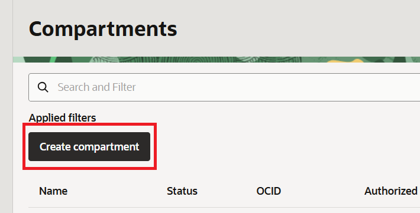
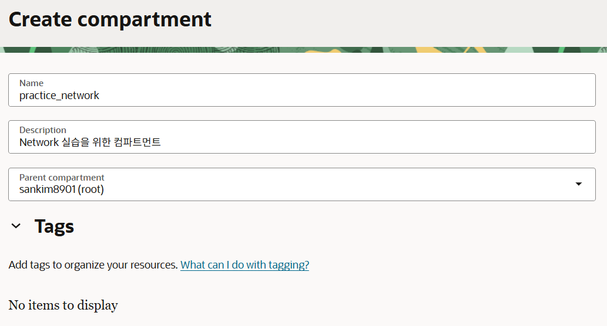
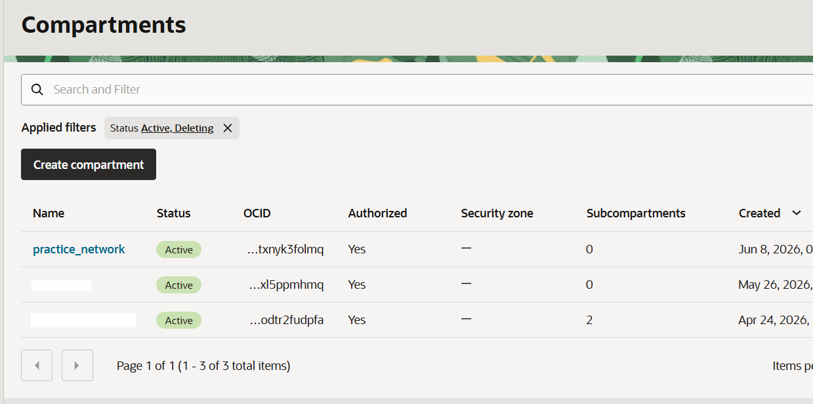
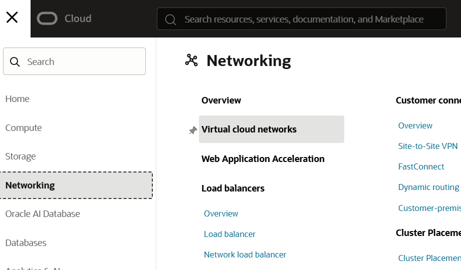
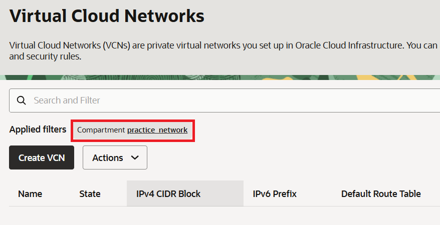
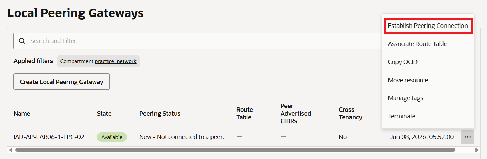
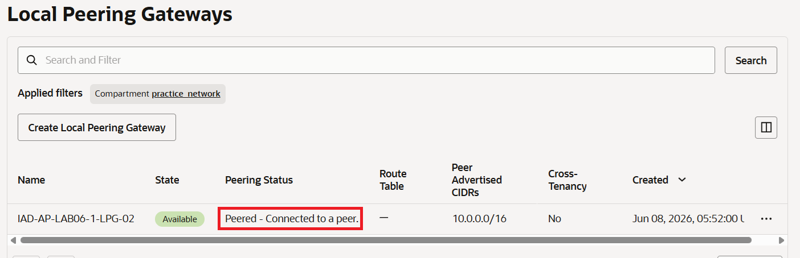

= 연습 1: 실습 환경 설정
:sectnums:

이 실습을 수행하려면 먼저 피어링된 두 개의 VCN과 인스턴스를 생성해야 합니다. 아래 절차에 따릅니다.

== 컴파트먼트 생성

이 연습에서 사용하는 모든 리소스를 한 구획(Compartment)에서 사용하기 위해, **practice_nsg** 라는 이름의 컴파트먼트를 생성합니다. 아래 절차에 따릅니다.

1. OCI 콘솔에서 태넌시와 컴파트먼트에 로그인합니다.
2. 왼쪽 위의 햄버거 버튼을 클릭하고 **Identity & Security**를 클릭합니다.
+
image:./images/01/image01.png[width=700]

3. Identity & Security 메뉴에서 **Identity** 구역의 **Compartments**를 클릭합니다.
+
image:./images/01/image02.png[width=700]

4. **Compartment** 페이지에서 **Create Compartment** 버튼을 클릭합니다.
+

5. **Create Compartment** 페이지에서 아래와 같이 정보를 입력하고 오른쪽 아래의 **Create Compartment** 버튼을 클릭합니다.
+
* **Name**: `practice_network`
* **Description**: `Network 실습을 위한 컴파트먼트`
* **Parent compartment**: _루트 컴파트먼트 (태넌시 이름 (root) 로 표시됨)_

+

6. 생성된 컴파트먼트를 확인합니다. 루트 컴파트먼트의 Subcompartments 숫자가 하나 증가된 것도 확인합니다.
+

== 두개의 VCN과 서브넷 생성

1. OCI 콘솔에서 태넌시와 컴파트먼트에 로그인합니다.
2. Ashburn 리전에 접속한 것을 확인합니다.
3. 왼쪽 위의 햄버거 메뉴를 클릭하고, **Networking**을 클릭한 후 **Virtual cloud networks**를 클릭합니다.
+

4. **Applied Filters**에서, 위에서 생성한 `practice_network` 컴파트먼트를 선택합니다.
+

5. **Actions** 드롭다운 리스트를 클릭하고 **Start VCN Wiard**를 클릭합니다.
6. **Create VCN with Internet Connectivity**를 클릭하고, **Start VCN Wizard**를 클릭한 후 아래 정보를 입력합니다.
* **VCN Name**: `IAD-AP-LAB06-1-VCN-01`
* **Compartment**: `practice_network` 컴파트먼트가 선택된 것을 확인합니다.
* **Configure VCN** 구역의 **VCN IPv4 CIDR Block**: 10.0.0.0/16
* **Configure public subnet** 구역의 **IPv4 CIDR block**: 10.0.0.0/24
* **Configure private subnet** 구역의 **IPv4 CUDR block**: 10.0.1.0/24
* 나머지 값은 모두 기본값으로 유지

7. **Next** 버튼을 클릭합니다.
8. OCI VCN 마법사가 생성할 리소스 목록을 검토하고 이해하십시오. 마법사는 VCN IP 주소와 공용 및 사설 서브넷에 대한 CIDR 블록 범위를 구성합니다. 또한 VCN에 대한 기본 액세스를 활성화하기 위해 보안 목록 규칙과 라우팅 테이블 규칙을 설정합니다.
9. **Create** 버튼을 클릭합니다.
10. 생성이 완료되면, **View VCN** 버튼을 클릭합니다.

11. 같은 절차로, 두 번쨰 VCN을 생성합니다. 정보는 아래와 같이 입력합니다.
* **VCN Name**: `IAD-AP-LAB06-1-VCN-02`
* **Compartment**: `practice_network` 컴파트먼트가 선택된 것을 확인합니다.
* **Configure VCN** 구역의 **VCN IPv4 CIDR Block**: 172.0.0.0/16
* **Configure public subnet** 구역의 **IPv4 CIDR block**: 172.0.0.0/24
* **Configure private subnet** 구역의 **IPv4 CUDR block**: 172.0.1.0/24
* 나머지 값은 모두 기본값으로 유지
12. **Next** 버튼을 클릭합니다.
13. **Create** 버튼을 클릭합니다.
14. 생성이 완료되면, **View VCN** 버튼을 클릭합니다.

== VCN간 로컬 피어링 설정

1. 왼쪽 위의 햄버거 메뉴를 클릭하고, **Networking**을 클릭한 후 **Virtual cloud networks**를 클릭합니다.
2. `IAD-AP-LAB06-1-VCN-01` VCN을 클릭합니다.
3. **VCN Information** 페이지에서, **Gateways** 탭을 클릭합니다.
4. **Local Peering Gateways** 구역에서, **Create Local Peering Gateway** 버튼을 클릭합니다.
5. **Name**을 `IAD-AP-LAB06-1-LPG-01` 로 지정하고, **Create Local Peering Gateway** 버튼을 클릭합니다.

6. 왼쪽 위의 햄버거 메뉴를 클릭하고, **Networking**을 클릭한 후 **Virtual cloud networks**를 클릭합니다.
7. `IAD-AP-LAB06-1-VCN-02` VCN을 클릭합니다.
8. **VCN Information** 페이지에서, **Gateways** 탭을 클릭합니다.
9. **Local Peering Gateways** 구역에서, **Create Local Peering Gateway** 버튼을 클릭합니다.
10. **Name**을 `IAD-AP-LAB06-1-LPG-02` 로 지정하고, **Create Local Peering Gateway** 버튼을 클릭합니다.

11. Local Peerting Gateway가 생상되면, 생성된 IAD-AP-LAB06-1-VCN-02의 마지막 컬럼에서 ... 버튼을 클릭하고 **Establish Peering Connection**을 클릭합니다.
+

12. 아래와 같이 설정합니다.
* **Browse Below** 선택
* **Virtual Cloud Network Compartment**: 위에서 생성한 `practice_network`
* **Virtual Cloud Network**: 위에서 첫 번째로 생성한 VCN, `IAD-AP-LAB06-1-VCN-01`
* **Local Peering Gateway Compartment**: 위에서 생성한 `practice_network` (첫 번째로 생성한 Local Peerting Gatewayd인 `IAD-AP-LAB06-1-LPG-01` 가 존재하는 Compartment)
* **Unpeered Peer Gateway**: `IAD-AP-LAB06-1-LPG-01`
13. 피어링 상태를 확인합니다. **Peering Status** 컬럼의 값이 **Peered - Connected to a peer** 로 표시됩니다.
+

14. `IAD-AP-LAB06-1-VCN-01` VPN의 Local Peering Gateway 의 `IAD-AP-LAB06-1-LPG-01` 상태 또한 확인합니다.

== VM 인스턴스 생성

1. 왼쪽 위의 햄버거 메뉴를 클릭하고, **Compute**를 클릭한 후 **Instances**를 클릭합니다.
2. **Applied Filters**에서, `practice_network` 컴파트먼트를 선택합니다.
3. **Create Instance** 버튼을 클릭하고, 아래와 같이 정보를 입력합니다.
* **Name**: `IAD-AP-LAB06-1-VM-01`
* **Create in compartment**: `practice_network`
* **Availability Domain**: `Ad 1`
* **Image and Shape**:
** **Image**: `Oracle Linux 9`
** **Shape**: `Ampere`, `VM.Standard.A1.Flex` (1 OCU, 6GB Memory)
* **Next** 버튼 클릭
* **Security** 페이지에서 **Next** 버튼 클릭
* **Networking**
** **Virtual cloud network**: `IAD-AP-LAB06-VCN-01`
** **Subnet**: `public subnet-IAD-AP-LAB06-VCN-01 (regional)`
* **Automatically assign public IPv4 address** 를 Enable
** **Add SSH Key**: 가장 편리한 방법으로 SSH 키 선택

4. 다른 값은 기본값으로 유지하고, **Next** 버튼을 클릭합니다.
5. **Next** 버튼을 클릭합니다.
6. **Review** 페이지에서 정보를 확인하고 **Create** 버튼을 클릭합니다.

---

다음: link:./02_zone-a_custom_private_zone.adoc[zone-a.local 사용자 지정 프라이빗 영역 생성]