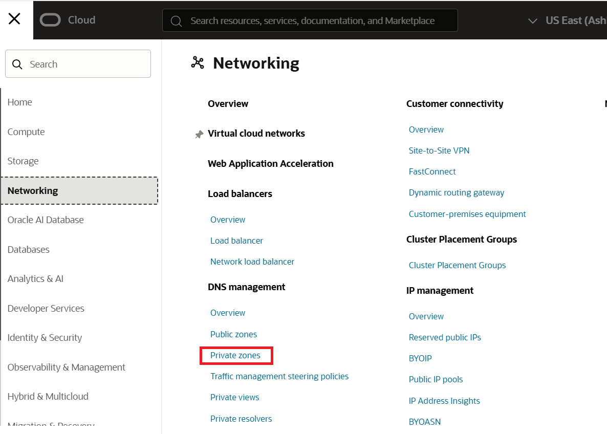
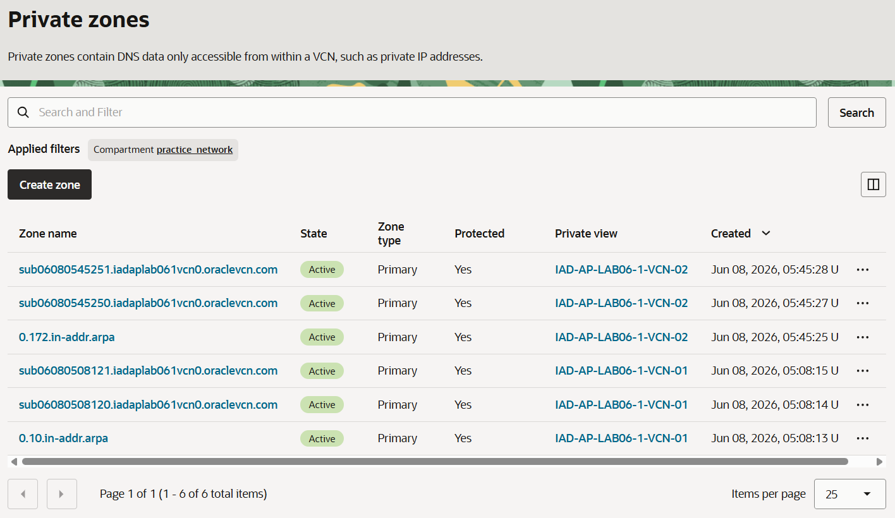
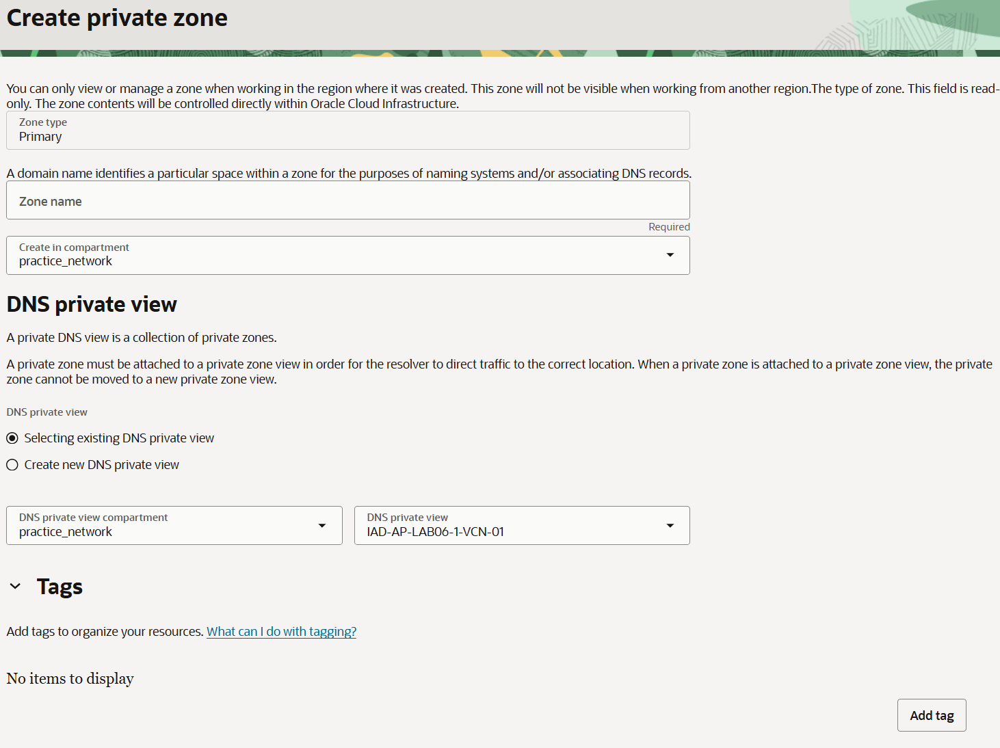
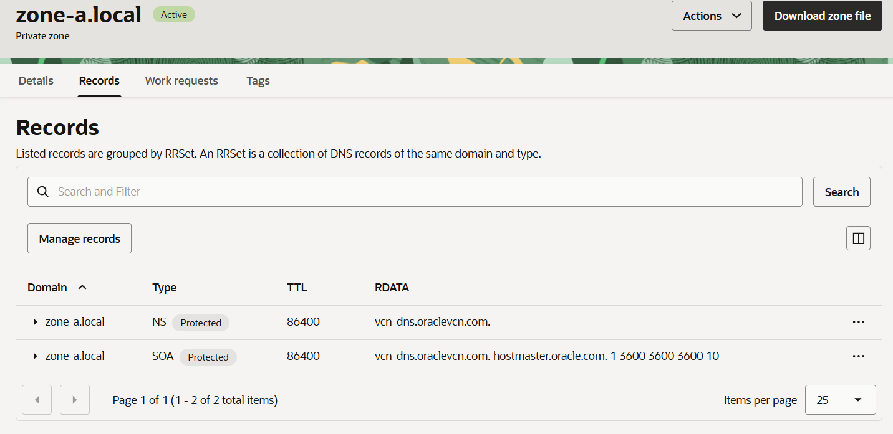
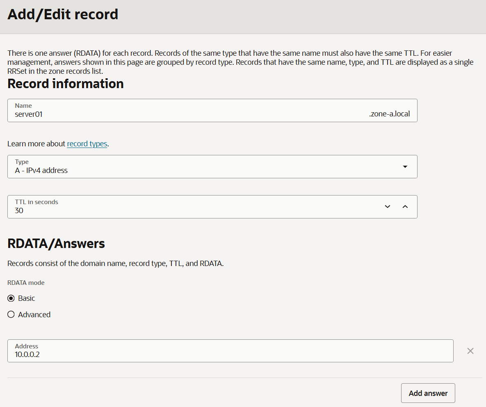
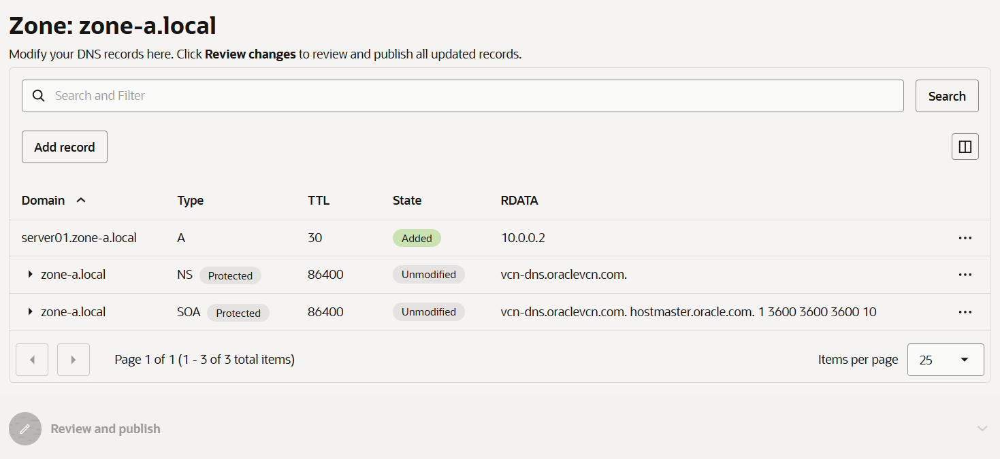

= 연습 2: zone-a.local 사용자 지정 프라이빗 영역 생성

프라이빗 DNS 영역(Private DNS zone)에는 프라이빗 IP 주소와 같이 가상 클라우드 네트워크(VCN) 내부에서만 액세스할 수 있는 DNS 데이터가 포함됩니다. 프라이빗 DNS 영역은 인터넷 DNS 영역과 유사한 기능을 갖추고 있지만, VCN을 통해 해당 영역에 접근할 수 있는 클라이언트에 대해서만 응답을 제공합니다. 이 실습에서는 프라이빗 영역과 레코드를 생성하게 됩니다. 이후에는 이를 활용하여 VCN 리졸버(resolver)를 다뤄보고, 다른 VCN과 연결된 영역에서 레코드를 조회해 보는 실습을 진행할 것입니다.

아래 절차에 따릅니다.

1. OCI 콘솔에서, 왼쪽 위의 햄버거 메뉴를 클릭하고 **Networking** -> **DNS Management** -> **Private Zone**을 클릭합니다. 
+

2. 서브넷에 자동으로 생성된 private zone을 확인합니다.
+

3. **Create Zone** 버튼을 클릭하고 아래와 같이 정보를 입력합니다.
* **Zone name**: `zone-a.local`
* **Create in compartment**: `practice_network`
* **DNS private view** 구역에서:
** **Selecting existing DNS private view** 선택
** **DNS private view compartment**: `practice_network`
** **DNS private view**: `IAD-AP-LAB06-1-VCN-01`

+

4. **Create** 버튼을 클릭합니다.
5. Zone이 생성되면, **Record**탭을 클릭하여 자동으로 생성된 NS와 SOA 레코드를 확인합니다.
+

6. **Records** 페이지에서, **Manage records** 버튼을 클릭합니다.
7. 아래와 같이 Record를 추가합니다.
* **Name** `server01`
* **Type**: `A - IPv4 address`
* **TTL in seconds**: 30
* **Address**: 10.0.0.2

+

8. **Save Changes** 버튼을 클릭합니다.
9. **Zone: zone-a.local** 페이지 생성된 레코드를 확인하고 **Review Changes** 버튼을 클릭합니다.
+

10. **Publish changes** 버튼을 클릭합니다.

---

다음: link:./03_zone-b_custom_private_zone.adoc[zone-b.local 사용자 지정 프라이빗 영역 생성]