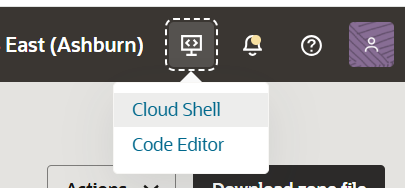

= 연습 4: 연관된 영역을 위한 인스턴스 테스트

다음으로, 생성한 인스턴스에 55H로 로그인하여 DNS 레코드와 VCN에 연결된 영역 및 프라이빗 뷰에 따라 레코드가 어떻게 표시되는지 확인합니다. zone-a-local과 zone-b.local 모두 생성되었지만, zone-a.local에 대한 VCN에만 리졸버와 Vlew가 구성되어 있다는 점에 유의하십시오.

아래 절차에 따릅니다.

1. 오른쪽 위애서 **Developer tool** 버튼을 클릭하고 **Cloud Shell**을 클릭합니다.
+

2. 이전 연습에서 생성한 VM 인스턴스의 public ip를 사용하여, Private SSH키를 사용하여 접속합니다.
+
----
$ ssh -i <private_ssh_key> opc@<public ip>
----

3. server01.zone-a.local을 찾습니다.
+
----
$ host server01.zone-a.local
----
+
아래와 같은 응답을 보게 됩니다:
+
----
server01.zone-z.local has address 10.0.0.1
----

4. zone의 authority recoard를 찾습니다:
+
----
host -t SOA zone-a.local
----
+
아래와 같은 응답을 보게 됩니다:
+
----
zone-a.local has SOA record vcn-dns.oraclevcn.com. hostmaster.oracle.com. 2 3600 3600 3600 10
----

5. server01.zone-b.local을 찾습니다.
+
----
$ host server01.zone-ㅠ.local
----
+
아래와 같은 응답을 보게 됩니다:
+
----
Host server01.zone-b.local not found: 3(NXDOMAIN)
----

이는 zone-b가 VCN의 어떤 뷰와도 연결되어 있지 않다는 것을 의미합니다. colud 셸을 종료합니다.

---

다음: link:./05_vcn_resolver.adoc[다른 Private view를 추가하여 VCN Resolver 구성]

