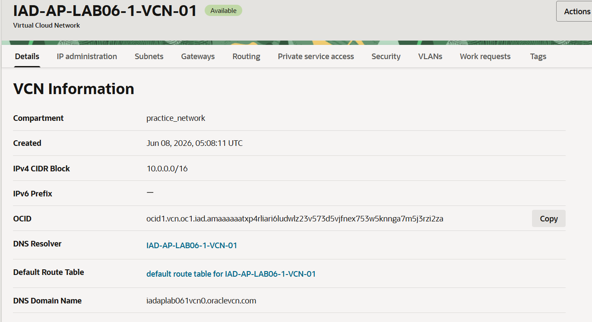
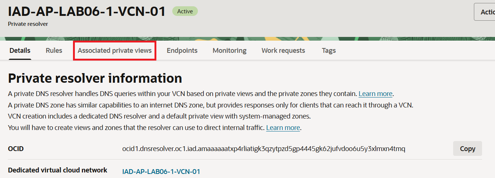
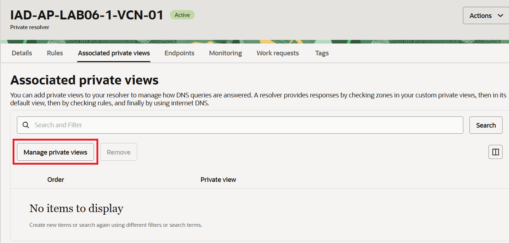
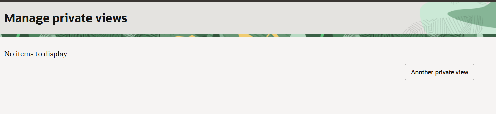

= 연습 5: 다른 Private view를 추가하여 VCN Resolver 구성

이제 다른 VCN에 대한 Private view를 추가하여 resolver를 구성합니다. 아래 절차에 따릅니다.

1. OCI 콘솔에서, 왼쪽 위의 햄버거 메뉴를 클릭하고 **Networking**을 클릭한 후 **Virtual Cloud Networks**를 클릭합니다.
2. `IAD-AP-LAB06-1-VCN-01` VCN을 클릭합니다.
3. **VCN Information** 페이지에서, **DNS Resolver** 열의 `IAD-AP-LAB06-1-VCN-01` 을 클릭합니다.
+

4. **Private Resolver information** 페이지에서, **Associate private views** 탭을 클릭합니다.
+

5. **Manage private views** 버튼을 클릭합니다.
+

6. **Manage privatwe views** 페이지에서, **Another private view** 버튼을 클릭합니다.
+

7. 아래와 같이 정보를 입력하고 **Save changes** 버튼을 클릭합니다.
* **Choose a private view compartment**: 이전 연습에서 생성한 `practice_network` 컴파트먼트
* **Choose a private view**: `IAD-AP-LAB06-1-VCN-02`

NOTE: Private resolver 세부 정보 페이지의 상태가 'Updating'에서 'Active'으로 변경될 때까지 기다랍니다.

---

다음: link:./06_test.adoc[연관된 영역을 위한 인스턴스 테스트]

