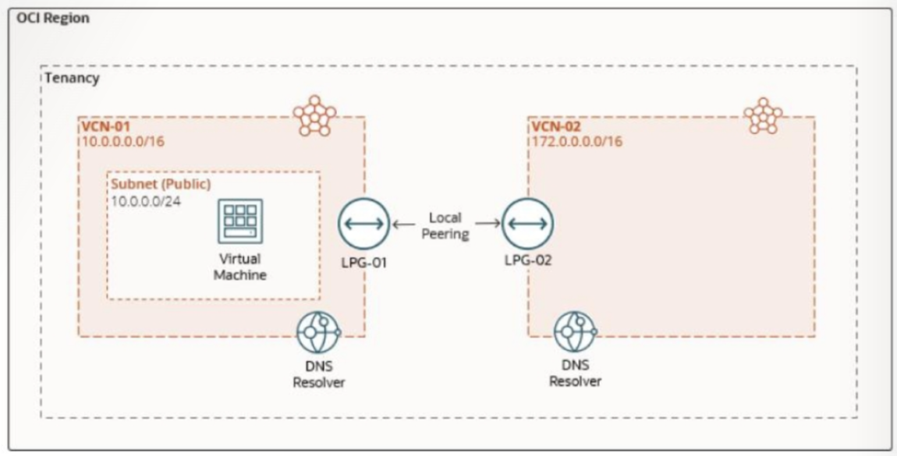

= Lab 03: 실제 네트워크 아키텍처 설계 및 구현: 프라이빗 DNS 영역, 뷰 및 리졸버 구성

이 연습은 아래와 같은 시나리오로 진행됩니다:

고객은 OCI에서 개인 자산을 관리하고 VCN 간, 그리고 VCN과 온프레미스 네트워크 간의 DNS 확인을 지원하기 위해 자체적인 개인 DNS 도메인 이름을 지정하고자 합니다. 개인 DNS를 사용하면 다음과 같은 작업을 수행할 수 있습니다.

* 원하는 이름으로 개인 DNS 영역을 생성하고 개인 리소스에 대한 레코드를 생성합니다.
* 다른 개인 네트워크와의 DNS 확인을 위한 개인 DNS 확인자를 생성합니다.
* oraclevcn.com과 같은 사용자 지정 개인 영역 및 시스템 생성 영역에 대한 쿼리를 확인합니다.
* DNS 보기를 확인하고 스플릿 호라이즌 환경에 대한 조건부 포워딩을 구현합니다.

이 연습에서, 아래와 같은 작업을 수행합니다:

a. Private zone을 생성합니다.
b. VCN resolver를 설정합니다.
c. 다른 private view를 추가하도록 VCN 리졸버를 구성합니다.

== 목차

1. link:./01_setup.adoc[환경 설정]
2. link:./02_zone-a_custom_private_zone.adoc[zone-a.local 사용자 지정 프라이빗 영역 생성]
3. link:./03_zone-b_custom_private_zone.adoc[zone-b.local 사용자 지정 프라이빗 영역 생성]
4. link:./04_test.adoc[연관된 영역을 위한 인스턴스 테스트]
5. link:./05_vcn_resolver.adoc[다른 Private view를 추가하여 VCN Resolver 구성]
6. link:./06_test.adoc[연관된 영역을 위한 인스턴스 테스트]