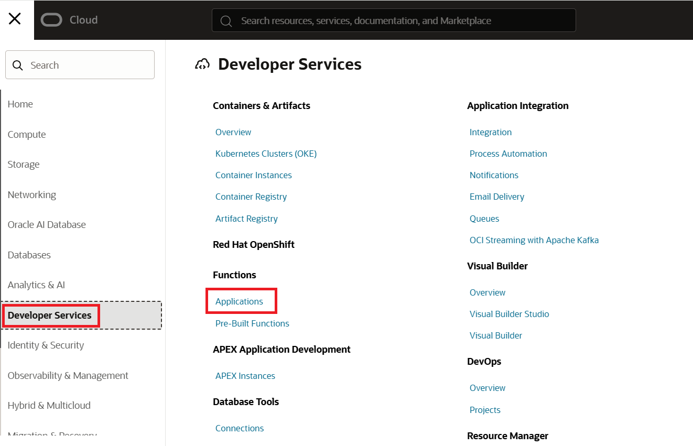
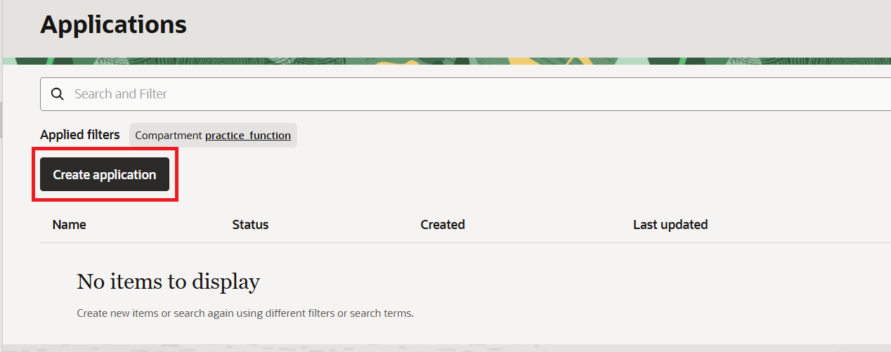
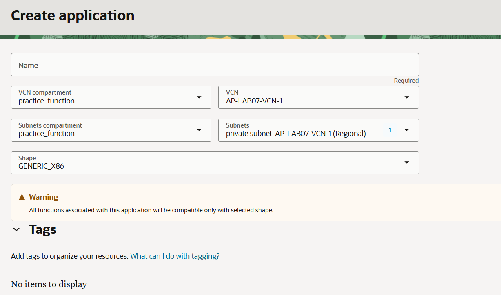

= 연습 1: VCN과 Function 애플리케이션 생성

Serverless Function은 OCI 함수 애플리케이션에 배포되며, 이 애플리케이션은 특정 VCN에 속한 하나에서 세 개의 서브넷에서 함수를 실행하도록 구성해야 합니다. 이 부분에서는 새 VCN이 필요하다고 가정합니다.

인터넷 연결 마법사를 사용하여 지역 공용 서브넷, 지역 개인 서브넷, 인터넷 게이트웨이, NAT 게이트웨이 및 서비스 게이트웨이를 포함하는 새 VCN을 생성합니다. 또한 마법사는 두 서브넷에 대한 기본 보안 목록 규칙을 설정합니다.

아래 절차에 따릅니다.

== 컴파트먼트 생성

이 연습에서 사용하는 모든 리소스를 한 구획(Compartment)에서 사용하기 위해, **practice_nsg** 라는 이름의 컴파트먼트를 생성합니다. 아래 절차에 따릅니다.

1. OCI 콘솔에서 태넌시와 컴파트먼트에 로그인합니다.
2. 왼쪽 위의 햄버거 버튼을 클릭하고 **Identity & Security**를 클릭합니다.
3. Identity & Security 메뉴에서 **Identity** 구역의 **Compartments**를 클릭합니다.
4. **Compartment** 페이지에서 **Create Compartment** 버튼을 클릭합니다.
5. **Create Compartment** 페이지에서 아래와 같이 정보를 입력하고 오른쪽 아래의 **Create Compartment** 버튼을 클릭합니다.
* **Name**: `practice_function`
* **Description**: `Serverless Function 실습을 위한 컴파트먼트`
* **Parent compartment**: _루트 컴파트먼트 (태넌시 이름 (root) 로 표시됨)_
6. 생성된 컴파트먼트를 확인합니다. 루트 컴파트먼트의 Subcompartments 숫자가 하나 증가된 것도 확인합니다.

== VCN 생성

1. OCI 콘솔애서, 왼쪽 위의 햄버거 버튼을 클릭하고 **Networking**을 클릭합니다.
2. **Virtual cloud networks** 를 클릭합니다.
3. **Applied filters**에서 위에서 생성한 `practice_function` 컴파트먼트를 선택합니다.
4. **Actions** 드롭다운 리스트를 클릭하고 **Start VCN Wiard**를 클릭합니다.
5. **Create VCN with Internet Connectivity**를 클릭하고, **Start VCN Wizard**를 클릭한 후 아래 정보를 입력합니다.
* **VCN Name**: `AP-LAB07-VCN-1`
* **Compartment**: `practice_network` 컴파트먼트가 선택된 것을 확인합니다.
* **Configure VCN** 구역의 **VCN IPv4 CIDR Block**: `10.0.0.0/16` (기본값)
* **Configure public subnet** 구역의 **IPv4 CIDR block**: `10.0.0.0/24` (기본값)
* **Configure private subnet** 구역의 **IPv4 CUDR block**: `10.0.1.0/24` (기본값)
* 나머지 값은 모두 기본값으로 유지

6. **Next** 버튼을 클릭합니다.
7. OCI VCN 마법사가 생성할 리소스 목록을 검토하고 이해하십시오. 마법사는 VCN IP 주소와 공용 및 사설 서브넷에 대한 CIDR 블록 범위를 구성합니다. 또한 VCN에 대한 기본 액세스를 활성화하기 위해 보안 목록 규칙과 라우팅 테이블 규칙을 설정합니다.
8. **Create** 버튼을 클릭합니다.
9. 생성이 완료되면, **View VCN** 버튼을 클릭합니다.

== Function Application 생성

1. OCI 콘솔에서 왼쪽 위의 햄버거 메뉴를 클릭하고 **Developer Service**를 클릭한 후 **Function** 구역의 **Application**을 클릭합니다.
+

2. **Applications** 페이지에서, **Create Application**을 클릭합니다.
+

3. **Create Application** 페이지에서, 아래와 같이 정보를 입력합니다.
* **Name**: `DP-APP`
* **VCN Compartment**: 위에서 생성한 `practice_function`
* **VCN**: 위에서 생성한 `AP-LAB07-VCN-1`
* **Subnets compartment**: 위에서 생성한 `practice_function`
* **Subnets**: `private subnet-AP-LAB07-1-VCN-1 (Regional)`
* **Shape**: `GENERIC_X86`

+

4. **Create** 버튼을 클릭합니다.

---

다음: link:./02_create_ocir.adoc[OCIR에 Private Repositor를 생성하고 접속을 위한 Cloud Shell 설정]