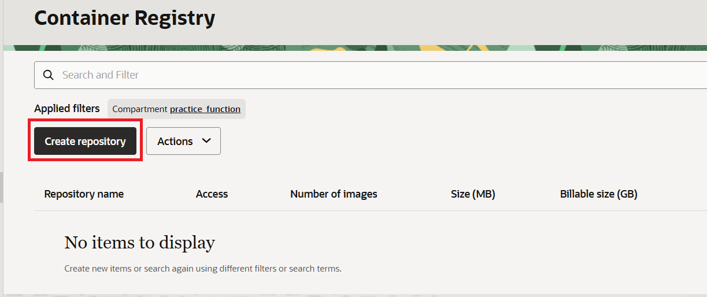
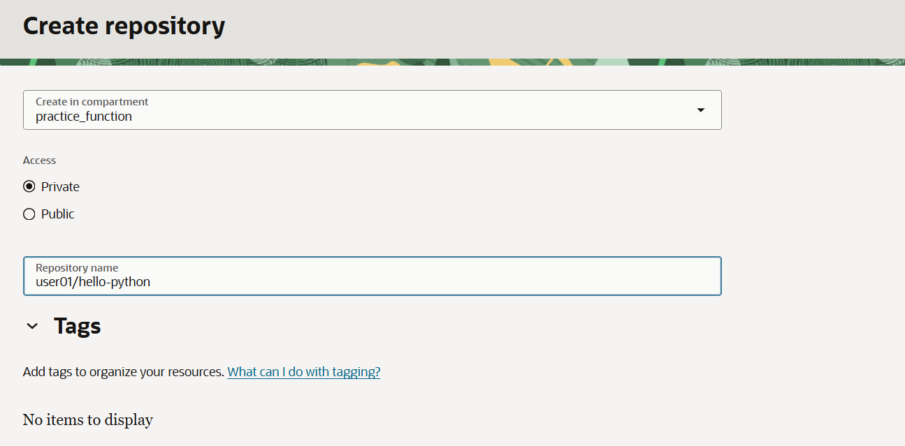
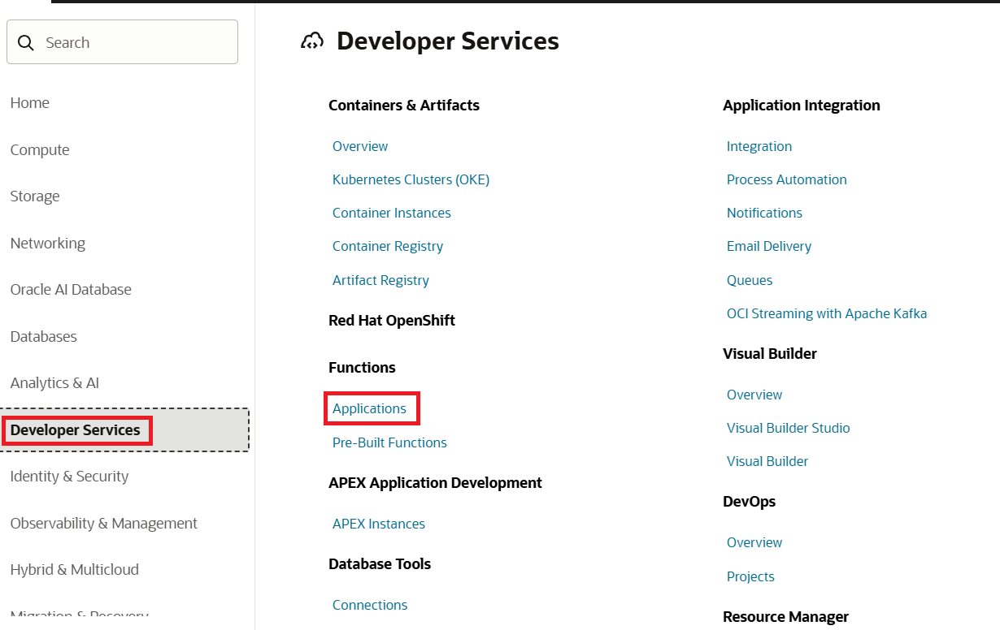
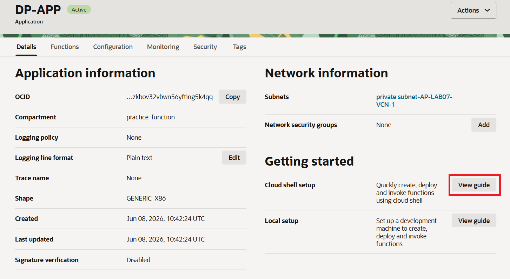
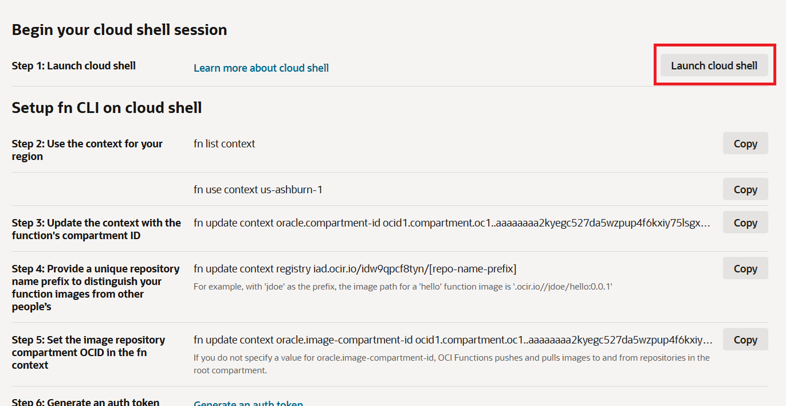
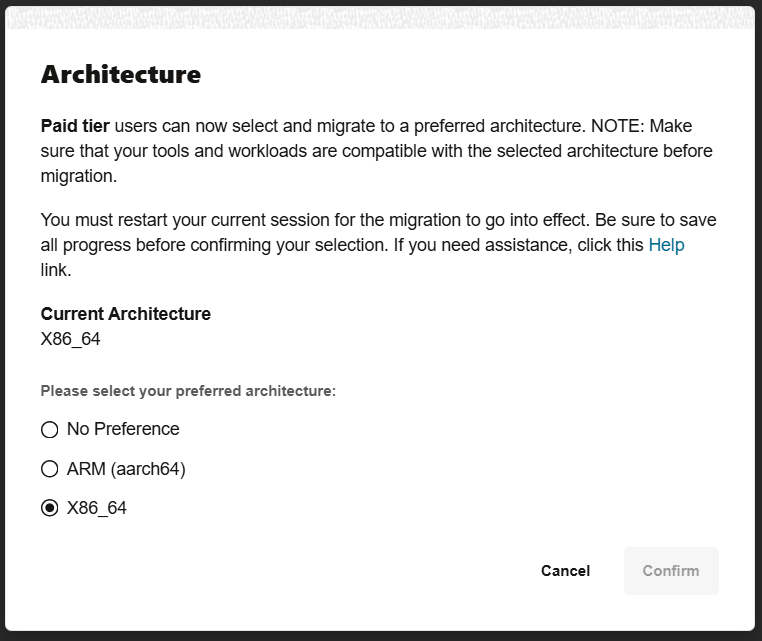
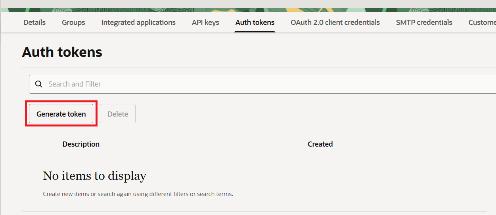
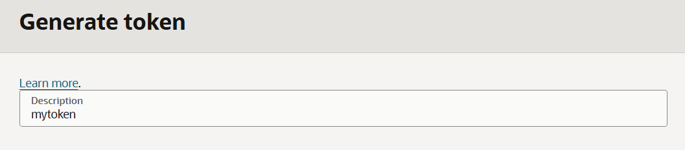
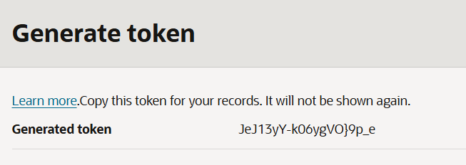

= 연습 2: OCIR에 Private Repositor를 생성하고 접속을 위한 Cloud Shell 설정

Function 코드가 포함된 컨테이너 이미지를 업로드하고 배포하기 전에, 함수 애플리케이션과 동일한 OCI 리전 내에 있는 개인 저장소를 컨테이너 레지스트리에 지정해야 합니다.

아래 절차에 따릅니다.

1. OCI 콘솔에서, 왼쪽 위의 햄버거 메뉴를 클릭하고 **Developer Service**를 클릭하고, **Containers & Artifacts** 구역의 **Container Registry**를 클릭합니다.
+
image:./images/02/image01.png[width=550]

2. **Create Repository** 버튼을 클릭합니다.
+

3. **Create repository** 페이지에서, 아래 정보를 입력합니다.
* **Create in compartment**: 이전 연습에서 생성한 `practice_function`
* **Access**: `Private` 선택
* **Repository name**: `<userID>/hello-python` (여기서는 <userID>를 `user01` 로 지정합니다.)

+

4. **Create** 버튼을 클릭합니다.

5. OCI 콘솔에서, 왼쪽 위의 햄버거 메뉴를 클릭하고 **Developer Service**를 클릭하고, **Functions** 구역의 **Applications**를 클릭합니다.
+

6. **DP-APP**을 클릭하고, **Getting started** 구역의 **Cloud shell setup**의 **View guide** 버튼을 클릭합니다.
+

7. **Cloud shell setup** 페이지에서, **Launch cloud shell** 버튼을 클릭합니다. Cloud shell이 실행됩니다.
+

+
NOTE: Cloud Shell이 실행되는데는 최대 60초가 소요될 수 있습니다.

8. Cloud shell의 왼쪽 위에서 **Actions** 드롭다운 상자를 클릭하고 **Architecture**를 클릭합니다.
+
image:./images/02/image07.png[width=450]

9. **X86_64**가 선택되어 있는 것을 확인합니다. **X86_64**가 선택되지 있지 않으면, **X86_64**를 선택하고 **Confirm and Restart** 버튼을 클릭합니다.
+

10. 콘솔에서 아래로 스크롤하여 Cloud Shell의 **Setup fn CLI on cloud shell**에 나열된 일련의 명령어를 빠르게 익히세요. 다음 단계에서는 나열된 명령어 중 일부만 실행합니다. 나열된 명령어 오른쪽에 있는 복사 링크를 참고하세요. 이 링크를 클릭하고 복사한 명령어를 Cloud Shell에 붙여넣어 다음 단계를 실행합니다.
11. **Step 2. Use the context for your region** 단계의 명령어를 차례로 복사하여 실행합니다. **Copy** 버튼을 누르면 명령어가 복사됩니다.
+
----
$ fn list context
CURRENT NAME            PROVIDER        API URL                                                 REGISTRY
        default         oracle-cs
*       us-ashburn-1    oracle-cs       https://functions.us-ashburn-1.oci.oraclecloud.com      iad.ocir.io/idw9qpcf8tyn/sanghoonkim
$ fn use context us-ashburn-1

Fn: Context us-ashburn-1 currently in use

See 'fn <command> --help' for more information. Client version: 0.6.41
----

12. **Step 3: Update the context with the function's compartment ID** 단계를 실행합니다. **Copy** 버튼을 누르면 명령어가 복사됩니다.
+
----
$ fn update context oracle.compartment-id ocid1.compartment.oc1..aaaaaaaa2kyegc527da5wzpup4f6kxiy75lsgx56fxxxxxxxxxxxx
Current context updated oracle.compartment-id with ocid1.compartment.oc1..aaaaaaaa2kyegc527da5wzpup4f6kxiy75lsgx56fxxxxxxxxxxxx
----

13. **Step 4: Provide a unique repository name prefix to distinguish your function images from other people's** 단계를 실행합니다. repo-name-prefix를 위에서 설정한 Repository name의 prefix인 user01을 대체하여 실행합니다.
+
----
$ fn update context registry iad.ocir.io/idw9qpcf8tyn/user01
Current context updated registry with iad.ocir.io/idw9qpcf8tyn/user01
----

14. **Step 5: Generate Auth Token** 단계를 수행합니다.
a. **Generate an Auth Token** 링크를 마우스 오른쪽 클릭하고 새 탭에서 열기를 클릭합니다.
b. **Auth tokens** 탭을 클릭하고 **Generate token** 버튼을 클릭합니다.
+

c. **Generate token** 페이지에서 **Description**에 `mytoken` 이라고 입력하고 오른쪽 아래의 **Generate token** 버튼을 클릭합니다.
+

d. 토큰이 생성됩니다. 토큰 값을 복사하여 적당한 메모장에 붙여놓고 기억합니다. ( `JeJ13yY-k06ygVO}9p_e` )
+

+
WARNING: 이 토큰은 콘솔에서 다시 발급받을 수 없으며, 읽을 수도 없습니다. 그러므로 이 값은 다음번 사용을 위해 반드시 저정해야 합니다. 토큰을 복사-붙여넣기 해서 저장한 다음에는 close 버튼 클링허여 **Generate token** 페이지를 닫고, 브라우저 탭을 닫습니다.

15. 이전 탭으로 돌아가서, **Step 7: Log into toe registry using the auth token as your password** 단계를 실행합니다. **Copy** 버튼을 누르면 명령어가 복사됩니다. 명령 실행후 Password로 위에서 생성한 token을 붙여넣고 로그인합니다. (붙여넣은 토큰은 화면에 출력되지 않습니다)
+
----
$ docker login -u 'idw9qpcf8tyn/sanghoon.k.kim@oracle.com' iad.ocir.io
Password: 
Login Succeeded!
----

16. **Setup fn CLI on Cloud Shell**의 다른 명령은 실행하지 않습니다.

---

다음: link:./03_build_deploy.adoc[Function 컨테이너를 빌드하고 배포, 테스트]

