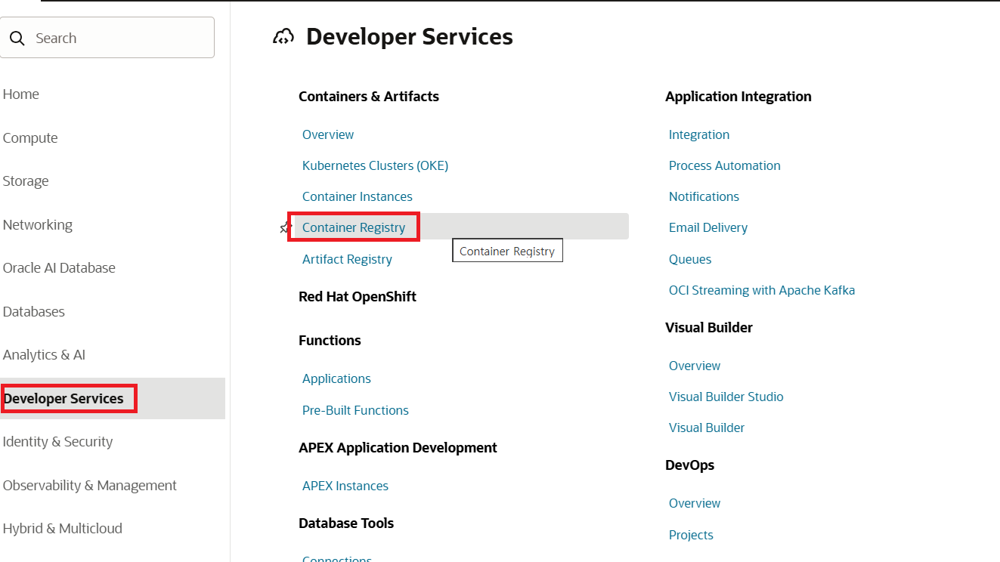
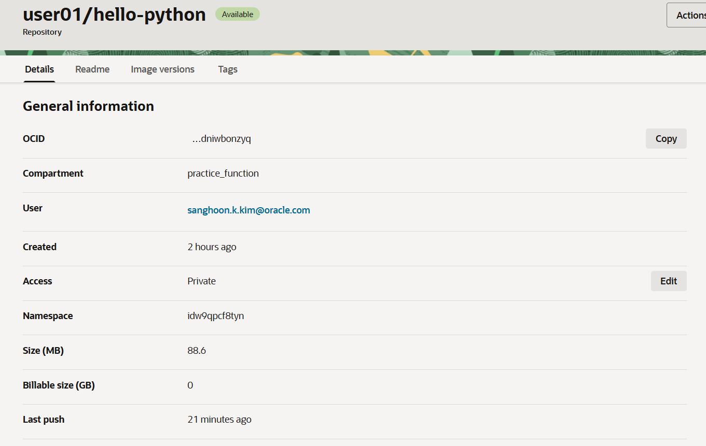
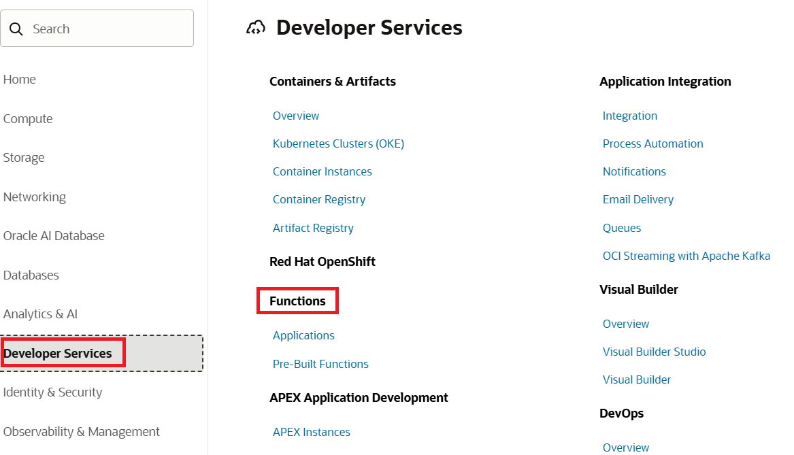
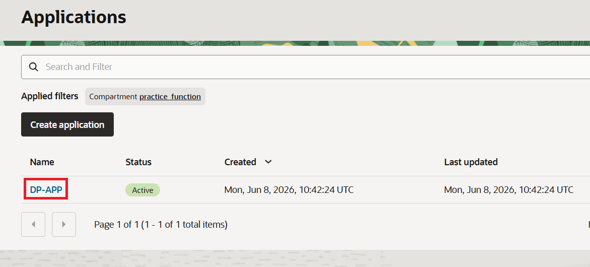
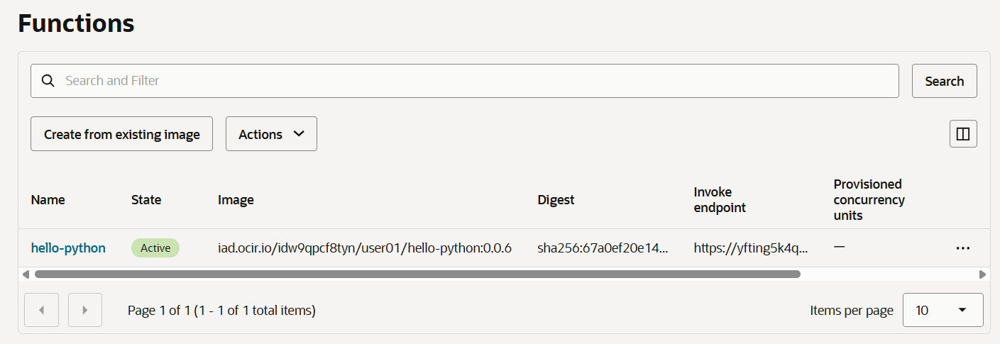
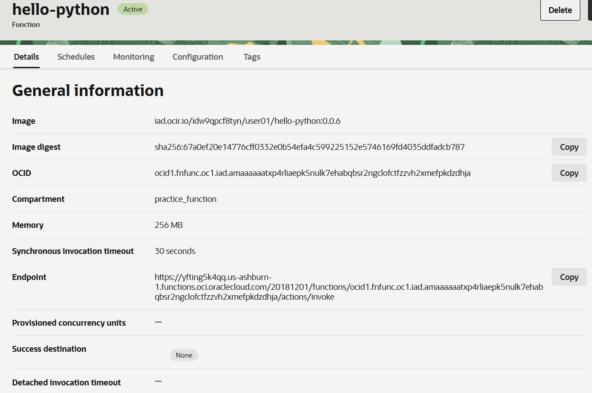

= 연습 3: Function 컨테이너를 빌드하고 배포, 테스트

Function 코드는 GitHub 리포지토리에서 다운로드 하여 사용할 수 있습니다. 여기에서는 Cloud Shell VM으로 파일을 가져와 fn 명령어를 사용하여 Function을 빌드하고 배포합니다.

아래 절차에 따릅니다.

1. Cloud Shell에서, 아래 명령을 실행하여 labs라는 이름의 디렉토리를 만들고 이동합니다.
+
----
$ mkdir labs
$ cd labs
----

2. 아래 명령을 실행하여 Python Function을 포함하는 GitHub 리포지토리를 복제합니다.
+
----
$ git clone https://github.com/ou-developers/oci-functions
----

3. 아래 명령을 실행하여 **hello-python** function 코드가 있는 디렉토리로 이동합니다.
+
----
$ cd oci-functions/hello-python
----

4. `fn deploy` 명령을 사용하여 function 컨테이너 이미지를 빌드하고 리포지토리에 추가합니다. (60초 정도 소요됩니다)
+
----
$ fn -v deploy --app DP-APP
----
+
NOTE: fn inspect context 명령을 실행한 후, `oracle.compartment-id` 와 `oracle.image-compartment-id` 값이 같아야 합니다.
아래와 같은 경우, `Message: Repository already exists.` 오류가 발생할 수 있습니다. +
`oracle.compartment-id: ocid1.compartment.oc1..aaaaaaaa2kyegc527da5wzpup4f6kxiy75lsgx56fbpf7armh4u7ym3xlytq` +
`oracle.image-compartment-id: ocid1.compartment.oc1..aaaaaaaawmxze7wkl45xvwkb6zd6elyfmqdviprhuip3lbjfknexl5ppmhmq` +
이 경우, `fn update context oracle.image-compartment-id ocid1.compartment.oc1..aaaaaaaa2kyegc527da5wzpup4f6kxiy75lsgx56fbpf7armh4u7ym3xlytq` 명령으로 `oracle.image-compartment-id`` 값을 변경할 수 있습니다.

5. 배포에 성공하면, 아래 명령을 실행하여 Function을 호출합니다. (이 명령에는 30초 정도 수행됩니다.)
+
----
$ fn invoke DP-APP hello-python
----

6. 호출에 성공하면, 아래와 같은 결과가 표시됩니다.
+
----
{"message": "Hello World"}
----

7. 제대로 배포 되었는지 한번 더 확인하기 위해, OCI 콘솔의 오른쪽 위해서 햄버거 메뉴를 클릭하고 **Developer Service**를 클릭합니다. **Container & Artifact**  아래에서 **Container Registry**를 클릭합니다.
+

8. 생성된 리포지토리를 클릭하고 정보를 확인합니다.
+

9. OCI 콘솔의 오른쪽 위해서 햄버거 메뉴를 클릭하고 **Developer Service**를 클릭한 후 **Functions**를 클릭합니다.
+

10. **Applications** 페이지에서 **DP-APP**을 클릭합니다.
+

11. DP-APP 페이지에서 **Functions** 탭을 클릭합니다.
12. hello-python 함수의 이미지, 이미지 요약 및 호출 부분을 확인합니다.
+

13. **Hello-python**을 클릭하고 정보를 확인합니다.
+

연습이 종료되었습니다. link:../05_api_gateway/readme.adoc[다음 연습]을 위해 환경을 삭제하지 않습니다.