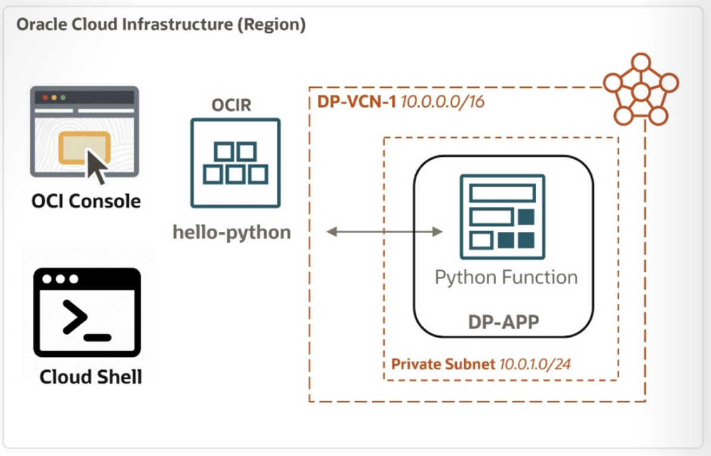

= Lab 04: 클라우드 네이티브, 마이크로서비스 및 서버리스 아키텍처 설계: Oracle Function 구축 및 배포

이 연습에서는, Python으로 작성된 샘플 서버리스 함수를 빌드하여 Oracle Functions에 배포합니다. 실습은 다음 세 단계로 구성됩니다.

1. VCN(Virtual Cloud Network) 및 Functions 애플리케이션 생성.
2. OCIR에 프라이빗 리포지토리 생성 및 액세스를 위한 Cloud Shell 설정.
3. 함수 컨테이너 빌드 및 배포, 그리고 함수 검증.

== 사전 준비 사항

* OCI tenancy, 컴파트먼트, 사용자 계정
* The code for the Python function has been staged in GitHub at this location: https://github.com/ou-developers/oci-functions

== 목차

연습을 위해, 아래 문서의 절차에 따르십시오.

1. link:./01_create_vcn_function.adoc[VCN과 Function 애플리케이션 생성]
2. link:./02_create_ocir.adoc[OCIR에 Private Repositor를 생성하고 접속을 위한 Cloud Shell 설정]
3. link:./03_build_deploy.adoc[Function 컨테이너를 빌드하고 배포, 테스트]