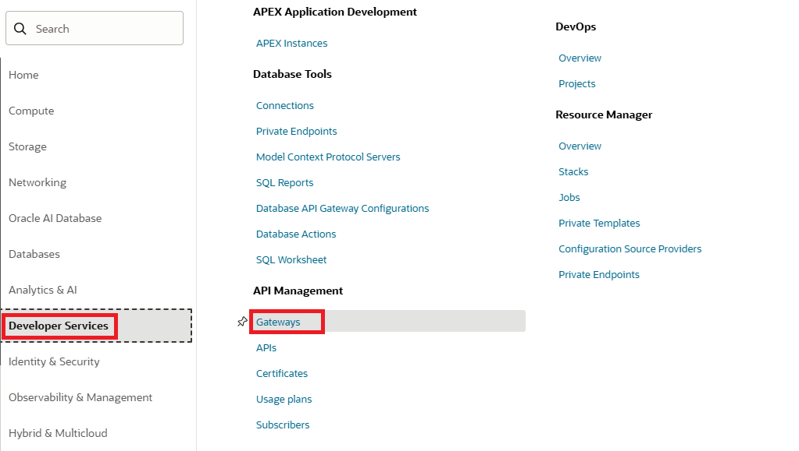
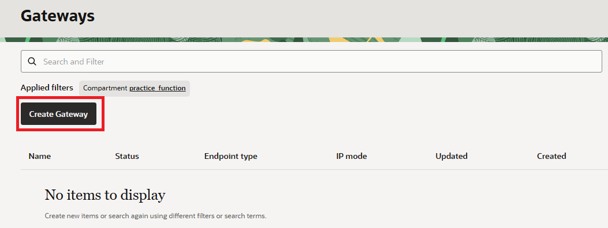
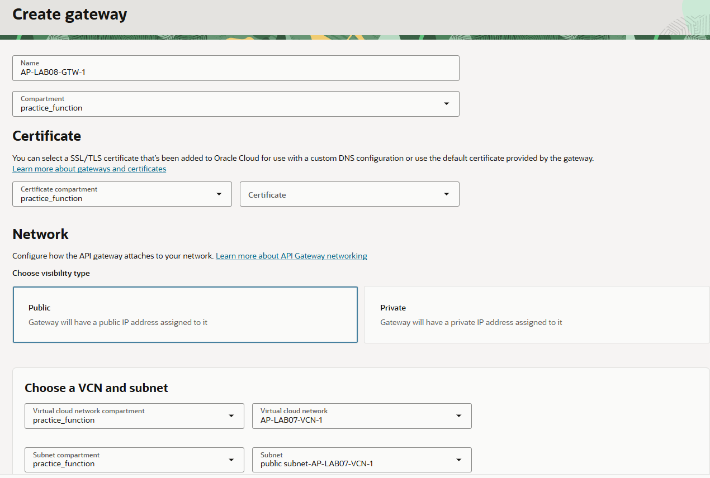

= 연습 1: API Gateway 생성

하나의 API 게이트웨이를 사용하여 여러 백엔드 서비스(예: 로드 밸런서, 컴퓨팅 인스턴스, Oracle Functions)를 하나의 통합 API 엔드포인트로 연결할 수 있습니다.

나중에 하나 이상의 함수를 호출하는 API 게이트웨이 배포를 생성하는 데 사용할 API 게이트웨이를 생성합니다.

아래 절차에 따릅니다.

1. OCI 콘솔에서 태넌시와 컴파트먼트에 로그인합니다.
2. 왼쪽 위의 햄버거 메뉴를 클릭하고 **Developer Services**를 클릭한 후, **API Management** 아래에서 **Gateways**를 클릭합니다.
+

3. **Applied Filter**에서 컴파트먼트를 이전 연습에서 생성한 `practice_function` 으로 선택합니다.
4. **Create Gateway** 버튼을 클릭합니다.
+

5. **Create Gateway** 페이지에서 아래와 같이 정보를 입력합니다.
* **Name**: `AP-LAB08-GTW-1`
* **Type**: `Public`
* **Compartment**: 이전 연습에서 생성한 `practice_function`
* **Virtual Cloud Network**: 이전 연습에서 생성한 `AP-LAB07-VCN-1`
+
이 VCN은 이전 연습인 _클라우드 네이티브, 마이크로서비스 및 서버리스 아키텍처 설계: Oracle Function 구축 및 배포_ 실습에서 생성한 VCN입니다.
* **Subnet**: `public Subnet-AP-LAB07-1-VCN-1`
* 나머지 값은 기본 값으로 유지합니다.

+

6. **Create** 버튼을 클릭합니다.

---

다음: link:./02_create_api_gateway_deployment.adoc[API Gateway Deployment 생성]