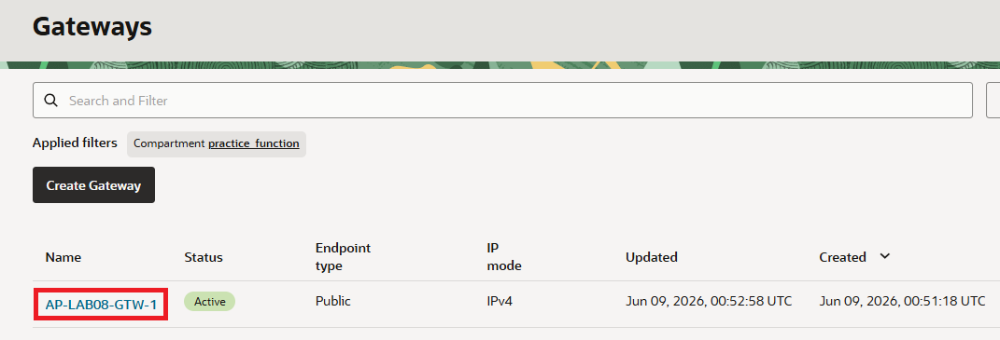
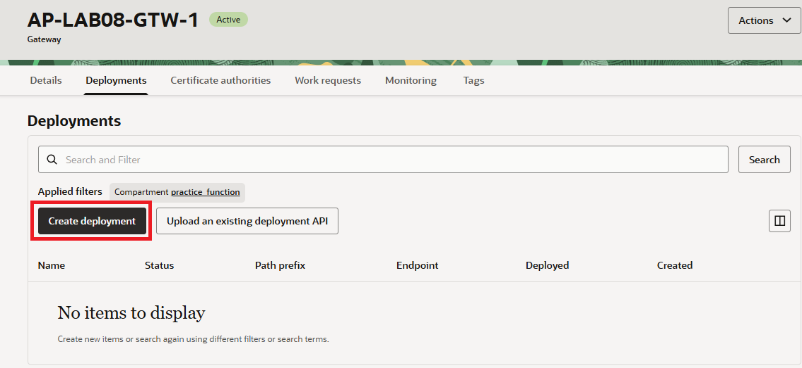
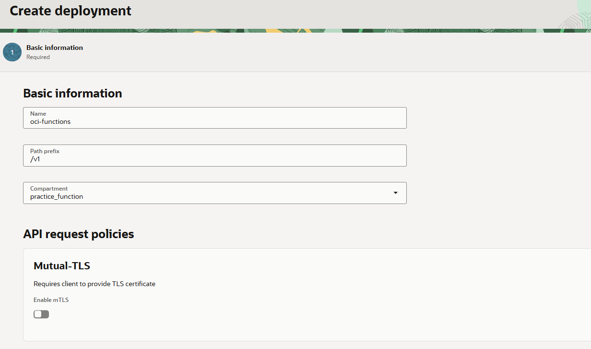
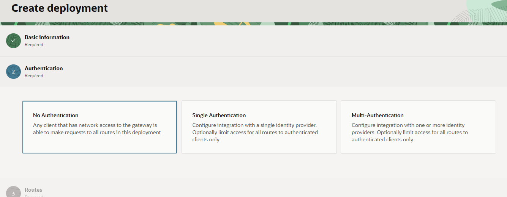
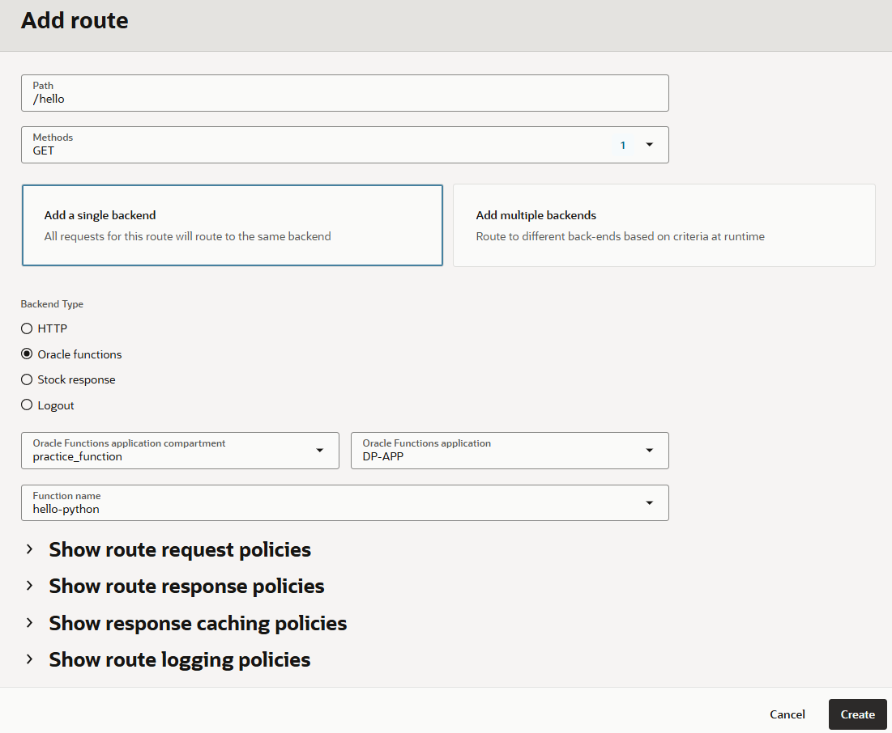
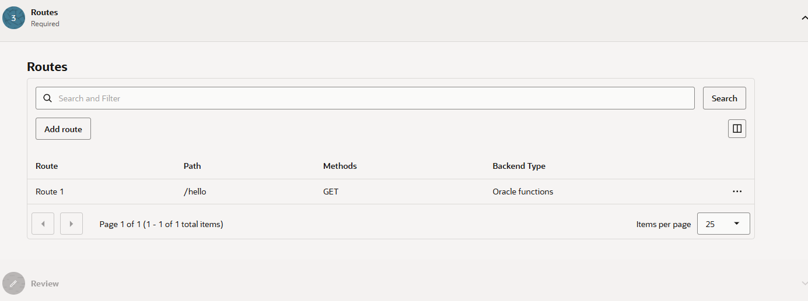
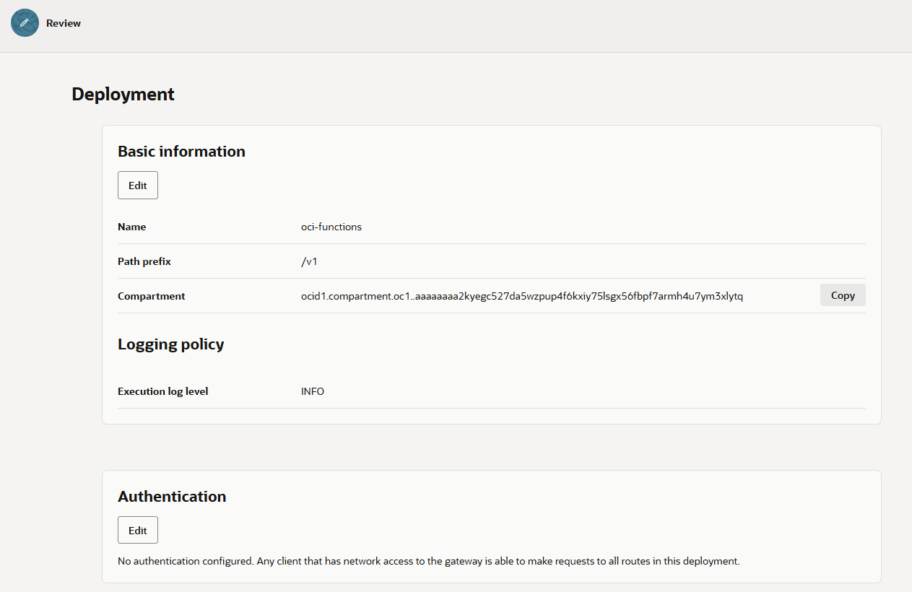
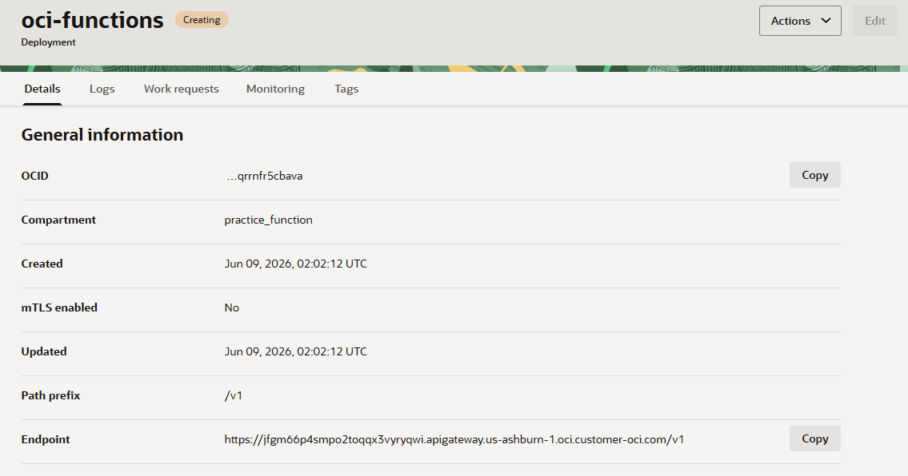

= 연습 2: API Gateway Deployment 생성

API 게이트웨이 서비스를 사용하여 API 게이트웨이를 생성했으므로 이제 Oracle Function에 정의된 서버리스 함수를 호출하는 API 배포를 생성할 수 있습니다.

API Gateway AP-LAB08-1-GTW-1에 대해 oci-functions라는 이름의 새로운 API 배포(Deployment)를 생성합니다. 이때 경로 접두사(Path Prefix)는 **/v1** 를 사용합니다.
그리고 새로운 Route를 생성하여 경로(Path)는 **/hello**, 메서드(Method)는 GET으로 설정하고, 해당 Route가 **hello-python** 함수를 호출하도록 구성합니다.

아래 절차에 따릅니다.

1. **Gateways** 페이지에서, 이전 연습에서 생성한 API Gateway `AP-LAB08-GTW-1` 을 클릭합니다.
+

2. **Gateway Details** 페이지에서, **Deployment** 탭을 클릭하고 **Create deployment** 버튼을 클릭합니다.
+

3. **Create deployment** 페이지에서 아래와 같이 정보를 입력합니다.
* **Name**: `oci-functions`
* **Path Prefix**: `/v1`
+
지정하는 배포 경로 접두사는 하나 이상의 슬래시(/)로 시작해야 하지만 슬래시로 끝나서는 안 됩니다. 영숫자, 대문자 및 소문자, $, -, ., +, !, *, ', (), %, ;, :, @, &, = 등의 특수 문자를 포함할 수 있지만 매개변수와 와일드카드는 포함할 수 없습니다.
* **Compartment**: 이전 연습에서 생성한 `practice_function`

+

4. **Next** 버튼을 클릭하고, **Authentication** 구역에서 **No Authentication**을 선택하여 API 배포의 모든 경로에 인증 없이 액세스할 수 있도록 합니다.
+

5. **Next** 버튼을 클릭하고, **Route** 구역에서 **Add route** 버튼을 클릭합니다. +
여기에서는 API 배포의 경로에 대한 세부 정보를 입력하고 **Route 1**을 편집하여 경로와 하나 이상의 메서드를 백엔드 서비스에 매핑하는 API 배포의 첫 번째 경로를 지정합니다. 아래와 같이 정보를 입력합니다.
* **Path**: `/hello`
* **Method**: `GET`
* **Add a single backend**를 선택
* **Backend Type**: `Oracle functions`
* **Oracle Functions application compartment**: 이전 연습에서 생성한 `practice_function`
* **Oracle Function application**: 이전 연습에서 생성한 `DP-APP`
* **Function name**: 이전 연습에서 생성한 `hello-python`
+

+
각 항목은 아래와 같은 정보를 지정합니다:
* **경로(Path)**: 나열된 메서드를 사용하여 백엔드 서비스를 호출하는 API의 경로를 나타냅니다.
* **메서드(Methods)**: 백엔드 서비스에서 허용하는 하나 이상의 메서드를 나타냅니다.
* **유형(Type)**: 백엔드 서비스의 유형을 나타냅니다.
* **애플리케이션(Application)**: 해당 함수를 포함하는 Oracle Functions 애플리케이션의 이름을 나타냅니다.
* **함수 이름(Function Name)**: Oracle Functions에서 해당 함수의 이름을 나타냅니다.

6. **Add Route** 페이지에서 **Create** 버튼을 클릭합니다.
7. **Create deployment** 페이지에서 생성된 Route를 확인하고 **Next** 버튼을 클릭합니다.
+

8. **review** 단계 페이지에서 정보를 확인하고 **Create** 버튼을 클릭합니다.
+

9. 생성된 API Gateway Deployment를 확인합니다.
+

---

다음: link:./03_validate_policy_state.adoc[API 게이트웨이가 해당 함수에 접근할 수 있도록 허용하는 Policy 검증]