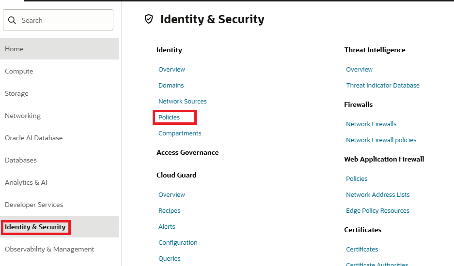
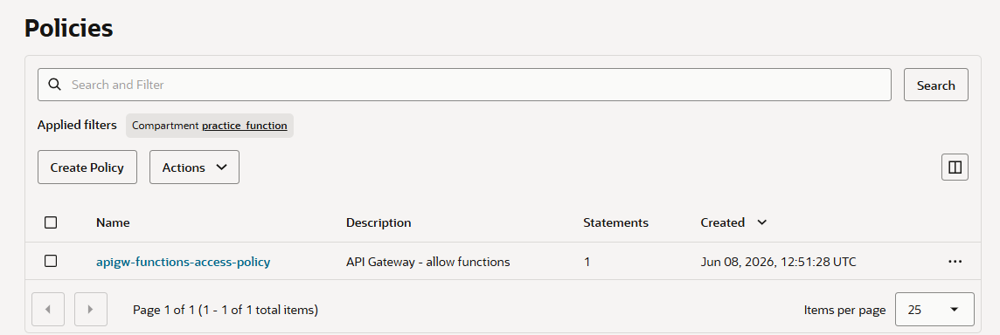

= 연습 3: API 게이트웨이가 해당 함수에 접근할 수 있도록 허용하는 정책문을 검증

이 연습에서는 해당 구획에 Oracle Functions에 액세스하기 위한 a110W5 API 게이트웨이에 대한 IAM 정책 문이 있는지 확인합니다.

아래 절차에 따릅니다.

1. 왼쪽 위의 햄버거 메뉴를 클릭하고 **Identity & Security**를 클릭한 후, **Identity** 구역의 **Policies**를 클릭합니다.
+

2. **Policies** 페이지에서, 작성되어 있는 정책을 클릭합니다.
+

3. **Statements** 탭을 클릭하고, 정책 Statements를 확인합니다. 아래와 유사할 것입니다.
+
----
ALLOW any-user to use functions-family in compartment [compartment_name] where ALL {request.principal.type = 'ApiGateway', request.resource.compartment.id = '[compartment_id]'}
----

4. 정책문에서, 컴파트먼트의 이름과 id가 바로 설정되어 있는지 확인합니다.
5. 만약 정책이 작성되어 있지 않다면, 아래와 같이 정책을 작성합니다.
+
----
ALLOW any-user to use functions-family in compartment [compartment_name] where ALL {request.principal.type = 'ApiGateway', request.resource.compartment.id = '[compartment_id]'}
----

---

다음: link:./04_add_ingress_rule.adoc[Public Subnet을 위한 Ingress 규칙 추가]