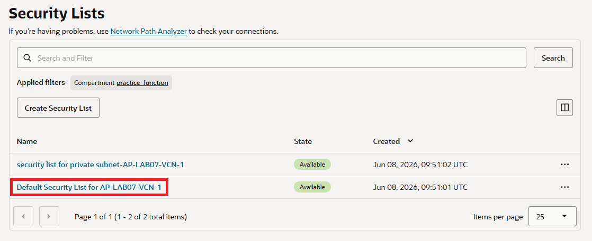
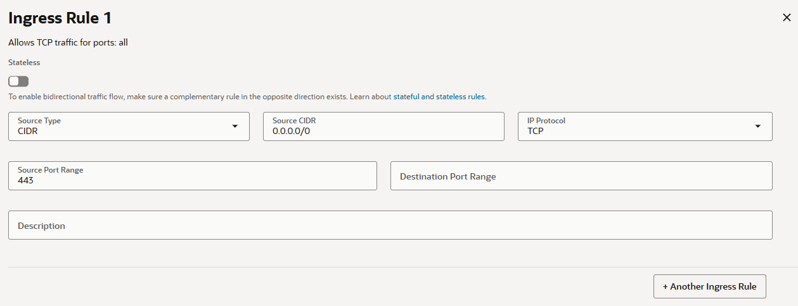
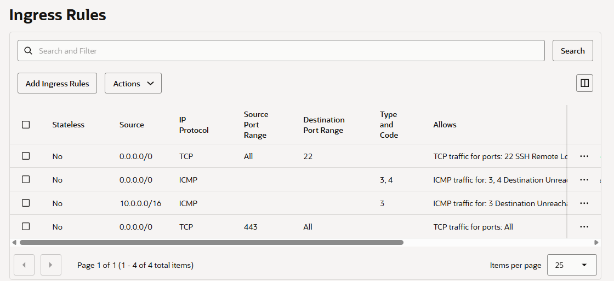

= 연습 4: Public Subnet을 위한 Ingress 규칙 추가

가상 네트워크의 기본 보안 목록에 있는 모든 IP 주소와 포트에서 TCP HTTPS 트래픽(포트 443)을 허용하는 새로운 상태 저장 CIDR 인그레스 규칙을 생성합니다. 이 규칙은 클라우드 셸에서의 액세스도 허용합니다.

아래 절차에 따릅니다.

1. OCI 콘솔에서, 왼쪽 위의 햄버거 메뉴를 클릭하고 **Networking**을 클릭한 후 **Virtual cloud networks**를 클릭합니다.
2. **Virtual Cloud Networks** 페이지에서, 이전 연습에서 생성한 `AP-LAB07-VCN-1` VCN을 클릭합니다.
3. **Security** 탭을 클릭합니다.
4. **Security List** 구역에서 **Default Security List for AP-Lab07-1-VCN-1** 링크를 클릭합니다.
+

5. **Security rules** 탭을 클릭합니다. 
6. **Ingress Rules** 구역에서 **Add Ingress Rules** 버튼을 클릭하고 아래 정보를 입력합니다. Stateful 규칙인지 Stateless 규칙인지 선택하세요. 별도로 지정하지 않는 한 기본적으로 규칙은 상태 저장형입니다.
* **Source Type**: `CIDR`
* **Source CIDR**: `0.0.0.0/0`
* **IP Protocol**: `TCP`
* **Destination Port**: `443`
* 나머지 항목은 기본값으로 유지합니다.

+

7. 오른쪽 아래의 **Add Ingress Rules** 버튼을 클릭합니다.
8. 추가된 Ingress Rule을 확인합니다.
+

---

다음: link:./05_call_function_via_api_gateway_deployment.adoc[API Gateway Deployment를 통해 Function 호출]