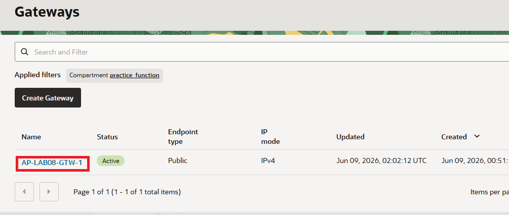
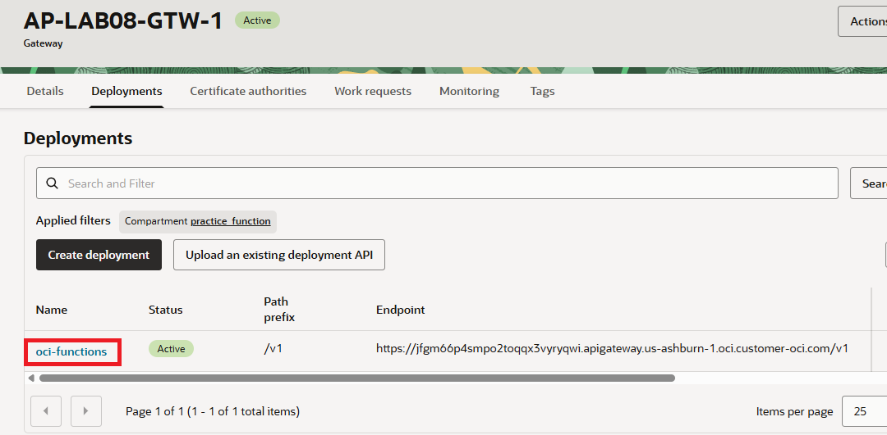
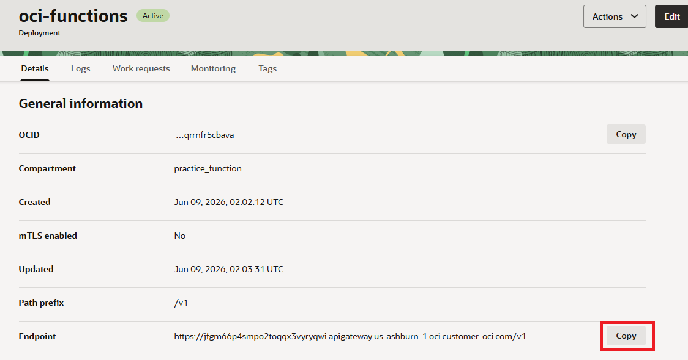
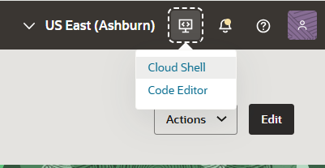

= 연습 5: API Gateway Deployment를 통해 Function 호출

API Gateway와 API Gateway Deployment가 생성되었으면, API Gateway deployment를 통해 Function을 호출할 수 있습니다.

아래 절차에 따릅니다.

1. OCI 콘솔에서, 왼쪽 위의 햄버거 메뉴를 클릭하고 **Developer Services**를 클릭한 후, **API Management** 구역의 **Gateways**를 클릭합니다.
2. 이전 연습에서 생성한 `AP-LAB08-GTW-1` API 게이트웨이를 클릭합니다.
+

3. **Deployments** 탭을 클릭하고, 이전 연습에서 작성한 `oci-functions` API Gateway Deployment를 클릭합니다.
+

4. **oci-functions** 페이지의 **Details** 탭에서, **Endpoint** 열의 **Copy** 버튼을 클릭하여 Endpoint를 복사합니다.
+

5. OCI 콘솔에서, 오른쪽 위의 **Developer Tools**를 클릭하고 **Cloud Shell**을 클릭하여 Cloud Shell을 실행합니다.
+

6. Cloud shell에서, 아래 명령을 실행하여 Function을 호출합니다.
+
----
$ curl <endpoint-url>/hello
----
+
성공적으로 호출되면, 아래와 같은 결과가 표시됩니다:
+
----
{"message": "Hello World"}
----

실습이 완료되었습니다.

---

다음: link:./06_env_clear.adoc[실습에 사용된 리소스 제거]