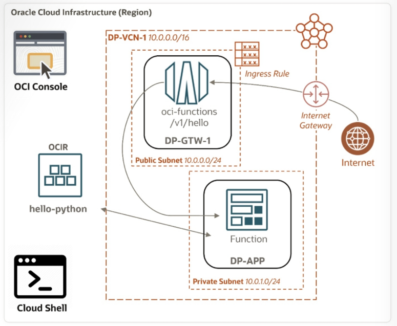

= Lab 05: 클라우드 네이티브, 마이크로서비스 및 서버리스 아키텍처 설계: API Gateway 배포 생성

Oracle Cloud Infrastructure(OCI) API Gateway를 사용하면 복잡한 서명된 HTTP 요청 없이도 OCI Functions를 공용 엔드포인트에 노출할 수 있습니다. 공개적으로 액세스해야 하는 모든 함수는 API Gateway에 API 배포를 생성하고 해당 API 배포의 경로를 Oracle Function 백엔드와 연결하여 간편하게 액세스할 수 있도록 설정할 수 있습니다.

이 실습에서는 이전에 프라이빗 서브넷에 배포된 함수를 API Gateway를 통해 액세스할 수 있도록 노출합니다.

이 연습은 아래와 같은 다섯개의 연습으로 구성되어 있습니다:

a. 새 API Gateway 생성
b. 새 API Gateway 배포 생성
c. API 게이트웨이가 해당 Function에 접근할 수 있도록 허용하는 정책문을 검증
d. 퍼블릭 서브넷에 ingress rule 추가
e. API Gateway 배포를 통한 Function 호출

== 사전 요구사항

* 할당된 OCI 테넌시, 컴파트먼트 및 사용자 자격 증명.
* 이 실습의 작업을 수행하기 위해 동일한 가상 클라우드 네트워크 및 애플리케이션을 사용하려면 이전 실습(Oracle 함수 빌드 및 배포)을 완료해야 합니다.

== 목차

연습을 위해, 아래 문서의 절차에 따르십시오.

1. link:./01_create_api_gateway.adoc[API Gateway 생성]
2. link:./02_create_api_gateway_deployment.adoc[API Gateway Deployment 생성]
3. link:./03_validate_policy_state.adoc[API 게이트웨이가 해당 함수에 접근할 수 있도록 허용하는 Policy 검증]
4. link:./04_add_ingress_rule.adoc[Public Subnet을 위한 Ingress 규칙 추가]
5. link:./05_call_function_via_api_gateway_deployment.adoc[API Gateway Deployment를 통해 Function 호출]