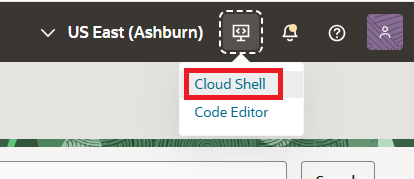
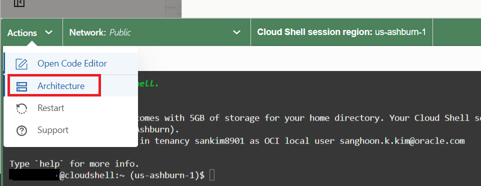
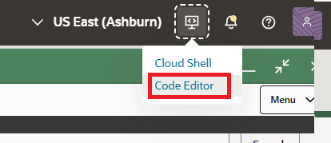
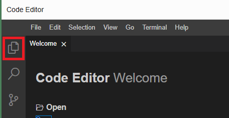
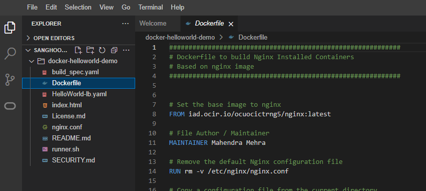

= 연습 1: Dockerfile에 액세스

이 연습에서는 Docker 이미지를 생성하는 데 필요한 Dockerfile에 접근하려면 Git 저장소를 클론합니다.

아래 절차에 따릅니다.

1. OCI 콘솔에서, 오른쪽 위의 **Developer Tools**를 클릭하고 **Cloud Shell**을 클릭하여 Cloud Shell을 실행합니다.
+

2. Cloud shell의 왼쪽 위에서 Actions 드롭다운 상자를 클릭하고 Architecture를 클릭합니다.
+

3. **X86_64**가 선택되어 있는 것을 확인합니다. **X86_64**가 선택되지 있지 않으면, **X86_64**를 선택하고 **Confirm and Restart** 버튼을 클릭합니다.
+
image:./images/01/image03.png[]

* **참고**:  
** 아키텍처 마이그레이션이 성공적으로 완료되면 다음과 같은 알림이 표시됩니다. "Welcome back you have successfully swltched your architecture to X86_64"
** Cloud Shell에서 실행되는 OCI CLI는 Cloud Shell 시작 시 콘솔의 지역 선택 메뉴에서 선택한 지역에 대해 명령을 실행합니다.

4. Cloud Shell에서, 아래 명령을 실행하여 샘플로 사용할 Nginx HelloWorld 애플리케이션을 빌드하기 위한 Docker 이미지를 사용하기 위해 GibHub 리포지토리를 복제(clone)합니다.
+
----
$ git clone https://github.com/ou-developers/docker-helloworld-demo
----

5. 아래 명령을 실행하여 복제한 디렉토리로 이동합니다.
+
----
$ cd docker-helloworld-demo/
----

6. 오른쪽 위의 Developer Tools를 클릭하고 **Code Editor**를 클릭하여 Code Editor를 실행합니다.
+

7. Code Editor 윈도우의 왼쪽 툴바에서, Explorer 아이콘을 클릭합니다.
+

8. 복제한 Git 디렉토리 `docker-helloworld-demo` 로 이동하여 애플리케이션 코드와 샘플 Nginx 애플리케이션 생성용 Dockerfile을 포함한 디렉토리 내의 다양한 파일을 확인하세요.
+

---

다음: link:./02_build_docker_image.adoc[Docker 이미지 빌드]