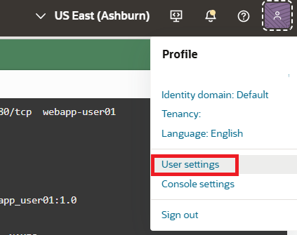
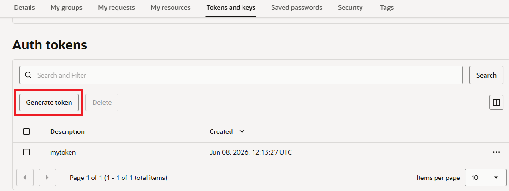
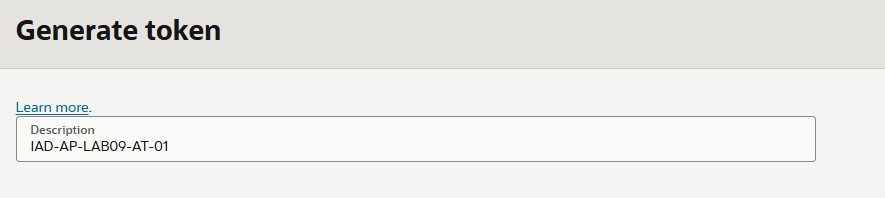
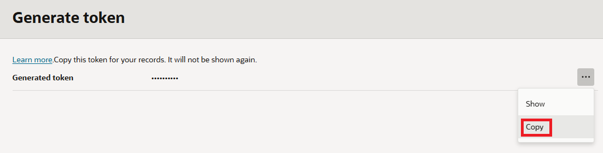

= 연습 4: Auth Token 생성

여기에서는 Oracle Cloud Infrastructure Registry (OCIR)에서 사용할 Auth Token을 생성합니다.

아래 절차에 따릅니다.

1. OCI 콘솔에서, 오른쪽 위의 Profile 메뉴를 클릭하고 User Settings 를 클릭합니다.
+

2. **Tokens and Keys** 탭을 클릭합니다.
3. **Auth tokens** 구역에서 **Generate token** 버튼을 클릭합니다.
+

+
NOTE: 사용자 한 명당 한 번에 두 개의 인증 토큰만 가질 수 있습니다.

4. **Description**에 사용자가 알아보기 쉬운 설명인 `IAD-AP-LAB09-AT-01` 을 입력합니다.
+

5. 오른쪽 아래의 **Generate token** 버튼을 클릭합니다.
6. 오른쪽의 ... 버튼을 클릭하고. **Copy**를 클릭하여 auth token을 복사합니다.
+

+
----
Auth token: X9_+mPkE{B6b6<tBoJ[a
----
+
NOTE: 인증 토큰을 복사하여 메모장 같은 에디터에 붙여넣어 보관합니다. auth token은 콘솔에서 다시 볼 수 없습니다. 이 토큰은 이 연습에서 계속 사용합니다.

7. **Close** 버튼을 클릭합니다.

---
다음: link:./05_create_container_repository.adoc[컨테이너 리포지토리 생성]