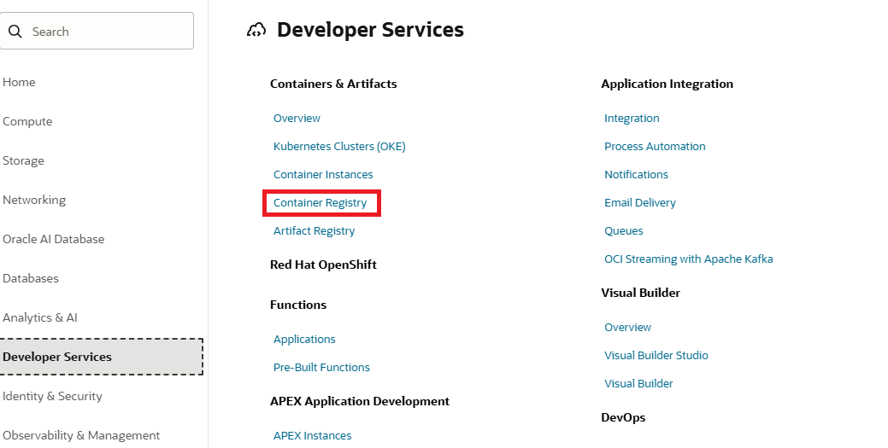
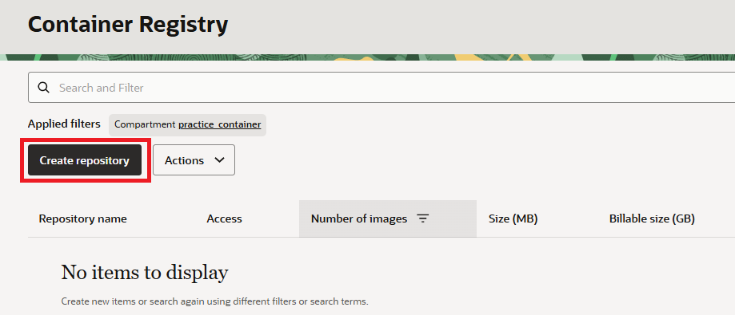
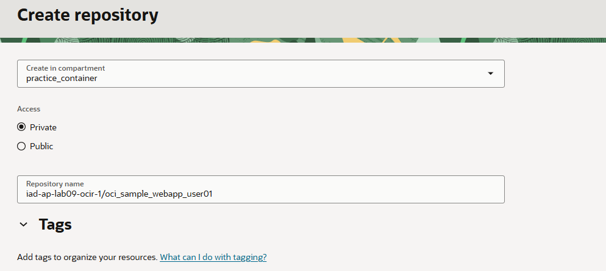
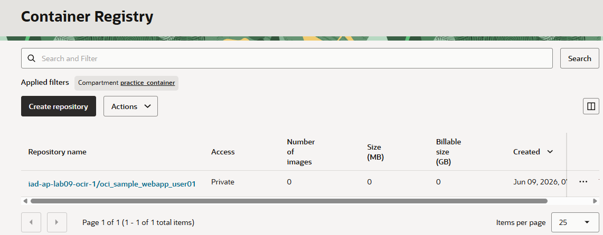

= 연습 5: 컨테이너 리포지토리 생성

여기에서는 컴파트먼트에 빈 리포지토리를 생성하고 테넌시 내 모든 컴파트먼트에서 접근할 수 있도록 고유한 이름을 지정합니다. 새 리포지토리를 생성한 후에는 Docker CLI를 사용하여 이미지를 해당 리포지토리에 푸시할 수 있습니다.

아래 절차에 따릅니다.

== 컴파트먼트 생성

이 연습에서 사용하는 모든 리소스를 한 구획(Compartment)에서 사용하기 위해, `practice_container` 라는 이름의 컴파트먼트를 생성합니다. 아래 절차에 따릅니다.

1. OCI 콘솔에서 태넌시와 컴파트먼트에 로그인합니다.
2. 왼쪽 위의 햄버거 버튼을 클릭하고 **Identity & Security**를 클릭합니다.
3. Identity & Security 메뉴에서 **Identity** 구역의 **Compartments**를 클릭합니다.
4. **Compartment** 페이지에서 **Create Compartment** 버튼을 클릭합니다.
5. **Create Compartment** 페이지에서 아래와 같이 정보를 입력하고 오른쪽 아래의 **Create Compartment** 버튼을 클릭합니다.
* **Name**: `practice_container`
* **Description**: `Container 실습을 위한 컴파트먼트`
* **Parent compartment**: _루트 컴파트먼트 (태넌시 이름 (root) 로 표시됨)_
6. 생성된 컴파트먼트를 확인합니다. 루트 컴파트먼트의 Subcompartments 숫자가 하나 증가된 것도 확인합니다.

== Oracle Cloud Infrastructure Repositry (OCIR) 생성

1. OCI 콘솔에서, 왼쪽 위의 햄버거 메뉴를 클릭하고 **Developer Services**를 클릭합니다. **Container & Artifacts** 구역에서 **Container Registry**를 클릭합니다.
+

2. **Applied filters** 구역에서 위에서 생성한 `practice_container` 컴파트먼트를 선택합니다.
3. **Create Repository**를 클릭합니다.
+

4. **Create Repository** 페이지에서 아래와 같이 정보를 입력합니다.
* **Create in compartment**: 위에서 생성한 `practice_container`
* **Access**: `Private` 선택
* **Repository name**: `iad-ap-lab09-ocir-1/oci_sample_webapp_user01`

+

5. **Create** 버튼을 클릭합니다.
6. 생성된 컨테이너 리포지토리를 확인합니다.
+

---

다음: link:./06_signin_ocir.adoc[Cloud Shell에서 OCIR에 로그인]