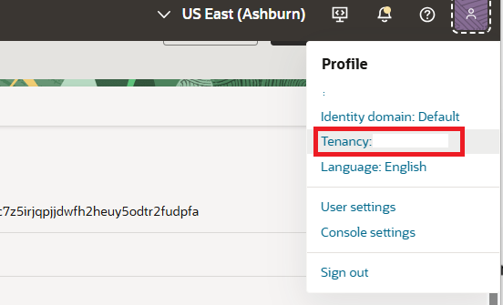
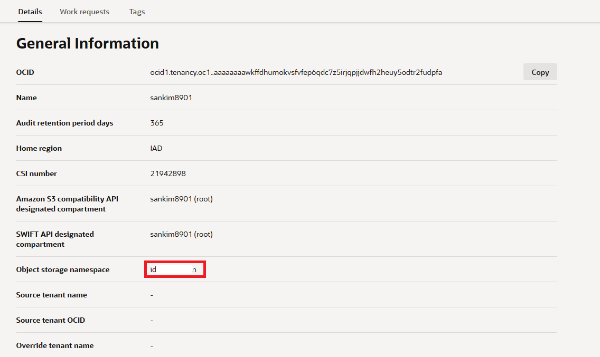

= 연습 6: Cloud Shell에서 OCIR에 로그인

Auth token과 컨테이너 리포지토리를 생성했다면, cloud shell에서 Docker CLI를 사용해서 Oracle Cloud Infrastructure (OCIR)에 로그인 할 수 있습니다.

아래 절차에 따릅니다.

1. OCI 콘솔에서, 오른쪽 위의 **Developer Tools**를 클릭하고 **Cloud Shell**을 클릭하여 Cloud Shell을 실행합니다.
+
NOTE: 클라우드 셸에서 실행되는 OCI CLI는 클라우드 셸이 시작될 때 콘솔의 지역 선택 메뉴에서 선택한 지역에 대해 명령을 실행합니다.

2. Cloud Shell에서, 다음 명령을 실행해 OCIR에 진입합니다.
+
----
$ docker login <region-key>.ocir.io
----
+
리전이 us-ashburn-1이면, 아래와 같이 명령을 사용할 수 있습니다.
+
----
$ docker login iad.ocir.io
----

3. 로그인 프롬프트에서, 아래와 같은 형태로 사용자 이름을 지정하고 enter 키를 누릅니다.
+
----
<tenancy_namespace>/<username>
----
+
`<tenancy-namespace>` 와 `<username>` 은 **Profile** 메뉴에서 확인하여 사용할 수 있습니다.

* `<tenancy-namespace>` 리포지토리를 생성할 테넌시의 자동 생성되는 객체 스토리지 네임스페이스 문자열입니다(테넌시 정보 페이지에 표시됨). 사용자 이름에는 프로필 메뉴에 표시된 사용자 이름을 사용하십시오. 이 정보는 Profile의 Tenancy Information에서 확인할 수 있습니다.
+

+

+
또는. Cloud Shell에서 아래 명령으로 확인할 수 있습니다.
+
----
$ oci os ns get
----
+
예로, 아래와 같은 형태가 됩니다.
+
----
ansh81vru1zp/blackkaiser@acme.com
또는
ourtenency29/99239836-lab.user16
----
+
예전의 태넌시에서는, 네임스페이스 문자열과 태넌시 이름이 같을 수 있습니다. 이 경우, 모든 문자는 소문자로 써야 합니다.
+
만약 태넌시가 Oracle Identity Cloud Service로 페더레이션 되어 있는 경우라면, 아래와 같은 형식이 됩니다.
+
----
<tenancy-namespace>/oracleidentitycloudservice/<username>
----

4. Pasword로, 이전 연습에서 생성한 Auth token을 복사해 붙여넣고 Enter 키를 누릅니다.
5. 로그인 성공 메시지를 확인합니다.
+
----
$ docker login iad.ocir.io
Username: idwxxxxxxxn/blackkaiser@oracle.com
Password: 
Login Succeeded!
----

----
idw9qpcf8tyn/sanghoon.k.kim@oracle.com
)ZSKLXuh1T:6cq9n0C:C
----

---

다음: link:./07_tag_docker_image.adoc[Docker 이미지 태깅]