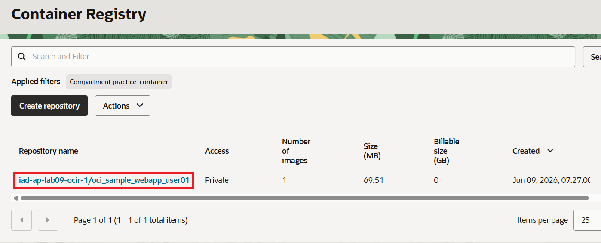
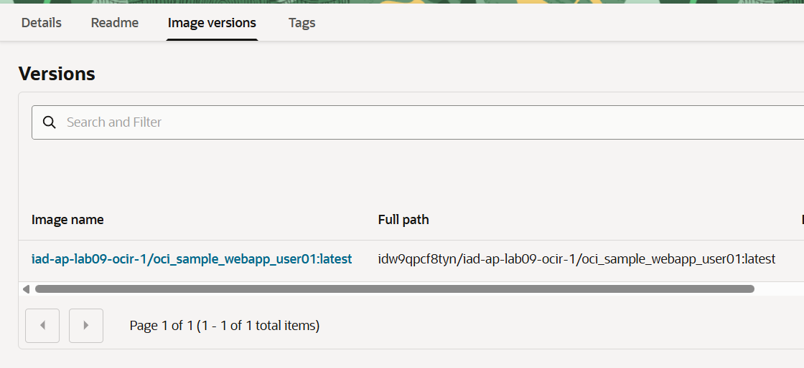
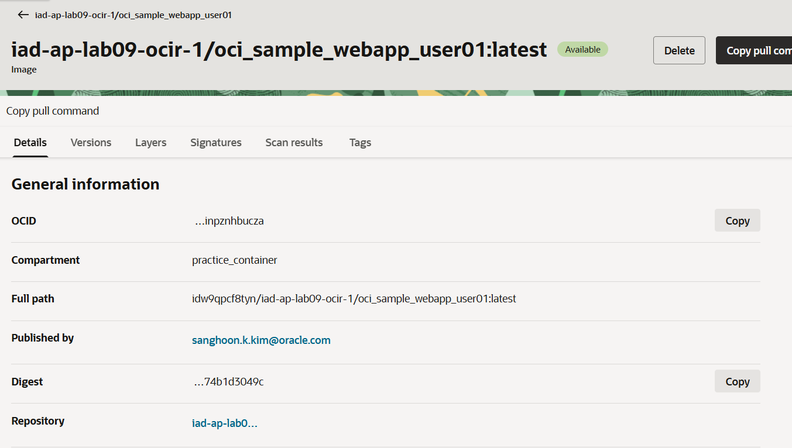

= 연습 9: 푸시된 이미지 확인

여기에서는 OCIR 리포지토리에 푸시된 이미지를 확인합니다.

아래 절차에 따릅니다.

1. OCI 콘솔에서, 왼쪽 위 햄버거 매뉴를 **Developer Services**를 클릭하고 **Container Registry**를 클릭합니다.
2. **Container Registory** 페이지에서 **Applied filters**에서 이전 연습에서 생성한 `practice_container` 컴파트먼트를 지정합니다.
3. 리포지토리 목록에서, 이전 연습에서 생성한 `iad-ap-lab09-ocir-1/oci_sample_webapp_user01` 리포지토리를 클릭합니다.
+

4. 리포지토리 페이지에서, **Image versions** 탭을 클릭하고 이미지 Push한 이미지를 확인합니다.
+

5. 이미지를 클릭하고, 이미지 정보를 확인합니다.
+

+ 
Details 탭에서 이미지의 크기, 어떤 사용자에 의해 언제 푸시뒤었는지, 몇 번 pull 되었는지 등의 정보를 확인할 수 있습니다.

---

다음: link:./10_pull_from_ocir.adoc[OCIR 리포지토리에서 Docker 이미지 pull]