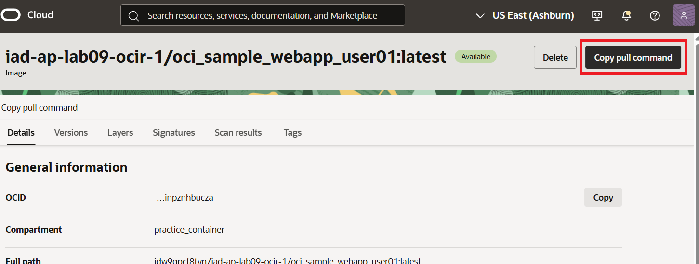

= 연습 10: OCIR 리포지토리에서 Docker 이미지 pull

여기에서는 로컬 docker 리포지토리의 이미지를 삭제합니다. 그 후 OCIR 리포지토리에 푸시한 같은 이미지를 pull 합니다.

아래 절차에 따릅니다.

1. 로컬 Docker 리포지토리에서 Docker 이미지 삭제
a. Cloud Shell에서, 아래 명령을 실행하여 로컬 리포지토리의 이미지를 조회합니다.
+
----
$ docker images
----
b. `docker rmi` 명령을 실행하여 로컬 리포지토리에 저장된 이미지를 삭제합니다.
+
----
$ docker rmi oad.ocir.io/idw9qpcf8tyn/iad-ap-lab09-ocir-1/oci_sample_webapp_user01:latest
----
+
삭제에 성공하면, 아래와 같은 메시지가 표시됩니다.
+
----
Untagged: iad.ocir.io/idw9qpcf8tyn/iad-ap-lab09-ocir-1/oci_sample_webapp_user01:latest
----

2. 아래 명령을 실행하여 이미지가 삭제된 것을 확인합니다.
+
----
$ docker images
----

3. OCI 콘솔로 이동하고, OCIR 페이지에서, 이전 연습에서 푸시한 이미지로 이동합니다.
4. 왼쪽 위에서 **Copy pull command** 버튼을 클릭합니다.
+

+
OCIR 리포지토리의 이미지를 pull 할 수 있는 명령이 복사됩니다. 명령의 형식은 아래와 같습니다
+
----
docker pull <region-key>.ocir.io/<tenancy_namespace>/iad-ap-lab09-ocir-1/<repo-name>:<tag>
----

5. Cloud Shell에서, 복사한 명령을 붙여 넣고 실행합니다. 복사한 명령은 아래와 같습니다:
+
----
docker pull iad.ocir.io/idw9qpcf8tyn/iad-ap-lab09-ocir-1/oci_sample_webapp_user01:latest
----

6. 아래 명령을 실행하여 OCIR 리포지토리에서 pull 한 이미지를 확인합니다.
+
----
$ docker images
----

연습이 완료되었습니다. 다음 실습을 위해 환경을 삭제하지 않습니다.