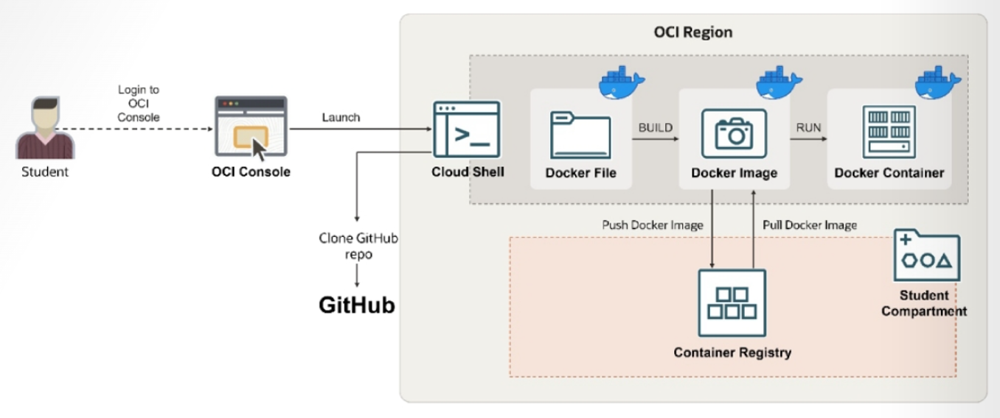

= Lab 06: 클라우드 네이티브, 마이크로서비스 및 서버리스 아키텍처 설계: OCIR 관리와 Docker CLI를 사용하여 이미지 Push 및 Pull

Docker를 사용하면 컨테이너 환경에서 애플리케이션을 생성, 실행 및 배포하는 여러 가지 방법이 있습니다. Docker 이미지는 애플리케이션 코드, 라이브러리, 도구, 종속성 및 애플리케이션 실행에 필요한 기타 파일을 포함합니다. 또한 Oracle에서 관리하는 레지스트리를 활용하면 개발에서 프로덕션으로의 워크플로를 간소화할 수 있습니다. 개발자는 컨테이너 레지스트리를 통해 Docker 이미지와 같은 컨테이너 이미지를 간편하게 저장, 공유 및 관리할 수 있습니다.

이 연습에서는 Dockerfile을 사용하여 Docker 이미지를 생성하고, 이 이미지를 기반으로 Docker 플랫폼에서 실행 가능한 컨테이너를 빌드합니다. 또한 컨테이너 레지스트리를 생성하고 Docker 이미지를 푸시 및 풀하는 등의 기본 작업을 수행합니다.

이 연습에서는, 아래와 같은 연습을 수행합니다:

a. Dockerfile에 액세스
b. Docker 이미지 빌드
c. Docker 이미지를 컨테이너로 실행
d. 컨테이너로 실행중인 웹 애플리케이션에 액세스
e. Docker 컨테이너 삭제
f. Auth Token 생성
g. 새 컨테이너 리포지토리 생성
h. Cloud Shell에서 Oracle Cloud Infrasrtucture Registry (OCIR)에 로그인
i. Docker 이미지 태깅
j. 태깅된 Docker 이미지를 OCIR 리포지토리에 집어넣기(Push)
k. 이미지가 푸시 되었는지 확인
l. OCIR 리포지토리에서 이미지 가져오기(Pull)

== 전제 조건

* 사용자는 자격 증명을 사용하여 Oracle Cloud Infrastructure(OCI) 계정에 로그인되어 있습니다.
* Dockerfile이 포함된 Git 리포지토리 링크에 액세스할 수 있습니다.
* `<userID>` 자리 표시자를 사용자 ID로 바꿔야 합니다.

== 목차

연습을 위해, 아래 문서의 절차에 따르십시오.

1. link:./01_access_dockerfile.adoc[Dockerfile에 액세스]
2. link:./02_build_docker_image.adoc[Docker 이미지 빌드]
3. link:./03_run_docker_image_as_container.adoc[Docker 이미지를 컨테이너로 실행]
4. link:./04_create_auth_token.adoc[Auth Token 생성]
5. link:./05_create_container_repository.adoc[컨테이너 리포지토리 생성]
6. link:./06_signin_ocir.adoc[Cloud Shell에서 OCIR에 로그인]
7. link:./07_tag_docker_image.adoc[Docker 이미지 태깅]
8. link:./08_push_image_to_ocir.adoc[태깅 된 이미지를 OCIR 리포지토리에 푸시]