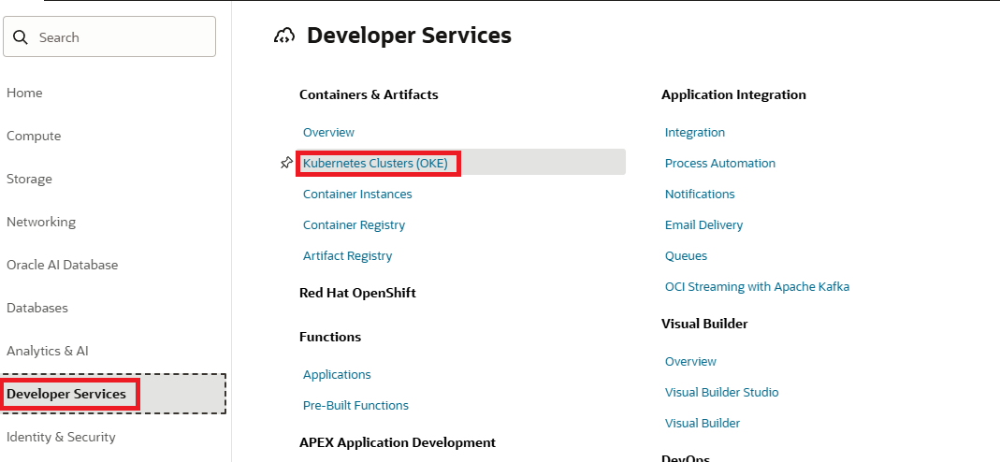
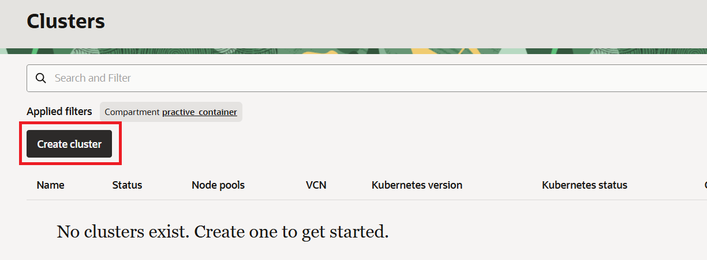
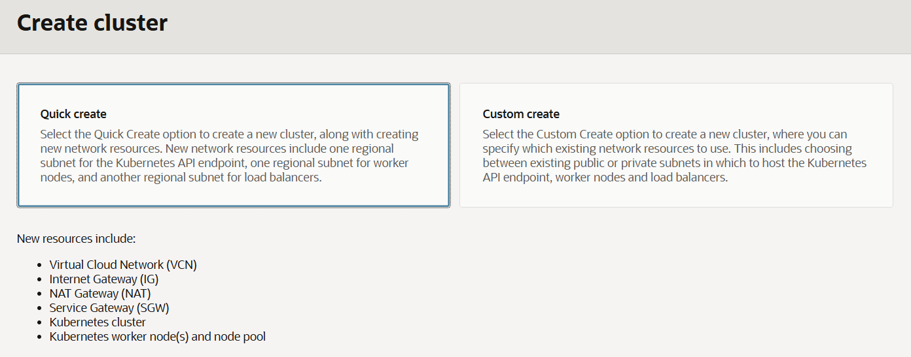
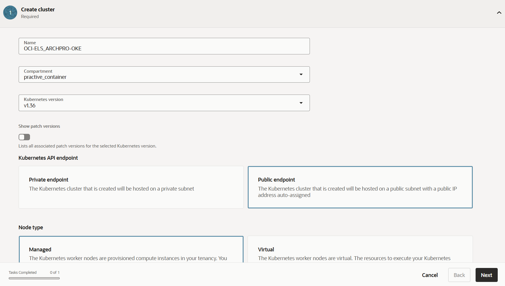
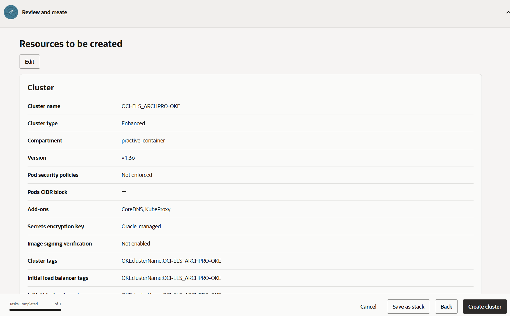
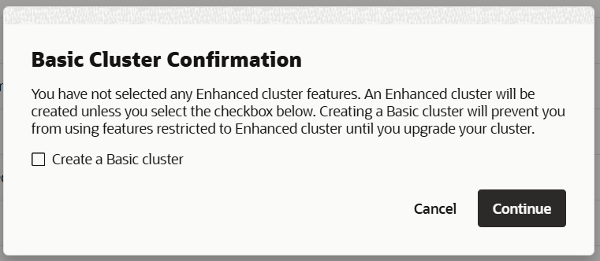
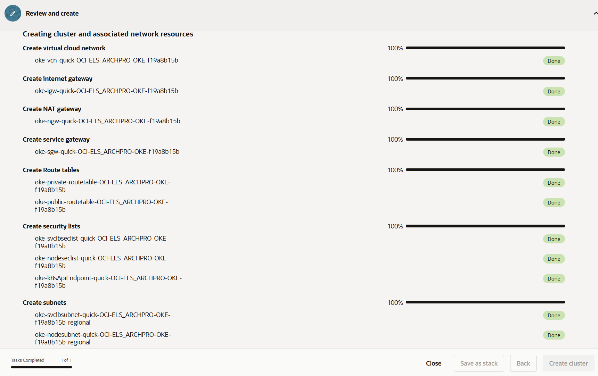

= 연습 1: Oracle Kubernetes Clusters (OKE) 생성

여기에서는 Oracle Kubernetes Cluster를 생성합니다. 

아래 절차에 따릅니다.

1. OCI 콘솔에서, 왼쪽 위의 햄버거 메뉴를 클릭하고 **Developer Services**를 클릭한 후 **Containers and Artifacts** 구역의 **Kubernetes Clusters (OKE)**를 클릭합니다.
+

2. **Clusters** 페이지에서 **Create Cluster** 버튼을 클릭합니다.
+

3. **Create cluster** 페이지에서, **Quick create** 를 선택하고 **Proceed** 버튼을 클릭합니다.
+

4. **create cluster (quick)** 페이지에서, 아래와 같이 정보를 입력합니다.
* **Name**: `OCI-ELS-ARCHPRO-OKE`
* **Compartment**: 이전 연습에서 생성한 `practice_container`
* 나머지 값들은 기본 값으로 둡니다.

+

5. 오른쪽 아래의 **Next** 버튼을 클릭합니다.
6. **Resource to be created** 구역에서, **Create cluster** 버튼을 클릭합니다.
+

7. **Basic Cluster Confirmation** 알림에서 **Continue** 버튼을 클릭합니다.
+

8. Kubernetes Cluster가 생성됩니다.
9. 생성이 완료되면, **Close** 버튼을 클릭합니다.
+
