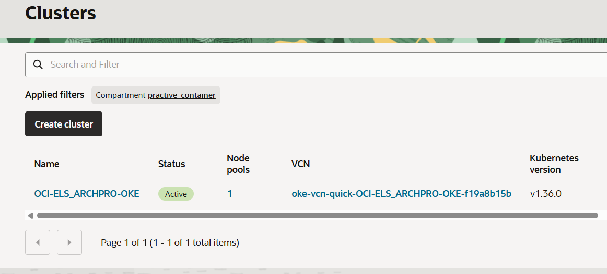
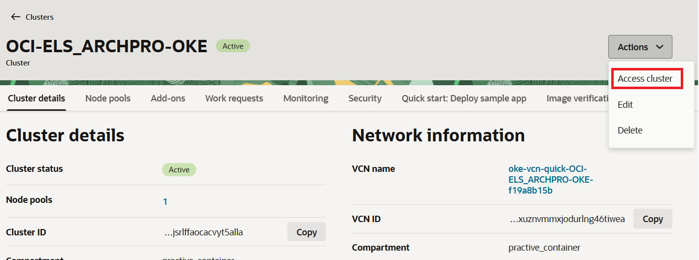
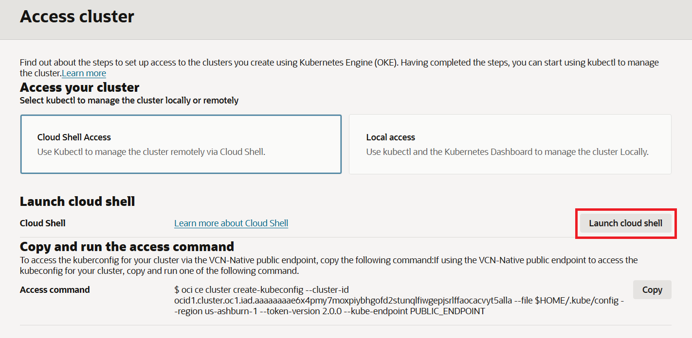

= 연습 2: kubectl 파일 설정

`kubectl` 을 사용하여 클러스터에 액세스하려면 해당 클러스터에 대한 Kubernetes 구성 파일(일반적으로 `kubeconfig` 파일이라고 함)을 설정해야 합니다. `kubeconfig` 파일에는 클러스터에 액세스하는 데 필요한 세부 정보가 포함되어 있습니다.

다음 절차에 따릅니다.

1. OCI 콘솔에서, 왼쪽 위의 햄버거 메뉴를 클릭하고 **Developer Services**를 클릭한 후 **Containers and Artifacts** 구역의 **Kubernetes Clusters (OKE)**를 클릭합니다.
2. **Applied Filters**에서, 이전 실습에서 생성한 `practice_container` 를 선택합니다.
3. 이전에 생성한 `OCI-ELS-ARCHPRO-OKE` 클러스터를 클릭합니다.
+

4. 오른쪽 위의 **Actions** 드롭다운 리스트를 클릭하고 **Access Cluster**를 클릭합니다.
+

5. **Access cluster** 페이지에서 **Cloud Shell Access**를 선택하고 **Copy and run the access command** 구역에서 **Access command** 구역의 **Copy** 버튼을 클릭합니다.
+

6. Cloud Shell을 실행하고 복사된 명령을 붙여넣어 실행합니다. 복사된 명령은 다음과 같습니다:
+
----
oci ce cluster create-kubeconfig --cluster-id ocid1.cluster.oc1.iad.aaaaaaaae6x4pmy7moxpiybhgofd2stunqlfiwgepjsrlffaocacvyt5alla --file $HOME/.kube/config --region us-ashburn-1 --token-version 2.0.0  --kube-endpoint PUBLIC_ENDPOINT
----

---

다음: link:./03_run_kubectl_commands.adoc[Kubernetes 클러스터에서 kubectl 명령 실행]