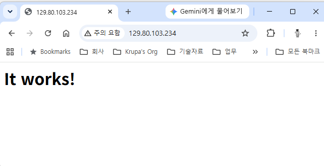

= 연습 3: Kubernetes 클러스터에서 kubectl 명령 실행

kubeconfig 파일을 설정했으면 OKE 클러스터에 샘플 배포를 생성하여 kubectl을 사용하여 클러스터에 액세스할 수 있습니다.

아래 절차에 따릅니다.

1. `kubectl` 이 클러스터에 액세스 할 수 있는지 확인하기 위해, 다음 명령을 실행합니다.
+
----
$ kubectl get nodes
----

2. 리소스를 관리하기 위해, 아래 명령을 실행하여 Kubernetes 클러스터에 네임스페이스를 생성합니다.
+
----
$ kubectl create ns ns-<userID>
----
+
`ns-<userID>` 는 클러스터 내에서 리소스를 그룹화 하기 위한 네임스페이스입니다. <userID>를 적당한 이름으로 바꾸어 사용할 수 있습니다.
+
명령의 실행 예는 다음과 같습니다:
+
----
$ kubectl create ns ns-user01
----

3. 아래 명령을 실행하여 클러스터 정보를 조회합니다.
+
----
$ kubectl cluster-info
----

4. 아래 명령을 실행하여 OKE 클러스터에서 샘플 deployment를 생성합니다.
+
----
$ kubectl create deployment deploy-<userID> --image=iad.ocir.io/ocuocictrng5/httpd:latest -n ns-<userID>
----
+
명령의 실행 예는 다음과 같습니다:
+
----
kubectl create deployment deploy-user01 --image=iad.ocir.io/ocuocictrng5/httpd:latest -n ns-user01
----
+
NOTE: `ocuocictrng5` 문자열을 **변경하지 마십시오**.
+
명령의 실행 결과는 아래와 같습니다.
+
----
deployment.apps/deploy-user01 created
----

* `kubectl create deployment`: 이 명령어는 실행 중인 컨테이너가 하나만 있는 파드를 생성하는 데 사용됩니다.
* `deploy-<userID>` deployment의 이름입니다.
* `image=iad.ocir.io/ocuocictrng5/httpd:latest`: OCIR 저장소에 있는 이미지에 대한 완전한 경로입니다.
* `-n ns-<userID>`: Kubenetes 개체가 생성될 네임스페이스를 지정합니다.

5. 아래 명령을 실행하여 로드 밸런서 유형의 서비스를 통해 deployment를 합니다.
+
----
$ kubectl expose deployment deploy-<userID> --type=LoadBalancer --name=svc-<userID> --port=80 --target-port=80 -n ns-<userID>
----
+
명령의 실행 예는 다음과 같습니다:
+
----
$ kubectl expose deployment deploy-user01 --type=LoadBalancer --name=svc-user01 --port=80 --target-port=80 -n ns-user01
----
+
명령의 실행 결과는 아래와 같습니다.
+
----
service/svc-user01 exposed
----

* `deploy-<userID>`: deployment의 이름입니다.
* `--type=LoadBalancer`: OCI 로드 밸런서를 사용하여 서비스를 외부로 노출합니다.
* `svc-<userID`: 서비스 이름입니다.
* `--port=80 --target-port=80`: 클러스터 내에서 실행 중인 애플리케이션을 80번 포트로 노출하는 데 사용됩니다.
* `ns-<userID>`: Kubernetes 개체가 생성될 네임스페이스를 지정합니다.

6. 아래 명령을 실행하여 네임스페이스의 모든 deployment를 조회합니다.
+
----
$ kubectl get deploy -n ns-<userID>
----
+
결과는 아래와 같습니다.
+
----
NAME            READY   UP-TO-DATE   AVAILABLE   AGE
deploy-user01   1/1     1            1           14m
----

7. 아래 명령을 실행하여 네임스페이스의 모든 Pod를 조회합니다.
+
----
$ kubectl get pods -n ns-<userID>
----
+
결과는 아래와 같습니다.
+
----
NAME                             READY   STATUS    RESTARTS   AGE
deploy-user01-56bc6c4b9c-n4pmt   1/1     Running   0          17m
----

8. 아래 명령을 실행하여 네임 스페이스의 모든 서비스를 확인합니다.
+
----
$ kubectl get svc -n ns-<userID>
----
+
결과는 아래와 같습니다.
+
----
NAME         TYPE           CLUSTER-IP   EXTERNAL-IP      PORT(S)        AGE
svc-user01   LoadBalancer   10.96.44.8   129.80.103.234   80:31563/TCP   27m
----

9. `kubectl get svc -n ns-<userID>` 명령의 실행 출력에서, EXTERNAL-IP 컬럼을 값을 복사하고, 웹 브라우저를 실행하여 OKE 클러스터에서 실행중인 httpd 애플리케이션에 액세스 합니다. 아래와 같이 실행됩니다.
+

10. 아래 명령을 실행하여 deployment에서 실행중인 pods 인스턴스의 수를 확인합니다.
+
----
$ kubectl get replicaset -n ns-<userID>
----
+
결과는 아래와 같습니다.
+
----
NAME                       DESIRED   CURRENT   READY   AGE
deploy-user01-56bc6c4b9c   1         1         1       45m
----

11. 어래 명령을 실행하여 현재 복제본 수를 3배로 늘려 Kubernetes가 서비스 확장에 필요한 새로운 Pod를 시작할 수 있도록 합니다.
+
----
$ kubectl scale --replicas=3 deployment/deploy-<userID> -n ns-<userID>
----
+
결과는 아래와 같습니다.
+
----
deployment.apps/deploy-user01 scaled
----

12. 아래 명령을 실행하여 3개의 복제본이 실행중인 것을 확인합니다.
+
----
$ kubectl get replicaset -n ns-<userID>
----
+
결과는 아래와 같습니다.
+
----
NAME                       DESIRED   CURRENT   READY   AGE
deploy-user01-56bc6c4b9c   3         3         3       49m
----

13. 아래 명령을 실행하여 네임스페이스내에서 실행중인 모든 리소스를 확인합니다.
+
----
$ kubectl get all -n ns-<userID>
----
+
결과는 아래와 같습니다.
+
----
NAME                                 READY   STATUS    RESTARTS   AGE
pod/deploy-user01-56bc6c4b9c-csg2p   1/1     Running   0          114s
pod/deploy-user01-56bc6c4b9c-n4pmt   1/1     Running   0          50m
pod/deploy-user01-56bc6c4b9c-pm245   1/1     Running   0          114s

NAME                 TYPE           CLUSTER-IP   EXTERNAL-IP      PORT(S)        AGE
service/svc-user01   LoadBalancer   10.96.44.8   129.80.103.234   80:31563/TCP   37m

NAME                            READY   UP-TO-DATE   AVAILABLE   AGE
deployment.apps/deploy-user01   3/3     3            3           50m

NAME                                       DESIRED   CURRENT   READY   AGE
replicaset.apps/deploy-user01-56bc6c4b9c   3         3         3       50m
----

14. 아래 명령을 실행하여 Pod 로그를 확인합니다. `kubectl` 명령을 사용하면 특정 파드의 로그를 검사할 수 있습니다.
+
----
$ kubectl logs <podname> -n ns-<userID>
----
+
<podname>에 pod 이름을 지정하고 실행한 결과는 아래와 같습니다.
+
----
AH00558: httpd: Could not reliably determine the server's fully qualified domain name, using 10.0.10.13. Set the 'ServerName' directive globally to suppress this message
AH00558: httpd: Could not reliably determine the server's fully qualified domain name, using 10.0.10.13. Set the 'ServerName' directive globally to suppress this message
[Wed Jun 10 09:10:15.404048 2026] [mpm_event:notice] [pid 1:tid 140565347985280] AH00489: Apache/2.4.57 (Unix) configured -- resuming normal operations
[Wed Jun 10 09:10:15.404486 2026] [core:notice] [pid 1:tid 140565347985280] AH00094: Command line: 'httpd -D FOREGROUND
----

15. 아래 명령을 실행하여 deployment를 삭제합니다.
+
----
$ kubectl delete deploy deploy-<userID> -n ns-<userID>
----
+
결과는 아래와 같습니다.
+
----
$ deployment.apps "deploy-user01" deleted
----

16. 아래 명령을 실행하여 서비스 개체를 삭제합니다.
+
----
$ kubectl delete svc svc-<userID> -n ns-<userID>
----
+
결과는 아래와 같습니다.
+
----
service "svc-user01" deleted
----

17. 아래 명령을 실행하여 네임스페이스의 모든 개체가 삭제된 것을 확인합니다.
+
----
$ kubectl get all -n ns-<userID>
----
+
결과는 아래와 같습니다.
+
----
No resources found in ns-user01 namespace.
----

18. 모든 리소스가 삭제되었으므로, 브라우저로 돌아가서 이전에 붙여넣은 IP 주소에서 새로 고침을 누르면 페이지가 더 이상 응답하지 않습니다.

IMPORTANT: 이 실습에서 생성된 kubeconfig 파일의 네임스페이스와 항목은 삭제하지 마십시오. 다음 실습에서 필요합니다.

---

다음: link:./04_create_secret.adoc[Kubernetes (OKE) Secret 생성]