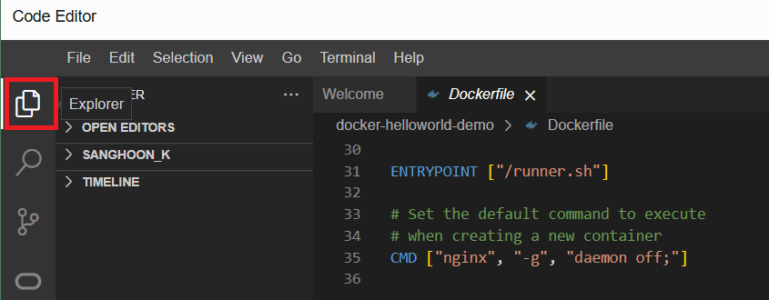
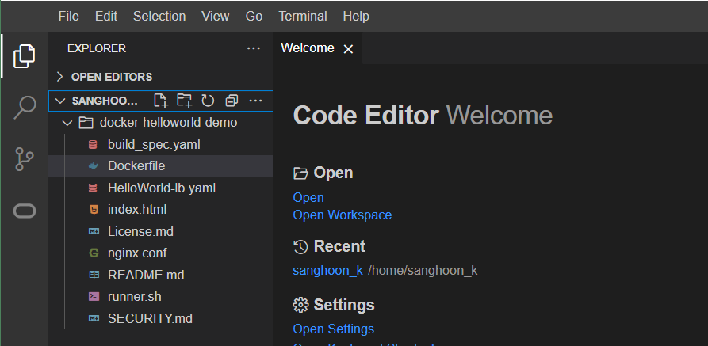
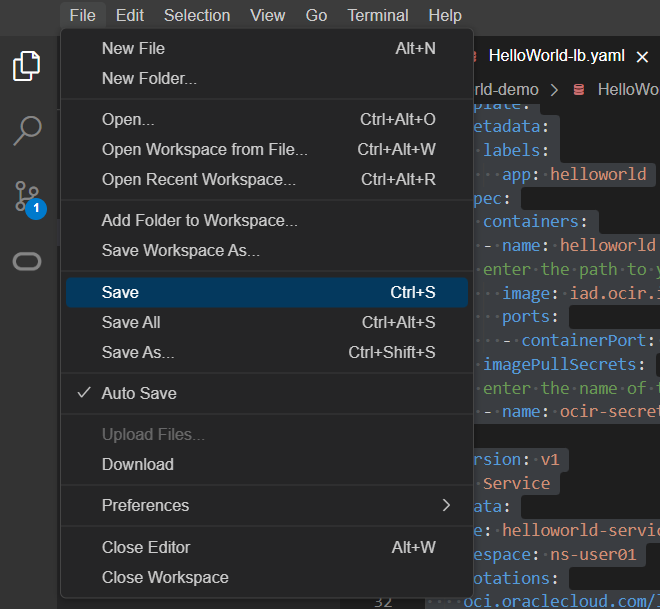

= 연습 5: Deployment Manifest에 Secret과 이미지 경로 추가

시크릿을 생성한 후에는 시크릿 이름(<name-of-secret>-<userID>)과 OCIR 저장소에 푸시된 이미지의 전체 경로(iad-ap-1ab09-1-ocir-1/oci sample webapp <userID>: latest)를 OKE 클러스터에 샘플 웹 애플리케이션을 배포하는 데 사용되는 배포 매니페스트에 포함해야 합니다.

NOTE: OCIR 저장소에 이미지를 푸시한 과정은 `Hands on Lab 06: 클라우드 네이티브, 마이크로서비스 및 서버리스 아키텍처 설계: OCIR 관리와 Docker CLI를 사용하여 이미지 Push 및 Pull` 에서 이미 진행했습니다. 이 작업에서는 해당 이미지를 사용합니다.

아래 절차에 따릅니다.

1. OCI 콘솔에서, 오른쪽 위의 **Developer Tools**를 클릭하고 **Code Editor**을 클릭하여 Code Editor를 실행합니다. Code Editor를 사용하면 클라우드 셸 내에서 복제된 Git 디렉터리에 있는 파일과 소스 코드를 편집할 수 있습니다.
2. 왼쪽 툴바에서 맨 위의 **Explorer** 아이콘을 클릭합니다.
+

a. Explorer에서, Lab 06에서 다운로드한 `docker-helloworld-demo` 디렉토리로 이동합니다.
+

b. 클론한 Got 디렉터리에서 HelloWorld-lb.yaml 파일을 찾아 Deployment 섹션의 자리 표시자를 관련 값으로 변경합니다. (`<userID>` 를 연습에서 사용한 값이 `user01` 로 변경합니다)
* **name**: `helloworld-deployment-<userid>`
* **namespace**: `ns-<userID>`
* **image**: `<region-key>.ocir.io/<tenency-namespace>/<repo-name>:<tag>`
** `<region-key>`: 사용 중인 Oracle Cloud Infrastructure 리전의 키입니다. 예를 들어, iad는 미국 동부(애쉬번) 리전의 리전 키입니다. 
** `ocir.io`: Oracle Cloud Infrastructure (OCI)의 레지스트리 이름입니다.
** `<tenancy-namespace>`: 는 이미지를 푸시할 테넌시(테넌시 정보 페이지에 표시됨)의 자동 생성된 객체 스토리지 네임스페이스 문자열입니다. 예를 들어 oracletenancy`입니다.
** `<repo-name>:<tag>`: Lab 06의 7, 8 연습에서 에서 태깅하고 이미지를 push 했던 리포지토리의 이름, `iad-ap-lab09-ocir-1/oci_sample_webapp_user01:lates`t 입니다.
* `name`: ocir-secret-<username>

3. 또한, **Service** 섹션의 자리 표시자를 관련 값으로 변경합니다.
* **name**: `helloworld-service-<userID>`
* **namespace**: `ns-<userid>`

4. 변경된 전체 코드는 아래와 같습니다.
+
[source, yaml]
----
apiVersion: apps/v1
kind: Deployment
metadata:
  name: helloworld-deployment-user01
  namespace: ns-user01
spec:
  selector:
    matchLabels:
      app: helloworld
  replicas: 1
  template:
    metadata:
      labels:
        app: helloworld
    spec:
      containers:
      - name: helloworld
    # enter the path to your image, be sure to include the correct region prefix    
        image: iad.ocir.io/idw9qpcf8tyn/iad-ap-lab09-ocir-1/oci_sample_webapp_user01:latest
        ports:
        - containerPort: 80
      imagePullSecrets:
    # enter the name of the secret you created  
      - name: ocir-secret-user01
---
apiVersion: v1
kind: Service
metadata:
  name: helloworld-service-user01
  namespace: ns-user01
  annotations:
    oci.oraclecloud.com/load-balancer-type: "lb"
    service.beta.kubernetes.io/oci-load-balancer-shape: "flexible"
    service.beta.kubernetes.io/oci-load-balancer-shape-flex-min: "10"
    service.beta.kubernetes.io/oci-load-balancer-shape-flex-max: "100"
spec:
  type: LoadBalancer
  ports:
  - port: 80
    protocol: TCP
    targetPort: 80
  selector:
    app: helloworld
----

5. File 메뉴에서 Save 를 클릭하여 수정한 코드를 저장합니다.
+

---

다음: link:./06_deploy_sample_webapp.adoc[OKE 클러스터에 샘플 웹 애플리케이션 배포]