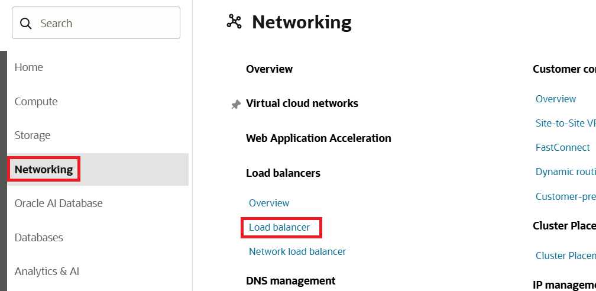
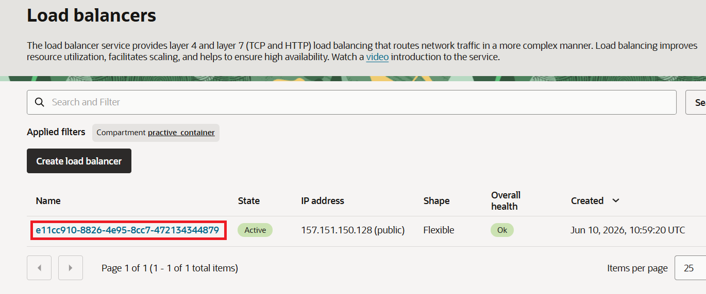
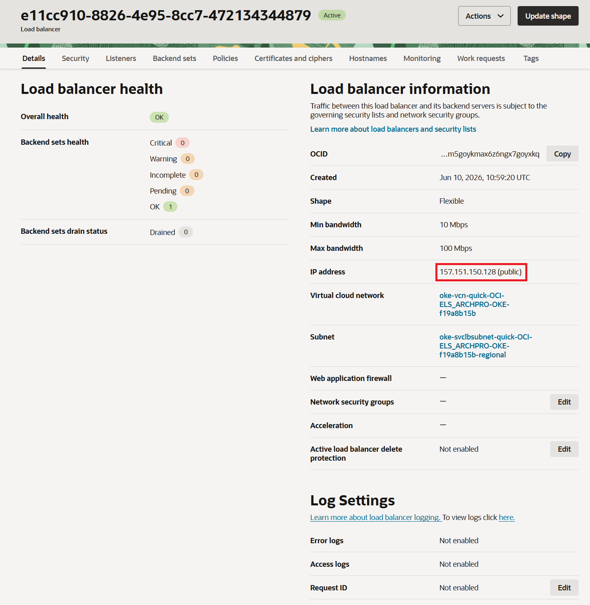

= 연습 6: OKE 클러스터에 샘플 웹 애플리케이션 배포

manifest를 수정했으면, OKE 클러스터에 애플리케이션을 배포할 준비가 된 것입니다.

아래 절차에 따릅니다.

1. Cloud Shell에서 아래 명령을 실행하여 디렉토리를 `docker-helloworld-demo` 디렉토리로 변경합니다.
+
----
$ cd ~/docker-helloworkd-demo
----

2. 아래 명령을 실행합니다.
+
----
$ kubectl create -f HelloWorld-lb.yaml
----
+
결과는 아래와 같습니다.
+
----
deployment.apps/helloworld-deployment-user01 created
service/helloworld-service-user01 created
----

NOTE: HelloWorld 서비스 로드 밸런서는 OCI 로드 밸런서로 구현되었으며, 백엔드는 수신 트래픽을 클러스터 노드로 라우팅하도록 설정되어 있습니다.

OKE 서비스는 루트 컴파트먼트에 새 로드 밸런서를 생성합니다. OCI 콘솔의 왼쪽 탐색 창에서 [범위 목록] 메뉴를 통해 루트 컴파트먼트를 선택하고 [네트워킹] 아래의 [로드 밸런서] 페이지로 이동하면 새 로드 밸런서를 확인할 수 있습니다.

로드 밸런서의 전체 상태와 공용 IP 주소를 확인하기 위해 아래 절차에 따릅니다.

1. OCI 콘솔에서, 왼쪽 위의 햄버거 메뉴를 클릭하고 **Networking**을 클릭한 후 **Load Balancer** 구역에서 **Load Balancer**를 클릭합니다.
+

2. **Load Balancer** 페이지에서, 생성된 로드 밸런서를 클릭합니다.
+

3. **Load Balancer information** 페이지에서, **IP address**를 확인합니다.
+

---

다음: link:./06_verify_webapp_accessible.adoc[웹 애플리케이션에 접근할 수 있는지 확인]