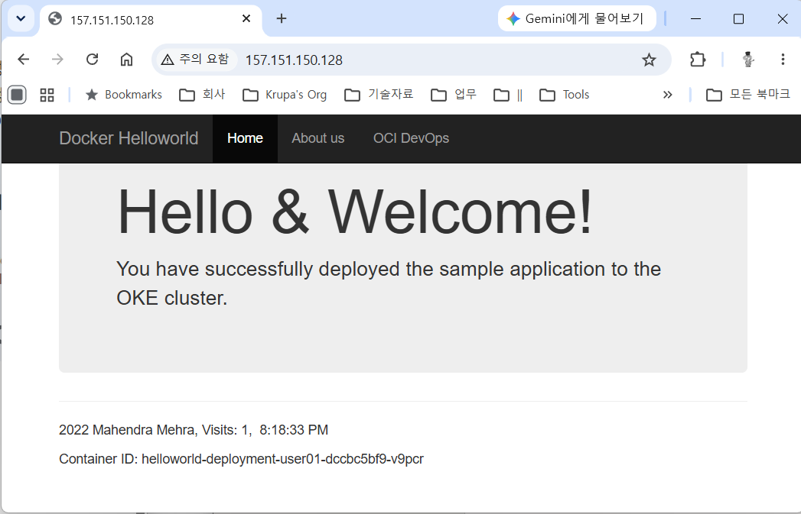

= 연습 7: 웹 애플리케이션에 접근할 수 있는지 확인

이 연습에서는 OKE 클러스터 노드에 배포된 웹 애플리케이션의 동작을 확인합니다.

아래 절차에 따릅니다.

1. Cloud Shell을 열고 아래 명령을 실행합니다.
+
----
$ kubectl get services -n ns-<userID>
----
+
결과는 아래와 같습니다.
+
----
NAME                        TYPE           CLUSTER-IP     EXTERNAL-IP       PORT(S)        AGE
helloworld-service-user01   LoadBalancer   10.96.125.13   157.151.150.128   80:31458/TCP   16m
----
+
NOTE: `EXTERNAL-IP`` 컬럼이 <pending>으로 표시되면 IP가 할당될 때 까지 잠시 기다렸다가 명령을 다시 실행합니다.

2. 웹 브라우저를 실행하고 실행 결과의 `EXTERNAL-IP` 또는 연습 6에서 확인한 로드 밸런서의 Public IP 에 접속합니다. 로드 밸런서는 요청을 클러스터 내 사용 가능한 노드로 라우팅합니다.
+
이 실습에서는 Kubernetes 매니페스트에서 복제본 수가 1로 설정되어 있으므로 노드가 하나만 표시됩니다. 요청이 해당 노드에 도달하면 다음 웹 페이지가 나타납니다.
+

3. 이제 재밌는 부분이 시작됩니다! 여러분의 샘플 웹 애플리케이션이 갑자기 인기를 얻어 더 많은 리소스를 할당해야 한다고 가정해 봅시다.
+
OKE 클러스터는 3개의 워커 노드로 구성된 단일 노드 풀에서 실행되므로 배포를 쉽게 확장할 수 있습니다.

a. 현재 단일 Pod 배포를 두 배로 확장하고 추가 Pod를 실행하기 위해, 다음 명령을 실행합니다.
+
----
$ kubectl -n ns-<userID> scale --replicas=2 deployment/<deploymentname>
----
+
명령의 예는 다음과 같습니다.
+
----
$ kubectl -n ns-user01 scale --replicas=2 deployment/helloworld-deployment-user01
----
+
실행 결과는 아래와 같습니다.
+
----
deployment.apps/helloworld-deployment-user01 scaled
----

b. 아래 명령을 실행하여 pod와 deployment의 상세 정보를 확인합니다.
+
----
$ kubectl get all -n ns-<userID>
----
+
실행 결과는 아래와 같습니다.
+
----
NAME          STATUS   ROLES   AGE     VERSION
10.0.10.159   Ready    node    5h24m   v1.36.0
sanghoon_k@cloudshell:~ (us-ashburn-1)$ kubectl get all -n ns-user01
NAME                                               READY   STATUS    RESTARTS   AGE
pod/helloworld-deployment-user01-dccbc5bf9-l2mvp   1/1     Running   0          56m
pod/helloworld-deployment-user01-dccbc5bf9-v9pcr   1/1     Running   0          83m

NAME                                TYPE           CLUSTER-IP     EXTERNAL-IP       PORT(S)        AGE
service/helloworld-service-user01   LoadBalancer   10.96.125.13   157.151.150.128   80:31458/TCP   83m

NAME                                           READY   UP-TO-DATE   AVAILABLE   AGE
deployment.apps/helloworld-deployment-user01   2/2     2            2           83m

NAME                                                     DESIRED   CURRENT   READY   AGE
replicaset.apps/helloworld-deployment-user01-dccbc5bf9   2         2         2       83m
----
+
여기서는 새로 생성된 pod 에 대한 행이 추가된 것을 확인할 수 있습니다. 컨테이너 ID 또는 출력의 'Age' 열 값을 비교하여 새 파드를 식별할 수 있습니다.

또한, 'Deployment' 행의 'READY' 열에 '2/2'가 표시되어 배포가 이제 두 개의 파드에서 호스팅되고 있음을 나타냅니다.

웹페이지를 몇 번 새로 고침하면 두 개의 컨테이너 ID가 번갈아가며 요청을 처리하는 것을 볼 수 있습니다. 이는 트래픽이 OCI 로드 밸런서를 통해 이러한 pod 중 어느 하나에든 도달할 수 있기 때문입니다.

---

다음: link:./08_clean_up.adoc[OKE 클러스터에 배포된 리소스 삭제]