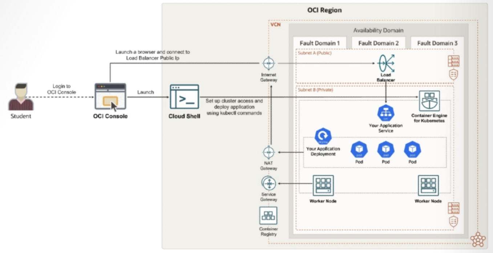

= Lab 07: 클라우드 네이티브, 마이크로서비스 및 서버리스 아키텍처 설계: Kubectl을 사용하여 OKE 클러스터에서 로드-밸런싱된 웹 애플리케이션 배포

Kubernetes 클러스터는 애플리케이션을 실행하는 노드(머신)들의 그룹입니다. 각 노드는 물리적 머신 또는 가상 머신일 수 있습니다.

이 실습에서는 애플리케이션을 배포하기 위해 Kubernetes 클러스터에 대한 액세스 권한을 설정합니다. `kubectl` 명령줄 클라이언트는 여러 클러스터를 관리하는 것을 포함하여 Kubernetes 클러스터와 상호 작용하는 데 유용한 도구입니다.

또한 Oracle Cloud Infrastructure(OCI) 자격 증명이 포함된 명명된 시크릿을 생성하고 이를 배포 매니페스트에 추가합니다. 그런 다음 이 매니페스트를 사용하여 샘플 웹 애플리케이션을 OKE 클러스터에 배포하고 애플리케이션에 액세스할 수 있는지 확인합니다.

이 연습에서는, 아래와 같은 연습을 수행합니다:

1. `kubeconfig` 파일 설정
2. Kubernetes 클러스터에 대해 `kubectl` 명령을 실행
3. Kubernetes (OKE) secret 생성
4. 배포 매니페스트에 비밀 키와 이미지 경로 추가
5. 샘플 웹 애플리케이션을 OKE 클러스터에 배포
6. 샘플 웹 애플리케이션에 액세스 및 검증
7. OKE 클러스터에 배포된 리소스 삭제(Clean up)

== 전제 조건

이 실습에서는 이전 실습에서 사용했던 Docker 이미지, OCIR 저장소, 인증 토큰 및 Kubernetes 네임스페이스를 활용하여 작업을 수행합니다.

* link:../06_ocir_push_pull_docker_cli/readme.adoc[클라우드 네이티브, 마이크로서비스 및 서버리스 아키텍처 설계: OCIR 관리와 Docker CLI를 사용하여 이미지 Push 및 Pull]

== 가정

* 현재 Oracle Cloud Infrastructure(OCI) 계정에 사용자 자격 증명을 사용하여 로그인했습니다.

== 목차

1. link:./01_create_oke.adoc[Oracle Kubernetes Clusters (OKE) 생성]
2. link:./02_setup_kubectl.adoc[kubectl 파일 설정]
3. link:./03_run_kubectl_commands.adoc[Kubernetes 클러스터에서 kubectl 명령 실행]
4. link:./04_create_secret.adoc[Kubernetes (OKE) Secret 생성]
5. link:./05_add_secret_imagepath.adoc[Deployment Manifest에 Secret과 이미지 경로 추가]
6. link:./06_deploy_sample_webapp.adoc[OKE 클러스터에 샘플 웹 애플리케이션 배포]
7. link:./06_verify_webapp_accessible.adoc[웹 애플리케이션에 접근할 수 있는지 확인]
8. link:./08_clean_up.adoc[OKE 클러스터에 배포된 리소스 삭제]
9. link:./08_env_clear.adoc[실습에 사용된 리소스 제거]