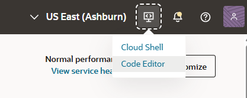
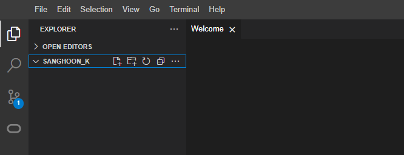
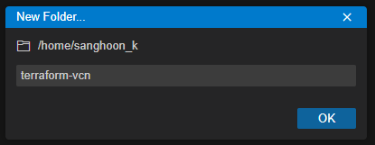
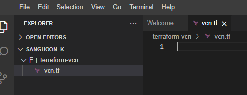
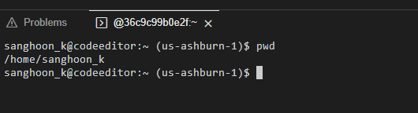

= 연습 1: Code Editor에서 Terraform 폴더를 생성

이 연습에서는, Terraform 스크립트를 저장할 폴더와 파일을 생성합니다.

아래 절차에 따릅니다.

1. 웹 브라우저를 열고 아래 웹 사이트로 이동합니다.
+
http://cloud.oracle.com

2. 유효한 계정을 사용하여 로그인합니다.
3. 왼쪽 위의 **Developer Tool**을 클릭하고, **Code Editor**를 클릭합니다.
+

4. Code Editor의 왼쪽 패널에서, 맨 위의 **Explorer** 아이콘을 클릭합니다.
+
image:./images/01/image02.png[]

5. 사용자의 Home 디렉토리를 확장하고, 파일이 없는 것을 확인합니다.
+

6. **File** 메뉴를 클릭하고 **New Folder**를 클릭한 후, **New Folder** 대화상자에서 이름을 `terraform-vcn` 으로 지정합니다.
+

7. 생성된 `terraform-vcn` 폴더를 마우스 오른쪽 클릭하고, 메뉴에서 **New File**을 클릭합니다. **New File** 대화상자에서 파일 이름을 `vcn.tf` 로 지정합니다. **Explorer**에서 파일이 terraform-vcn 폴더에 제대로 생성되었는지 확인합니다.
+

8. 첫 번째로, 이 디렉토리에서 Terraform과 OCI Provider를 지정합니다. 아래 코드를 파일에 입력합니다.
+
[source, terraform]
----
terraform {
    required_providers {
        oci = {
            source = "oracle/oci"
            version = ">=4.67.3"
        }
    }
    required_version = ">= 1.0.0"
}
----

9. Ctrl + S 키를 누르거나 **File** 메뉴에서 **Save**를 클릭하여 vcn.tf 파일을 저장합니다.
10. 이제, 코드를 실행합니다. 메뉴에서 **Terminal**을 클릭하고, **New Terminal**을 클릭하여 터미널을 시작합니다.
11. 터미널에서 아래 명령을 실행하여 현재 디렉토리가 사용자의 홈 디렉토리인 것을 확인합니다.
+
----
$ pwd
----
+

12. 아래 명령을 실행하여 `terraform_vcn` 디렉토리를 확인합니다.
+
----
$ ls
----

13. 아래 명령을 실행하여 현재 디렉토리를 `terraform_vcn` 으로 변경합니다.
+
----
cd terraform_vcn
----

14. 아래 명령을 실행하여 디렉토리를 Tereaform용으로 초기화합니다.
+
----
$ terraform init
----

15. 아래 명령을 실행하여 Terraform을 위해 생성된 모든 파일과 숨김 디렉토리를 확인합니다.
+
----
ls -a
----
+
실행 결과는 아래와 같습니다.
+
----
.  ..  .terraform  .terraform.lock.hcl  vcn.tf
----

---

다음: link:./02_create_destroy_vcn_terraform.adoc[Terraform을 사용하여 VCN을 생성하고 제거]