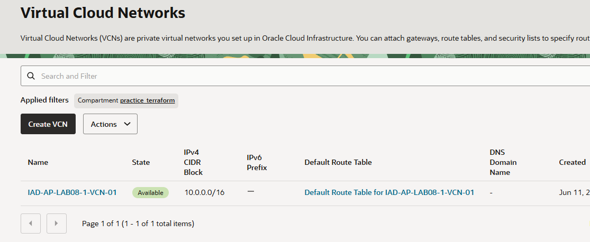
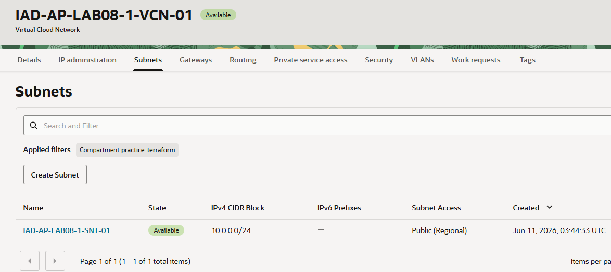

= 연습 2: Terraform을 사용하여 VCN을 생성하고 제거

Terraform은 프로바이더를 사용하여 Terraform 엔진과 지원되는 클라우드 플랫폼 간의 인터페이스를 제공합니다. Oracle Cloud Infrastructure(OCI) Terraform 프로바이더는 관리하려는 OCI 서비스에 Terraform을 연결하는 구성 요소입니다.

이 실습에서는 VCN과 서브넷을 시작하는 Terraform 스크립트를 생성합니다. 그런 다음 스크립트를 수정하고 두 개의 추가 파일을 생성하여 Terraform 스크립트에 구획 OCID 변수를 적용합니다.

아래 절차에 따릅니다.

== 작업 1: 컴파트먼트 생성

이 연습에서 사용하는 모든 리소스를 한 구획(Compartment)에서 사용하기 위해, **practice_terraform** 라는 이름의 컴파트먼트를 생성합니다. 아래 절차에 따릅니다.

1. OCI 콘솔에서 태넌시와 컴파트먼트에 로그인합니다.
2. 왼쪽 위의 햄버거 버튼을 클릭하고 **Identity & Security**를 클릭합니다.
3. Identity & Security 메뉴에서 **Identity** 구역의 **Compartments**를 클릭합니다.
4. **Compartment** 페이지에서 **Create Compartment** 버튼을 클릭합니다.
5. **Create Compartment** 페이지에서 아래와 같이 정보를 입력하고 오른쪽 아래의 **Create Compartment** 버튼을 클릭합니다.
* **Name**: `practice_terraform`
* **Description**: `Terraform 실습을 위한 컴파트먼트`
* **Parent compartment**: _루트 컴파트먼트 (태넌시 이름 (root) 로 표시됨)_
6. 생성된 컴파트먼트를 확인합니다. 루트 컴파트먼트의 Subcompartments 숫자가 하나 증가된 것도 확인합니다.
7. 생성된 컴파트먼트의 OCID를 확인합니다.

== 작업 2: Terraform 작성

1. https://docs.oracle.com/en-us/iaas/tools/terraform-provider-oci/latest/[OCI Provider Documentation]을 열고, 문서를 검토합니다. 실습을 진행하면서 문서에서 관련 부분을 찾아보는 것이 도움이 될 수 있습니다.

2. 기존 코드 아래에 다음 코드 블록을 추가하여 VCN을 선언하고, <your_compartment ocid> 부분을 올바른 OCID로 변경합니다. 필수 매개변수는 구획 OCID뿐이지만, 나중에 더 많은 매개변수를 추가할 수 있습니다.
+
[source, terraform]
----
resource "oci_core_vcn" "example_vcn" {
    compartment_id = "ocid1.compartment.oc1..aaaaaaaa25et4wk4i6z45r4qfiwy22evesc6sanm3sgn5xkkkf2vcj6giksq"
}
----
+
이 코드는 `type_oci_core` 유형의 _리소스 블록_ 을 선언합니다. Terrafrom이 이 리소스에 사용할 레이블은 example_vcn입니다.

3. 터미널에서, 아래 명령을 실행합니다.
+
----
$ terraform plan
----
+
Terraform이 VCN을 생성하는 것을 확인할 수 있습니다. 대부분의 매개변수가 지정되지 않았기 때문에 Terraform은 해당 값을 "(적용 후 확인됨)"으로 표시합니다. 이번 실습에서는 "-out 옵션을 사용하여 이 계획을 저장하세요"라는 경고를 무시해도 됩니다.
+
명령의 실행 결과는 아래와 같습니다.
+
----
Terraform used the selected providers to generate the following execution plan. Resource actions are indicated with the following symbols:
  + create

Terraform will perform the following actions:

  # oci_core_vcn.example_vcn will be created
  + resource "oci_core_vcn" "example_vcn" {
      + byoipv6cidr_blocks               = (known after apply)
      + cidr_block                       = (known after apply)
      + cidr_blocks                      = (known after apply)
      + compartment_id                   = "ocid1.compartment.oc1..aaaaaaaa25et4wk4i6z45r4qfiwy22evesc6sanm3sgn5xkkkf2vcj6giksq"
      + default_dhcp_options_id          = (known after apply)
      + default_route_table_id           = (known after apply)
      + default_security_list_id         = (known after apply)
      + defined_tags                     = (known after apply)
      + display_name                     = (known after apply)
      + dns_label                        = (known after apply)
      + freeform_tags                    = (known after apply)
      + id                               = (known after apply)
      + ipv6cidr_blocks                  = (known after apply)
      + ipv6private_cidr_blocks          = (known after apply)
      + is_ipv6enabled                   = (known after apply)
      + is_oracle_gua_allocation_enabled = (known after apply)
      + security_attributes              = (known after apply)
      + state                            = (known after apply)
      + time_created                     = (known after apply)
      + vcn_domain_name                  = (known after apply)
    }

Plan: 1 to add, 0 to change, 0 to destroy.

──────────────────────────────────────────────────────────────────────────────────────────────────────────────────────────────────────────────────────────

Note: You didn't use the -out option to save this plan, so Terraform can't guarantee to take exactly these actions if you run "terraform apply" now.
----
+
NOTE: `terraform plan`은 Terraform 구성을 분석하여 연결된 스택에 대한 실행 계획을 생성하는 반면, `terraform apply`는 실행 계획을 적용하여 리소스를 생성(또는 수정)합니다.

4. 코드에 display name과 CIDR 블록을 추가합니다. 여기서 `cidr blocks` 파라미터를 사용해야 하며, `cidr block`은 더 이상 사용되지 않습니다. 아래 예시에서는 미국 동부(애쉬번) 지역의 지역 코드로 `IAD`를 사용했습니다.
+
[source, terraform]
----
resource "oci_core_vcn" "example_vcn" {
    compartment_id = "ocid1.compartment.oc1..aaaaaaaa25et4wk4i6z45r4qfiwy22evesc6sanm3sgn5xkkkf2vcj6giksq"
    display_name = "IAD-AP-LAB08-1-VCN-01"
    cidr_blocks = ["10.0.0.0/16"]
}
----

5. 파일을 저장하고 아래 명령을 한번 더 실행합니다. Terraform의 plan에 표시 이름과 CIDR 블록이 반영된 것을 확인할 수 있습니다.
+
----
$ terraform plan
----

6. VCN에 서브넷을 추가합니다. 파일의 아래쪽에, 아래와 같은 코드 블록을 추가합니다.
+
[source, terraform]
----
resource "oci_core_subnet" "example_subnet" {
    compartment_id = "ocid1.compartment.oc1..aaaaaaaa25et4wk4i6z45r4qfiwy22evesc6sanm3sgn5xkkkf2vcj6giksq"
    display_name = "IAD-AP-LAB08-1-SNT-01"
    vcn_id = oci_core_vcn.example_vcn.id
    cidr_block = "10.0.0.0/24"
}
----
+
NOTE: VCN ID를 설정하는 부분을 주목하세요. 여기서는 이전에 선언한 VCN의 OCID를 참조하는데, Terraform에 지정한 이름(예: example vcn)을 사용합니다. 이 종속성 때문에 Terraform은 먼저 VCN을 프로비저닝하고, OCI가 OCID를 반환할 때까지 기다린 후 서브넷을 프로비저닝합니다.

7. 파일을 저장하고 `terraform plan` 명령을 한번 더 실행합니다.

== 작업 3: 변수 추가

1. 다음으로 넘어가기 전에 기존 코드를 개선할 수 있는 몇 가지 방법이 있습니다. 서브넷과 VCN 모두 구획 OCID가 필요하다는 점에 유의하세요. 이를 변수로 분리할 수 있습니다. 
+
`terraform-vcn` 폴더를 마우스 오른쪽 클릭하고, 메뉴에서 **New File**을 클릭합니다. **New File** 대화상자에서 파일 이름을 `variables.tf` 로 지정합니다. 
2. `variables.tf` 파일에서, `compartment_id` 라는 이름의 변수를 선언합니다.
+
[source, terraform]
----
variable "compartment_id" {
    type = string
}
----

3. `vcn.ff` 파일에서, 모든 컴파트먼트 OCID 값을 `var.compartment_id` 로 변경합니다. 코드는 아래와 같습니다.
+
[source, terraform]
----
terraform {
    required_providers {
        oci = {
            source = "oracle/oci"
            version = ">=4.67.3"
        }
    }
    required_version = ">= 1.0.0"
}

resource "oci_core_vcn" "example_vcn" {
    compartment_id = var.compartment_id
    display_name = "IAD-AP-LAB08-1-VCN-01"
    cidr_blocks = ["10.0.0.0/16"]
}

resource "oci_core_subnet" "example_subnet" {
    compartment_id = var.compartment_id
    display_name = "IAD-AP-LAB08-1-SNT-01"
    vcn_id = oci_core_vcn.example_vcn.id
    cidr_block = "10.0.0.0/24"
}
----

4. `vcn.tf` 와 `variables.tf` 두 파일을 저장합니다.
+
`terraform plan` 또는 `apply now` 명령을 실행하면 Terraform은 변수를 인식하고 구획 OCID를 입력하라는 메시지를 표시합니다. 하지만 이 경우 변수 값은 별도의 파일에 저장해야 합니다. 
5. `terraform-vcn` 폴더를 마우스 오른쪽 클릭하고, 메뉴에서 **New File**을 클릭합니다. **New File** 대화상자에서 파일 이름을 `terraform.tfvars` 로 지정하여 파일을 생성합니다.
+
NOTE: Terraform은 이 이름의 파일에 저장된 값을 자동으로 불러옵니다. 다른 이름을 사용하려면 Terraform CLI에 파일 이름을 지정해야 합니다. 

6. `terraform.tfvars` 파일에 컴파트먼트 OCID 값을 다음과 같이 추가합니다.
+
[source, terraform]
----
`compartment_id = '<구획 OCID 입력값>'`
----

7. `terraform.tfvars` 파일을 저장합니다.
8. 터미널에서 `terraform plan` 명령을 다시 한번 실행합니다. 결과는 이전과 같습니다.

== 작업 4: VCN 프로비저닝

1. `terraform apply` 명령을 실행하고 프롬프트에 `yes`를 입력하여 변경 사항을 적용하는지 확인합니다.
+
----
$ terraform apply
----

2. OCI 콘솔에서, 왼쪽 위의 햄버거 메뉴를 클릭하고, **Networking** -> **Virtual cloud networks**를 클릭합니다. 
3. **Apply filters**에서, 작업 1에서 생성한 `practice_terraform` 컴파트먼트를 선택합니다.
4. 생성된 VCN을 확인합니다.
+

5. Terraform으로 생성한 `IAD-AP-LAB08-VCN-01` VCN을 클릭하고, **IAD-AP-LAB08-VCN-01** 페이지에서 **Subnets**를 클릭하여 생성된 Subnet을 확인합니다.
+

== 작업 5: VCN 제거

1. Code Editor의 터미널에서, `terrafrom destroy` 명령을 실행하고, 프롬프트에 `yes`를 입력하여 확인합니다.
+
----
$ terraform destory
----

2. OCI 콘솔의 Virtual Cloud Networks 메뉴에서 VCN이 제거된 것을 확인합니다.

---

다음: link:./03_create_destroy_vcn_resourcemanager.adoc[Terraform을 사용하여 VCN을 생성하고 제거]