= 연습 3: Terraform을 사용하여 VCN을 생성하고 제거

Terraform을 통해 프로비저닝된 인프라를 더 효율적으로 관리하려면 Cloud Shell이나 코드 편집기에서 Terraform을 로컬로 실행하는 대신 Resource Manager로 마이그레이션하는 것이 좋습니다. 이 섹션에서는 Terraform 코드를 재사용하되 CLI를 Resource Manager로 대체하는 방법을 설명합니다.

아래 절차에 따릅니다.

== 작업 1: 파일 다운로드

1. 클라이언트 컴퓨터에 `terraform_vcn` 이라는 폴더를 생성합니다. 
2. OCI 콘솔의 Code Editor에서 `terraform.tfvars` 파일을 마우스 오른쪽 클릭하고 **Download**를 클릭합니다.
+
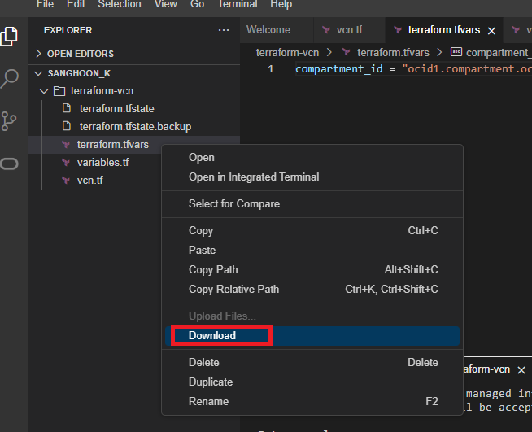

3. 같은 방법으로, `variables.tf`, `vcn.tf` 파일을 다운로드 합니다.
4. 다운로드 한 폴더를 위에서 생성한 `terraform_vcn` 폴더로 이동합니다.
+
NOTE: 여러 파일을 선택해 다운로드하면 `.tar` 압축 파일 형태로 다운로드 됩니다.

== 작업 2: Stack 생성

1. OCI 콘솔에서, 왼쪽 위의 햄버거 메뉴를 클릭하고 **Developer Services**를 클릭한 후 **Resource Manager** 구역의 **Stacks**를 클릭합니다.
+
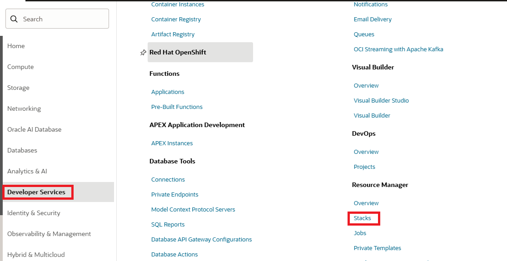

2. **Stacks** 페이지에서, **Create Stack** 버튼을 클릭합니다.
+
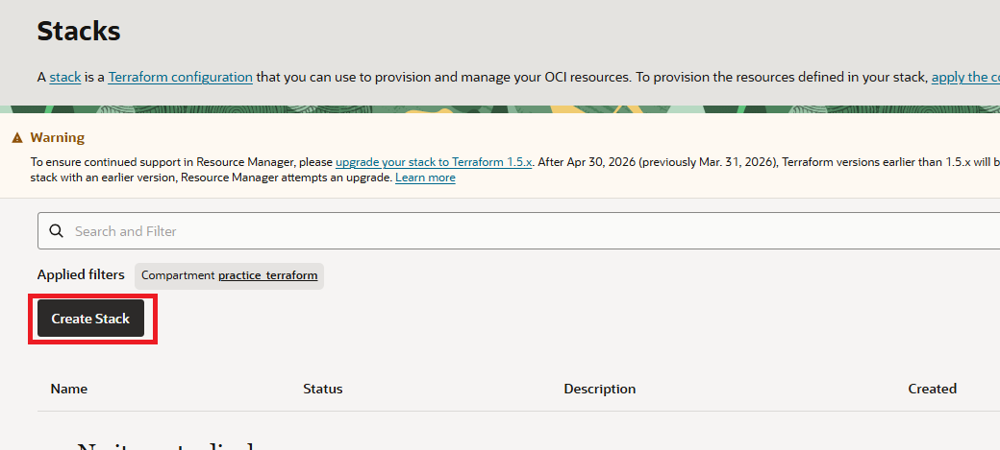

a. **Stack Information** 페이지에서, 아래와 같이 정보를 입력합니다.
* **Origin of terraform**에서, `My configuration` 을 선택합니다.
* **Stack configuration**: `folder` 를 선택하고 클라이언트의 `terraform_vcn` 폴더를 끌어다 놓습니다.
* **Custom providers**: **Use custom Terraform providers**를 **선택하지 않습니다**. (기본값으로 선택되어 있지 않습니다)
* **Name**: `my_vcn_stack`.
* **Description**: `VCN 스택`
* **Compartment**: 연습 2의 작업 1에서 생성한 `practice_terraform` 컴파트먼트 선택
* 나머지는 기본 값으로 유지합니다.

+
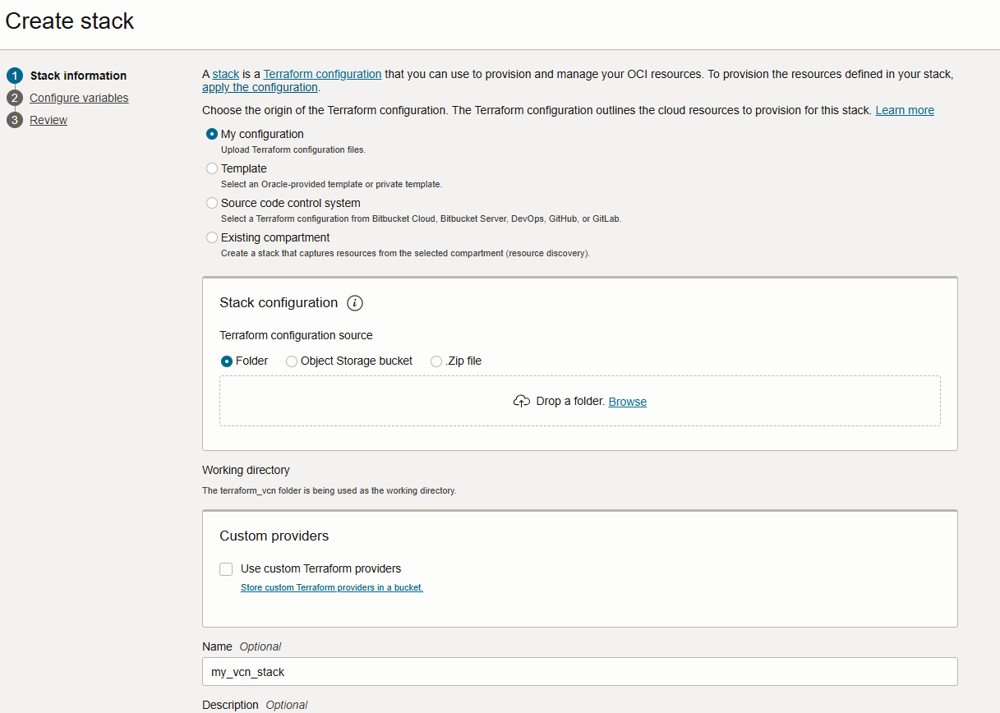

3. 왼쪽 아래의 **Next** 버튼을 클릭합니다.
4. **Configure variables** 페이지에서, `variables.tf` 파일에서 지정한 변수들이 보이는 것을 확인하고, 왼쪽 아래의 **Next** 버튼을 클릭합니다.
+
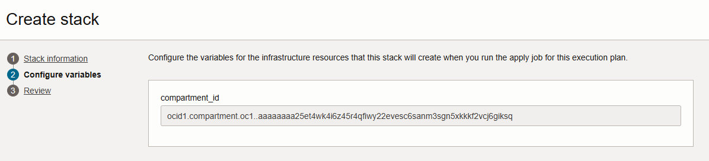

5. **Review** 페이지에서, **Run apply on created stack?** 구역에서 **Run apply**가 **선택되지 않은 것을 확인**하고, 왼쪽 아래의 **Create** 버튼을 클릭합니다.
+
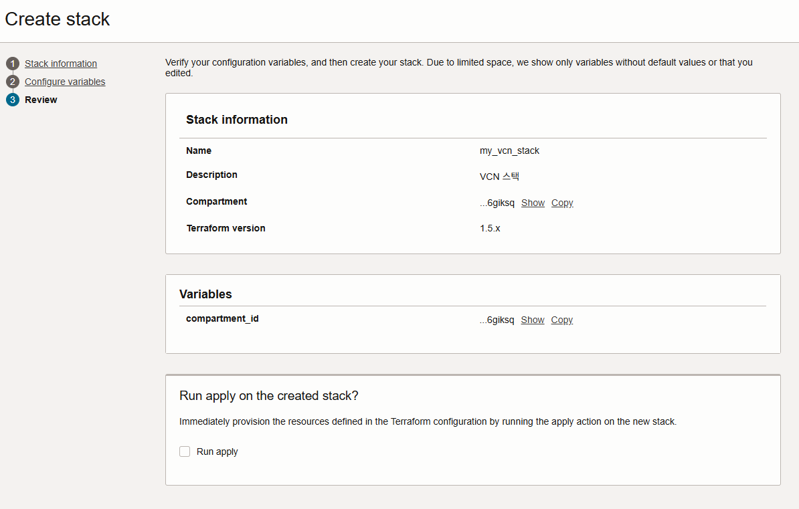

== 작업 3: Plan 작업 실행

1. 스택 자체는 단순한 예약 자원일 뿐이며, 아직 인프라가 구축되지 않았습니다. 생성된 Stack 페이지에서, 오른쪽 위의 **Actions** 드롭다운 리스트를 클릭하고 **Plan**을 클릭합니다.
+
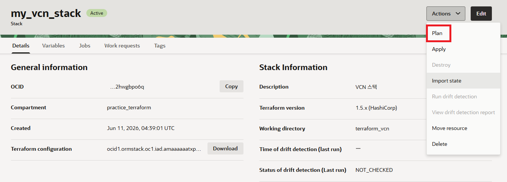

2. **Plan** 페이지에서 **Name**을 `RM-Plan-01` 로 지정하고. 오른쪽 아래의 **Plan** 버튼을 클릭합니다.
+
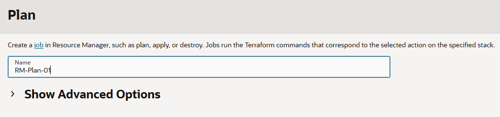
+
Resource Manager가 `terraform plan` 작업을 제출합니다.

3. **Logs** 탭에서 작업이 완료되기를 기다립니다. 작업이 완료되면 로그를 확인합니다. 결과는 연습 2에서 Code Editor 터미널에서의 결과와 유사할 것입니다.
+
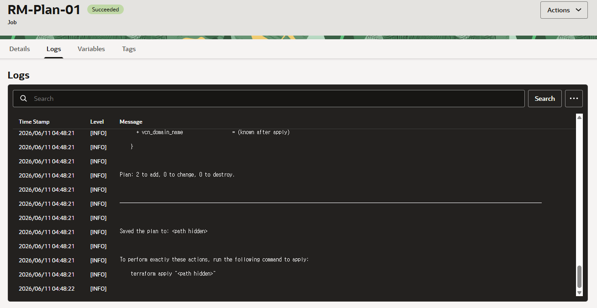

== 작업 4: Apply 작업 실행

1. OCI 콘솔에서, 왼쪽 위의 햄버거 메뉴를 클릭하고 **Developer Services**를 클릭한 후 **Resource Manager** 구역의 **Stacks**를 클릭합니다.
2. 작업 2에서 생성한 `my_vcn_stack` 스택을 클릭합니다.
3. **my_vcn_stack** 페이지에서 **Actions** 드롭다운 리스트를 클릭하고 **Apply**를 클릭합니다.
+
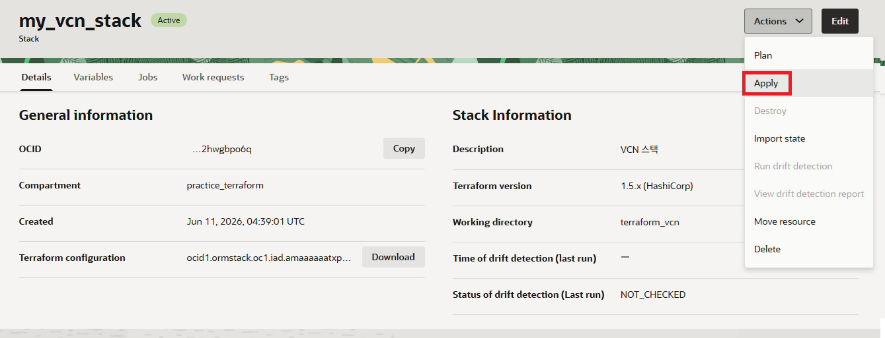
4. **Apply** 페이지에서, 아래와 같이 정보를 입력합니다.
* **Name**: `RM-Apply-01`
* **Apply job plan resolution**: 작업 2에서 생성한 Plan을 선택합니다. 이 선택은 새 plan을 만들지 않고 이전의 Plan을 실행합니다.
* 오른쪽 아래의 **Apply** 버튼을 클릭합니다. 이 작업은 Resource Manager가 `terraform apply` 명령을 실행하도록 합니다.

+
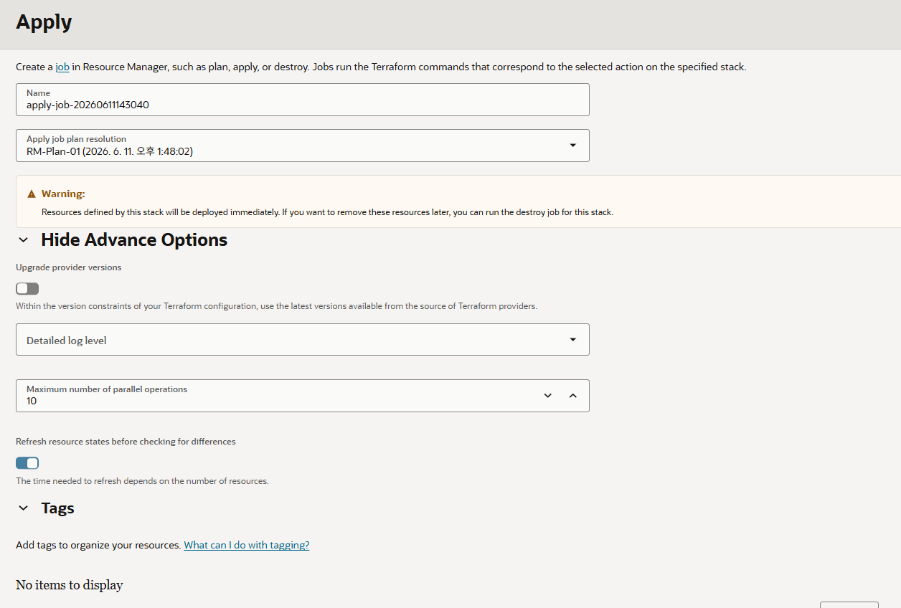

5. **Logs** 탭에서 작업이 완료되기를 기다립니다. 작업이 완료되면 로그를 확인합니다. 결과는 연습 2에서 Code Editor 터미널에서의 결과와 유사할 것입니다.

== 작업 5: VCN 확인

1. OCI 콘솔에서, 왼쪽 위의 햄버거 메뉴를 클릭하고 **Networking**을 클릭한 후 **Virtual cloud networks**를 클릭합니다.
2. 컴파트먼트를 확인하고, 생성된 VCN을 확인합니다.
+
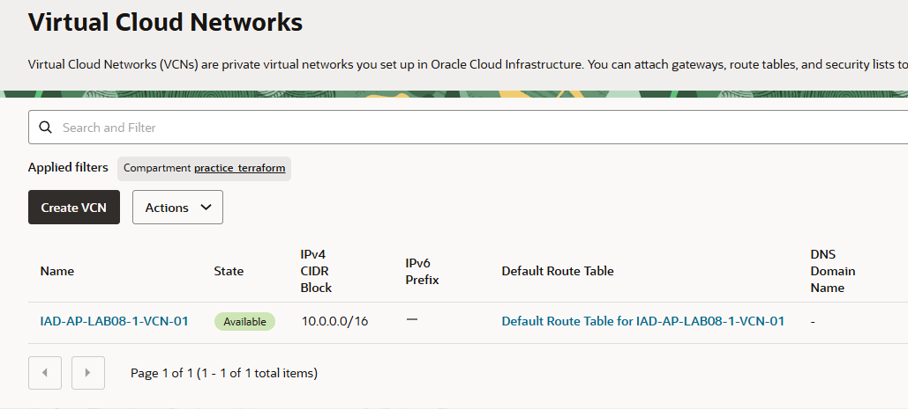

3. Resource Manager에 의해 생성된 `IAD-AP-LAB08-1-VCN-01` VCN을 클릭합니다.
4. **Subnet** 탭을 클릭하고 생성된 Subnet을 확인합니다.

== 작업 6: 제거 작업 실행

1. OCI 콘솔에서, 왼쪽 위의 햄버거 메뉴를 클릭하고 **Developer Services**를 클릭한 후 **Resource Manager** 구역의 **Stacks**를 클릭합니다.
2. 작업 2에서 생성한 `my_vcn_stack` 을 클릭합니다.
+
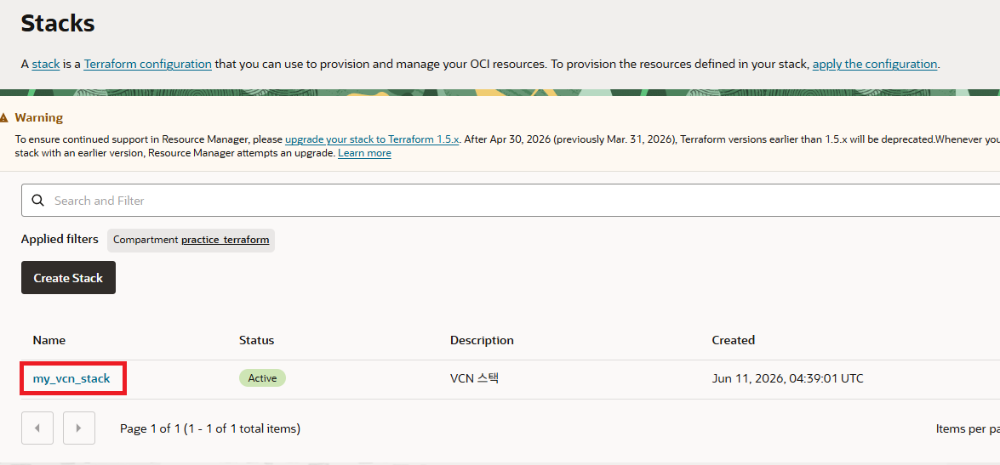

3. 오른쪽 위의 **Actions** 드롭다운 리스트에서 **Destroy**를 클릭합니다.
+
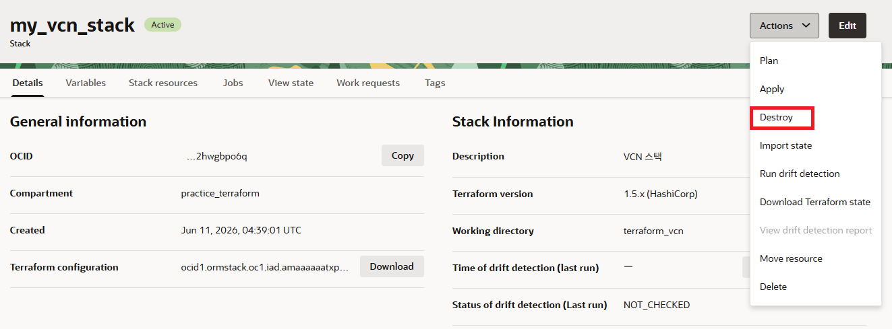

4. **Destroy** 페이지에서, 왼쪽 아래의 **Destroy** 버튼을 클릭합니다.
+
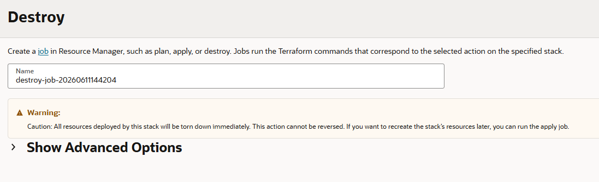

5. **Logs** 탭에서 작업이 완료되기를 기다립니다. 작업이 완료되면 로그를 확인합니다. 결과는 연습 2에서 Code Editor 터미널에서의 결과와 유사할 것입니다.
6. OCI 콘솔에서, 왼쪽 위의 햄버거 메뉴를 클릭하고 **Networking**을 클릭한 후 **Virtual cloud networks**를 클릭합니다.
7. VCN이 삭제된 것을 확인합니다.
8. OCI 콘솔에서, 왼쪽 위의 햄버거 메뉴를 클릭하고 **Developer Services**를 클릭한 후 **Resource Manager** 구역의 **Stacks**를 클릭합니다.
9. 작업 2에서 생성한 `my_vcn_stack` 을 클릭합니다.
10. 오른쪽 위의 **Actions** 드롭다운 리스트에서 **Delete**를 클릭합니다.
+
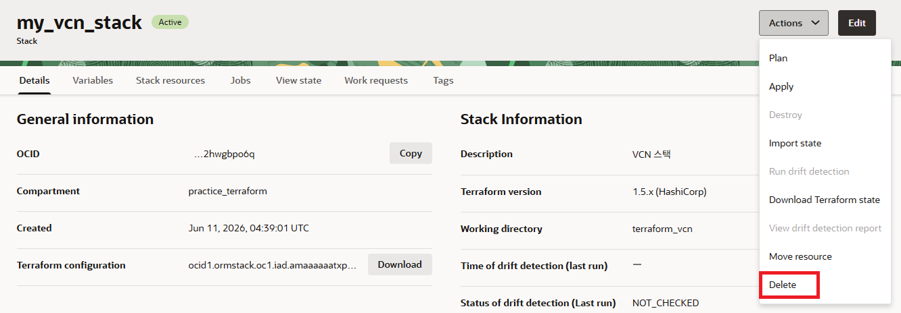

11. **Delete Stack** 경고 상자에서 **Delete** 버튼을 클릭합니다.
+
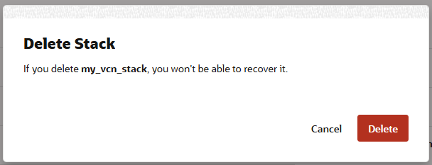

---

다음: link:./04_env_clear.adoc[실습에 사용된 리소스 제거]