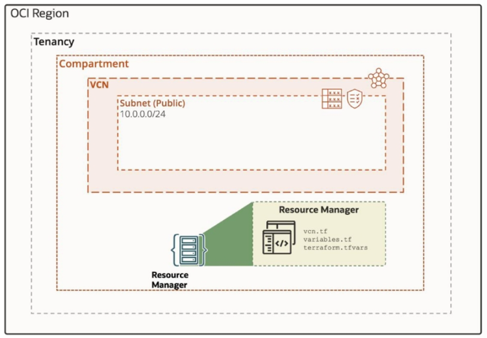

= Lab 08: Infrastructure as Code: Terrform을 사용하여 재사용 가능한 VCN 구성 생성

Oracle Cloud 콘솔에서 VCN과 서브넷을 생성하는 방법은 여러 가지가 있습니다. 특히 동일한 구성으로 여러 VCN을 시작하려는 경우 Terraform 또는 Resource Manager를 사용하여 프로세스를 간소화하고 자동화하는 것이 유용합니다. Terraform은 컴퓨팅, 스토리지, 네트워킹 리소스와 같은 하위 수준 구성 요소는 물론 DNS 항목 및 SaaS 기능과 같은 상위 수준 구성 요소도 관리할 수 있습니다.

이 실습에서는 Terraform 자동화 스크립트를 생성하고 코드 편집기에서 명령을 실행하여 VCN과 서브넷을 시작하고 삭제합니다. 다음으로, 이러한 Terraform 스크립트를 다운로드하고 Oracle Cloud Infrastructure Resource Manager에 업로드하여 스택을 생성합니다. 마지막으로, 해당 서비스를 사용하여 동일한 VCN과 서브넷을 시작하고 삭제합니다.

이 연습에서는 아래와 같은 작업을 수행합니다:

1. Code Editor에서 Terraform 폴더를 생성합니다.
2. Terraform을 사용하여 VCN을 생성하고 제거합니다.
3. Resource Manager를 사용하여 VCN을 생성하고 제거합니다.

== 목차

1. link:./01_create_terraform_folder_using_codeeditor.adoc[Code Editor에서 Terraform 폴더를 생성]
2. link:./02_create_destroy_vcn_terraform.adoc[Terraform을 사용하여 VCN을 생성하고 제거]
3. link:./03_create_destroy_vcn_resourcemanager.adoc[Terraform을 사용하여 VCN을 생성하고 제거]
4. link:./04_env_clear.adoc[실습에 사용된 리소스 제거]