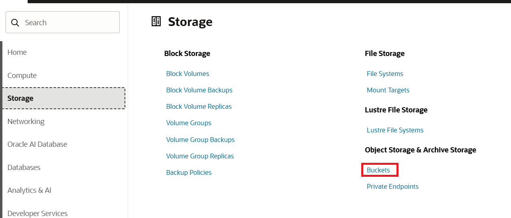
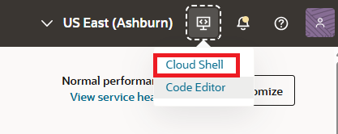
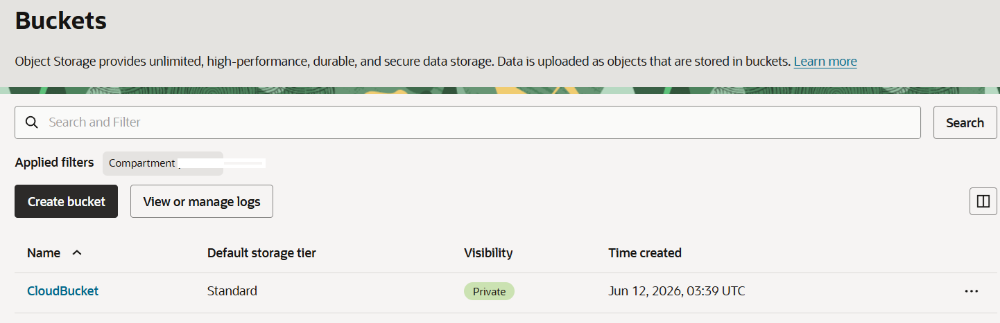

= 연습 1: CLI 명령을 사용하여 버킷 생성

여기에서는 CLI 명령을 사용하여 버킷을 생성합니다. 버킷 이름은 CloudBucket으로 지정합니다.

아래 절차에 따릅니다.

== 작업 1: 컴파트먼트 생성

이 연습에서 사용하는 모든 리소스를 한 구획(Compartment)에서 사용하기 위해, `practice_bucket` 라는 이름의 컴파트먼트를 생성합니다. 아래 절차에 따릅니다.

1. OCI 콘솔에서 태넌시와 컴파트먼트에 로그인합니다.
2. 왼쪽 위의 햄버거 버튼을 클릭하고 **Identity & Security**를 클릭합니다.
3. Identity & Security 메뉴에서 **Identity** 구역의 **Compartments**를 클릭합니다.
4. **Compartment** 페이지에서 **Create Compartment** 버튼을 클릭합니다.
5. **Create Compartment** 페이지에서 아래와 같이 정보를 입력하고 오른쪽 아래의 **Create Compartment** 버튼을 클릭합니다.
* **Name**: `practice_bucket`
* **Description**: `Bucket 실습을 위한 컴파트먼트`
* **Parent compartment**: _루트 컴파트먼트 (태넌시 이름 (root) 로 표시됨)_
6. 생성된 컴파트먼트를 확인합니다. 루트 컴파트먼트의 Subcompartments 숫자가 하나 증가된 것도 확인합니다.
7. 생성된 컴파트먼트의 OCID를 확인하고, 기록합니다.

== 작업 2: 버킷 확인

여기서는 현재 태넌시의 버킷 상태를 확인합니다. 아래 절차에 따릅니다.

1. OCI 콘솔에 로그인합니다.
2. OCI 콘솔에서, 왼쪽 위의 햄버거 메뉴를 클릭하고 **Storage**를 클릭한 후 **Object Storage & Archive Storage** 구역에서 **Buckets**를 클릭합니다.
+

3. **Applied filters**에서 컴파트먼트를 'practice_bucket' 으로 지정합니다.
4. **Buckets** 페이지에서, 생성된 버킷이 없는 것을 확인합니다.

== 작업 3: CLI 명령을 사용하여 버킷 생성

1. OCI 콘솔에서, 오른쪽 위의 **Developer tool**을 클릭하고 **Cloud Shell**을 클릭합니다.
+

2. Cloud Shell에서, 아래 명령을 실행하여 홈 디렉토리의 파일을 확인합니다. 숨김 파일과 디렉토리를 제외하면 아무런 파일이나 디렉토리도 보이지 않습니다.
+
----
$ ls
----

3. `CloudBucket` 이라는 이름의 버킷을 생성합니다. 
+
명령의 형식은 아래와 같습니다.
+
----
$ oci os bucket create -c "<compartment_id>" --name <bucket_name>
----
+
실제 명령의 예는 아래와 같습니다. 명령을 실행합니다.
+
----
$ oci os bucket create -c "ocid1.compartment.oc1..aaaaaaaaec6gdunqodbkjboteg453is5ljx2lciuf6ccdo2qsmdzbfaz42ya" --name "CloudBucket"
----

4. 명령의 실행 결과는 아래와 같습니다.
+
----
{
  "data": {
    "approximate-count": null,
    "approximate-size": null,
    "auto-tiering": null,
    "compartment-id": "ocid1.compartment.oc1..aaaaaaaaec6gdunqodbkjboteg453is5ljx2lciuf6ccdo2qsmdzbfaz42ya",
    "created-by": "ocid1.user.oc1..aaaaaaaa3y4dxfl3eq23bctcatthlujtx54gonuvrnewqwcszjsyoc3httta",
    "defined-tags": {
      "Oracle-Tags": {
        "CreatedBy": "default/sanghoon.k.kim@oracle.com",
        "CreatedOn": "2026-06-12T03:39:13.031Z"
      }
    },
    "etag": "fbc09ea1-4660-4ca8-bd2f-68735c8553ae",
    "freeform-tags": {},
    "id": "ocid1.bucket.oc1.iad.aaaaaaaam6fzbiw2eea7cszgwqkk43igxwsa4rjoybiu4z5qrodhylwzgqua",
    "is-read-only": false,
    "kms-key-id": null,
    "metadata": {},
    "name": "CloudBucket",
    "namespace": "idw9qpcf8tyn",
    "object-events-enabled": false,
    "object-lifecycle-policy-etag": null,
    "public-access-type": "NoPublicAccess",
    "replication-enabled": false,
    "storage-tier": "Standard",
    "time-created": "2026-06-12T03:39:13.038000+00:00",
    "versioning": "Disabled"
  },
  "etag": "fbc09ea1-4660-4ca8-bd2f-68735c8553ae"
}
----

5. **Buckets** 페이지에서, 생성된 버킷을 확인합니다.
+

---

다음: link:./02_upload_file_to_cloudshell.adoc[Cloud Shell로 파일 업로드]