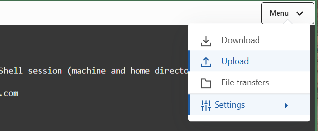
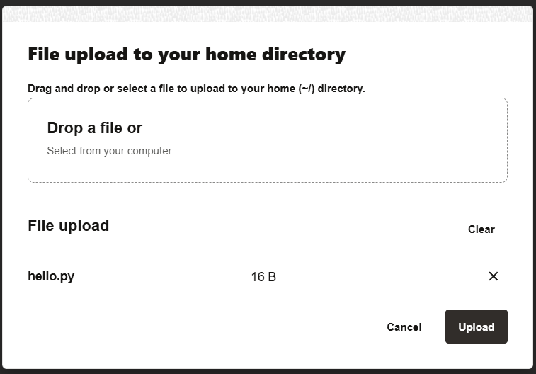

= 연습 2: Cloud Shell로 파일 업로드

Cloud Shell은 OCI 콘솔에서 제공하는 브라우저 기반 가상 터미널로, 사용자 별로 5GB의 영구 저장소가 홈 디렉토리로 제공됩니다. 이 연습에서는 Cloud Shell의 홈 디렉토리로 파일을 업로드합니다.

아래 절차에 따릅니다.

== 클라이언트에서 파일 생성 및 Cloud Shell 홈디렉토리로 업로드

1. 클라이언트의 터미널에서, 아래 명령을 실행하여 hello.py 파일을 만듭니다.
+
Windows
+
----
\> echo print('hello') > hello.py
----
+
macOS/Linux
+
----
$ echo "print('hello')" > hello.py
----

2. OCI 콘솔의 Cloud Shell에서, 오른쪽 위의 Menu 드롭다운 리스트를 클릭하고 **Upload**를 클릭합니다.
+

3. **File upload to your home directory** 대화 상자에서, 위에서 생성한 hello.py 파일을 드래그하여 놓고, Upload 버튼을 클릭합니다.
+

4. Cloud shell에서, `ls` 명령을 실행하여 업로드 된 파일을 확인합니다.
+
----
$ ls
----

다음: link:./03_upload_file_to_bucket.adoc[Cloud Shell의 파일을 CLI 명령을 사용하여 버킷에 파일 업로드]