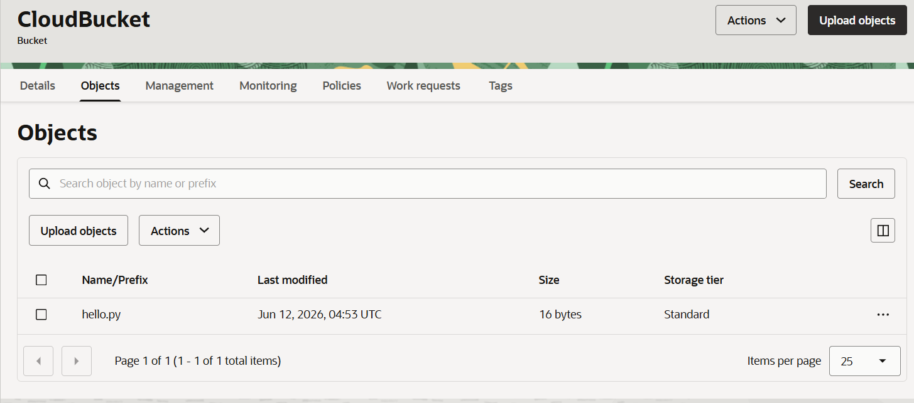

= 연습 3: Cloud Shell의 파일을 CLI 명령을 사용하여 버킷에 파일 업로드

이 연습에서는 Cloud Shell 홈 디렉토리의 파일을 CLI 명령을 사용하여 생성한 버킷으로 업로드 합니다. 

아래 절차에 따릅니다.

1. OCI 콘솔의 Cloud Shell에서, 'ls' 명령을 실행하여 홈 디렉토리의 파일을 확인합니다.
+
----
$ ls
----

2. 아래 명령을 실행하여 hello.py 파일을 연습 1에서 생성한 CloudBucket 버킷으로 업로드합니다.
+
----
$ oci os object put --bucket-name CloudBucket --file hello.py
----
+
명령의 실행 결과는 아래와 같습니다.
+
----
Uploading object  [####################################]  100%
{
  "etag": "5763e87c-ac74-4065-85c4-522597e0a9b8",
  "last-modified": "Fri, 12 Jun 2026 04:53:05 GMT",
  "opc-content-md5": "Y79A0ToKl1bh180hyR/t8w=="
}
----

3. OCI 콘솔의 Buckets 페이지에서, 연습 1에서 생성한 CloudBucket을 클릭합니다.
4. **CloudBucket** 페이지에서 Objects 탭을 클릭하고 업로드된 `hello.py` 파일을 확인합니다.
+

연습이 종료되었습니다.

---

다음: link:./04_env_clear.adoc[실습에 사용된 리소스 제거]