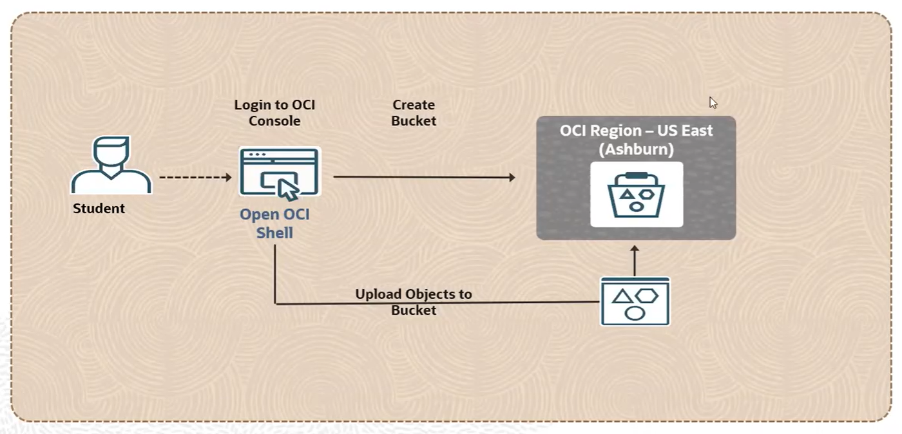

=0 Lab 09: CLI를 사용하여 Bucket을 만들고 파일 업로드

이 연습에서는 명령줄 인터페이스를 사용하여 버킷을 생성하고 파일을 업로드하는 것을 수행합니다. 

CLI를 사용하여 버킷을 생성하는 방법은 여러 가지가 있습니다. 컴퓨트 인스턴스에서 생성할 수도 있지만, 이 경우 계정에 인스턴스 주체가 구성되어 있어야 해당 컴퓨트 인스턴스에 리소스 생성 권한을 부여할 수 있습니다.

다른 방법으로, Cloud Shell을 사용하는 것입니다 이 연습에서는 Cloud Shell을 사용하여 작업을 수행할 것입니다. 커맨드 인터페이스를 사용하여 리소스를 생성하려면 최소한 두 가지 기본 명령어를 알아야 합니다.

이 연습에서는 다음과 같은 작업들을 수행합니다:

1. Cloud Shell에서 CLI 명령을 사용하여 버킷을 생성합니다.
2. Cloud Shell로 파일을 업로드 합니다.
3. Cloud Shell의 파일을 CLI 명령을 사용하여 버킷에 파일 업로드

== 목차

1. link:./01_create_bucket_using_cli.adoc[CLI 명령을 사용하여 버킷 생성]
2. link:./02_upload_file_to_cloudshell.adoc[Cloud Shell로 파일 업로드]
3. link:./03_upload_file_to_bucket.adoc[Cloud Shell의 파일을 CLI 명령을 사용하여 버킷에 파일 업로드]
4. link:./04_env_clear.adoc[실습에 사용된 리소스 제거]