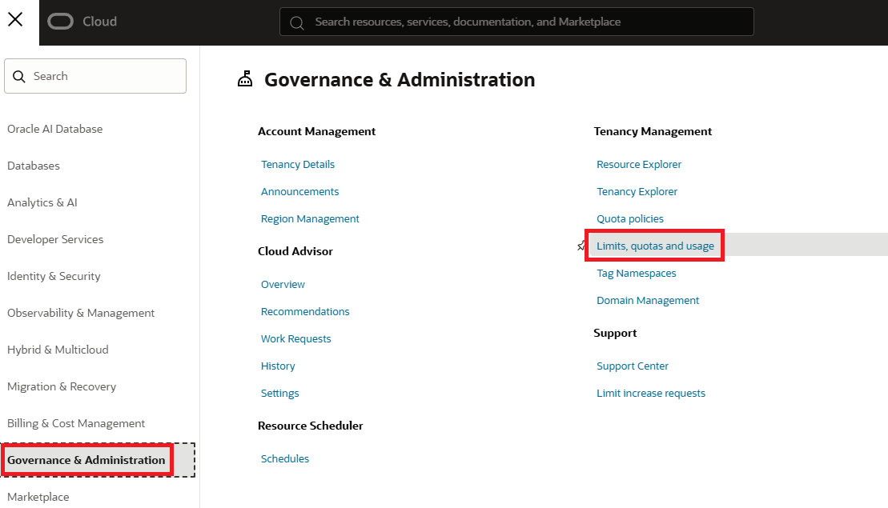
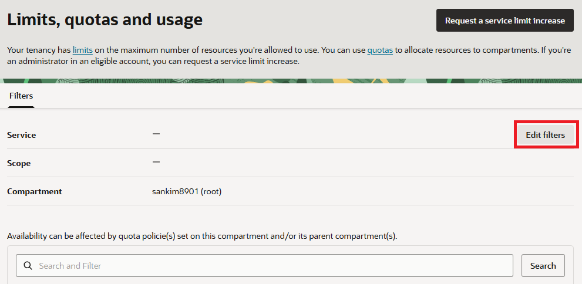
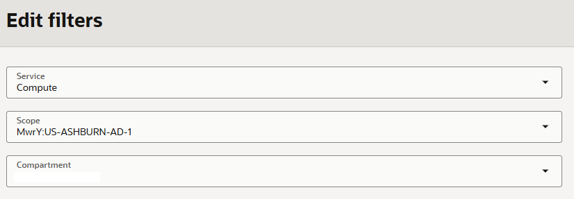
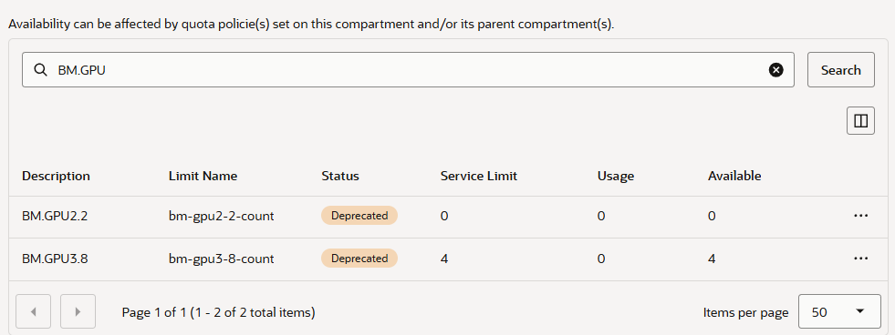

= 연습 1. 서비스 한도 확인

이 연습에서는 GPU Bare Metal 인스턴스를 생성할 수 있는지 여부를 확인할 수 있는 서비스 한도(Service Limit)를 확인합니다.

== OCI 서비스 한도(Service Limits)

OCI 서비스 한도(Service Limits)는 태넌시(Tenancy) 내에서 생성 및 사용할 수 있는 클라우드 자원(Compute OCPU, Storage TB, Network VCN 등)의 최대 허용량 또는 할당량(Quota)을 의미합니다. 

클라우드 인프라의 안정을 유지하고 사용자의 예기치 못한 비정상 비용 발생을 방지하기 위해 제공되는 기본 보안 장치입니다.

=== 특징

* Oracle에 의해 설정됨: 계정 생성 시 구독 유형(Pay As You Go, Annual Universal Credits, Free Trial 등)에 따라 Oracle이 기본값을 자동으로 부여합니다.
* 범위(Scope): 자원의 종류에 따라 적용되는 범위가 다릅니다.
** Global / Regional: 태넌시 전체 또는 특정 리전 단위 적용(예: VCN 개수)
** Availability Domain(AD): 특정 데이터 센터(AD) 단위 적용 (예: GPU BM 또는 특정 Compute OCPU 코어 수 등)
* 요청을 통한 증액 가능: 기본 한도에 도달하더라도 OCI 콘솔을 통해 사유를 제출하여 증액(Limit Increase)을 요청하면 Oracle의 승인을 거쳐 한도를 늘일 수 있습니다.

=== OCI 콘솔에서 서비스 한도 확인

여기에서는 OCI 콘솔에서 서비스 한도를 확인합니다. 아래 절차에 따릅니다.

1. OCI 콘솔에 유효한 계정으로 로그인합니다.
2. 왼쪽 위의 햄버거 메뉴(≡)를 클릭합니다.
3. **Governance & Administration**을 클릭하고 **Limits, Quotas and Usage**를 클릭합니다.
+

4. **Limists, quotas and usage** 페이지에서 `Filters` 오른쪽 아래의 **Edit Filters** 버튼을 클릭합니다.
+

5. **Edit filters**에서 Filter를 자종헉ㅎ **Update** 버튼을 클릭합니다.
* **Service** 드롭다운 목록에서 `Compute'를 선택합니다.
* **Scope**에서 리소스를 생성할 Region을 선택합니다.
* **Compartment**에서 리소스가 위치할 Compartment를 선택합니다.

+

6. **Limits, quotas and usage** 페이지에서, 필터가 적용된 것을 확인하고 검색창에 `BM.GPU` 를 입력하여 리소스 필터를 지정한 후 검색 버튼을 클릭합니다.
7. 검색된 결과를 확인합니다. **Service Limit**은 한도로 설정된 인스턴스의 수, **Usage**는 사용중인 인스턴스의 수, **Available**은 사용 가능한 인스턴스의 수를 나타냅니다.
+

== OCI 콘솔에서 서비스 한도 요청 (서비스 한도가 부족할 경우)