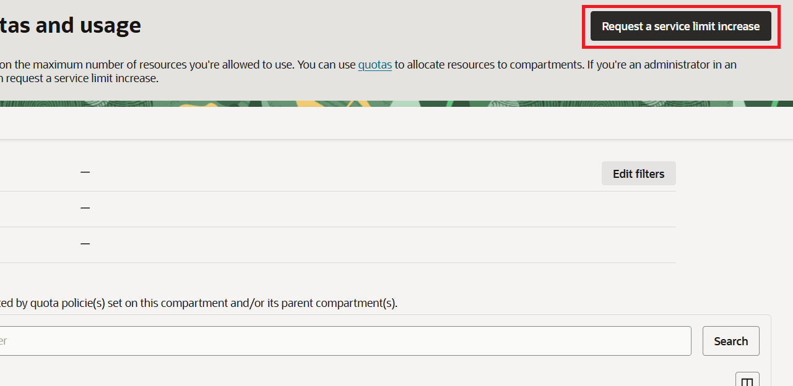
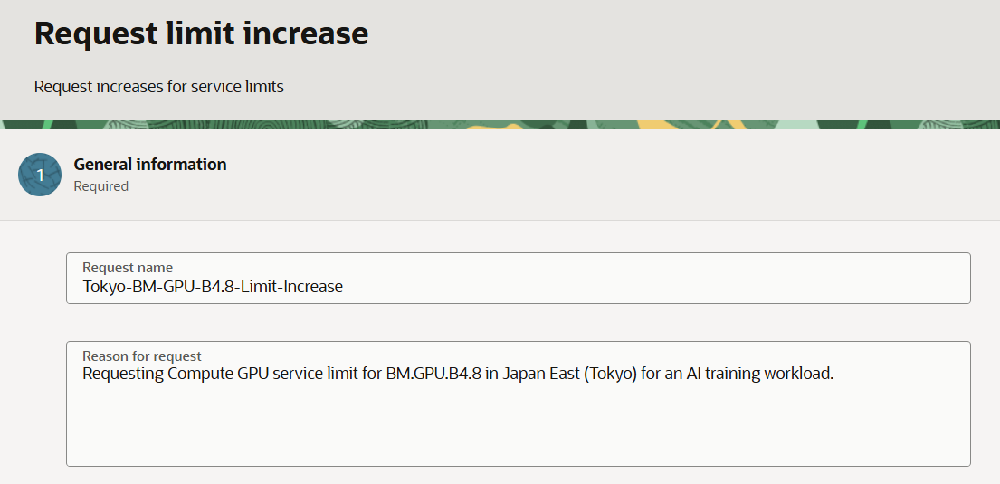
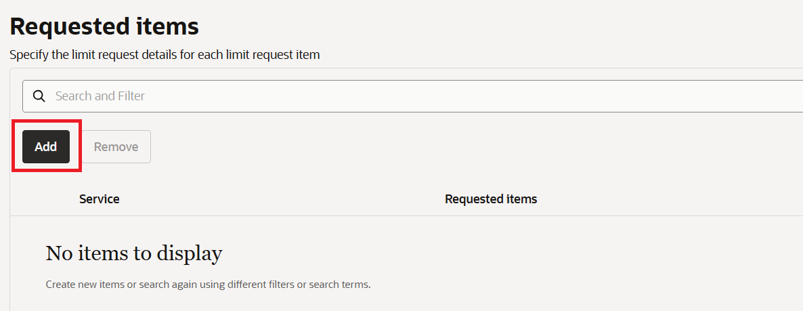
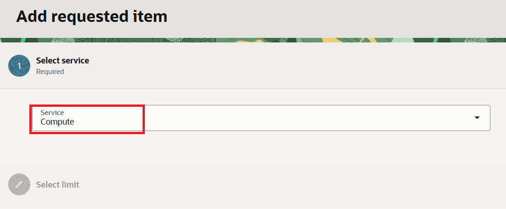
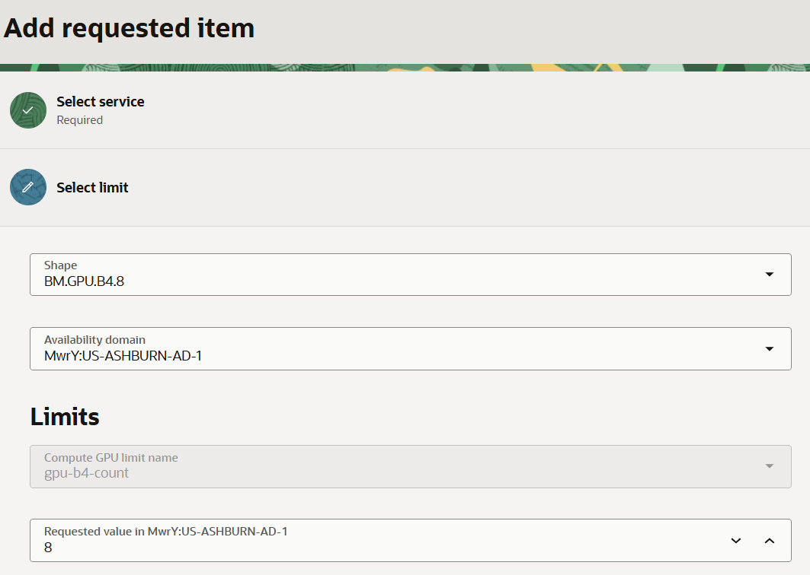

= 演習1：サービス制限の確認

この演習では、GPUベアメタル・インスタンスを作成できるかどうかを確認するため、サービス制限（Service Limit）を確認します。

== OCIサービス制限（Service Limits）

OCIサービス制限（Service Limits）とは、テナンシ（Tenancy）内で作成および使用できるクラウド・リソース（Compute OCPU、Storage TB、Network VCNなど）の最大許容量または割当て量（Quota）を指します。

クラウド・インフラストラクチャの安定性を維持し、ユーザーに予期しない異常なコストが発生することを防ぐために提供される、基本的な保護機能です。

=== 特徴

* Oracleによる設定：アカウント作成時に、サブスクリプションの種類（Pay As You Go、Annual Universal Credits、Free Trialなど）に応じて、Oracleがデフォルト値を自動的に設定します。
* 範囲（Scope）：適用範囲はリソースの種類によって異なります。
** Global / Regional：テナンシ全体または特定のリージョン単位で適用されます（例：VCN数）。
** Availability Domain（AD）：特定のデータ・センター（AD）単位で適用されます（例：GPU BM、特定のCompute OCPUコア数など）。
* リクエストによる引き上げが可能：デフォルトの制限に達した場合でも、OCIコンソールから理由を提出して制限の引き上げ（Limit Increase）をリクエストすることで、Oracleの承認後に制限を引き上げることができます。

=== OCIコンソールでのサービス制限の確認

ここでは、OCIコンソールでサービス制限を確認します。以下の手順に従ってください。

1. 有効なアカウントを使用してOCIコンソールにサインインします。
2. 左上のハンバーガーメニュー（≡）をクリックします。
3. **Governance & Administration**をクリックし、**Limits, Quotas and Usage**をクリックします。
+
image:./images/01/image01.png[]

4. **Limits, Quotas and Usage**ページで、`Filters`の右下にある**Edit Filters**ボタンをクリックします。
+
image:./images/01/image02.png[]

5. **Edit Filters**でフィルタを設定し、**Update**ボタンをクリックします。
* **Service**ドロップダウン・リストから`Compute`を選択します。
* **Scope**で、リソースを作成するリージョンを選択します。
* **Compartment**で、リソースを配置するコンパートメントを選択します。

+
image:./images/01/image03.png[]

6. **Limits, Quotas and Usage**ページでフィルタが適用されていることを確認し、検索ボックスに`BM.GPU`と入力してリソース・フィルタを指定した後、検索ボタンをクリックします。
7. 検索結果を確認します。**Service Limit**は制限として設定されているインスタンス数、**Usage**は使用中のインスタンス数、**Available**は使用可能なインスタンス数を示します。
+
image:./images/01/image04.png[]

== OCIコンソールでサービス制限をリクエストする（サービス制限が不足している場合）

ここでは、サービス制限が不足している場合に、サービス制限の引き上げをリクエストします。以下の手順に従います。

1. OCIコンソールに有効なアカウントでログインします。
2. 左上のハンバーガーメニュー（≡）をクリックします。
3. **Governance & Administration**をクリックし、**Limits, Quotas and Usage**をクリックします。
4. 右上の**Request a service limit increase**ボタンをクリックします。
+

5. RRequest limit increaseページで、**Request name**と**Reason for request**を入力します。
* **Request name**: Tokyo-BM-GPU-B4.8-Limit-Increase
* **Reason for Request**: 
+
----
We request a Compute service limit increase for BM.GPU.B4.8.

Region: Japan East (Tokyo), ap-tokyo-1
Availability Domain: <target AD>
Shape: BM.GPU.B4.8
Required capacity: 1 bare metal instance
Requested GPU count: 8, if the limit is GPU-based
Planned start date: 2026-07-29
Expected duration: 6 months
Workload: Distributed AI model training and GPU performance validation
Capacity type: On-demand

Please confirm whether a capacity reservation is required for this shape.
----
+

6. 右下の**Next**ボタンをクリックします。
7. **Requested items**セクションで**Add**ボタンをクリックします。
+

8. **Add requested item**ページの**Select service**で、**Service**ドロップダウン・リストから**Compute**を選択し、右下の**Next**ボタンをクリックします。
+

9. **Select limit**で、リクエストするシェイプを検索して選択し、可用性ドメインを選択します。この演習では、BM.GPU.B4.8とAshburnリージョンのAD 1を選択しました
10. **Limits**に、使用するGPU数を入力します。
+
NOTE: ここで重要なのは、増加分ではなく、**承認を受けたい最終的な合計値を入力する**ことです。公式のリクエスト画面でも、引き上げ後に必要となる値を入力するよう案内されています。
+

11. 右下の**Save**ボタンをクリックします。
