= 연습 5. GPU BM 인스턴스 생성
:toc:
:sectnums:

이 연습에서는 Oracle 공식 GitHub에서 제공하는 이미지를 사용하여 GPU BM 인스턴스를 생성합니다. 아래 절차에 따릅니다.

== Oracle 공식 Github에서 이미지와 PAR 검색

여기에서는 Oracle 공식 GitHub에서 PAR(Pre-Authenticated Request)로 제공하는 커스텀 이미지를 찾습니다. 아래 절차에 따릅니다.

1. 웹 브라우저에서 새 창을 열고 아래 웹 사이트로 이동합니다.
+
https://github.com/oracle-quickstart/oci-hpc-oke/blob/main/docs/worker-node-images.md?utm_source=chatgpt.com[Images to Use for Worker Nodes]

2. 생성할 BM의 Shape에 맞는 이미지를 찾습니다. 아래 예는 **BM.GPU.B4.8** Shape와 호환되는 Ubuntu 22.04 이미지입니다.
+
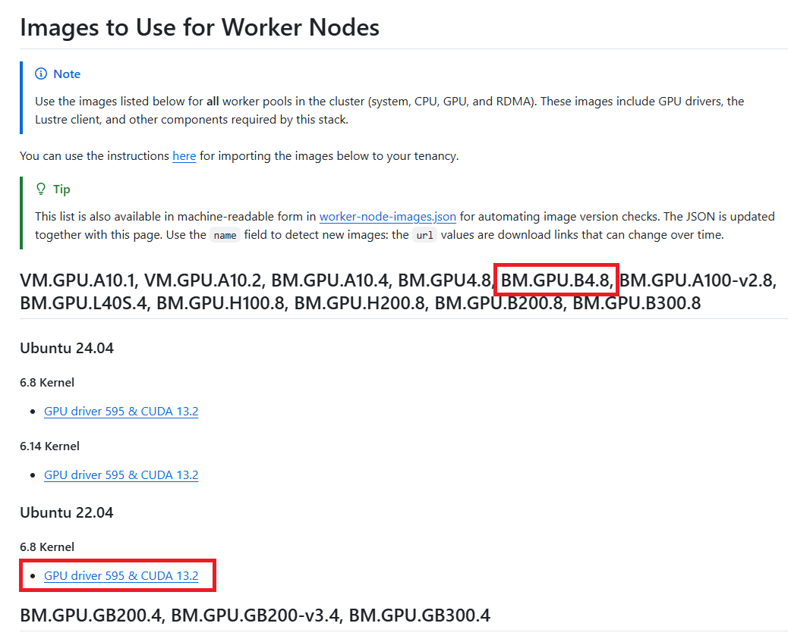
+
NOTE: 이 문서가 작성되는 2026년 7월 27일 JSON 목록(https://raw.githubusercontent.com/oracle-quickstart/oci-hpc-oke/main/docs/worker-node-images.json)은 7월 14일에 갱신되었습니다.

== PAR URL로 Custom Image 가져오기

로컬 PC에 이미지를 다운로드 할 필요는 없습니다. OCI가 Oracle Object Storage의 PAR URL을 읽어 사용자 태넌시에 Custom Image를 생성하도록 할 수 있습니다. 아래 절차에 따릅니다.

1. 왼쪽 위의 햄버거 메뉴(≡)를 클릭하고 **Compute**를 클릭합니다.
+
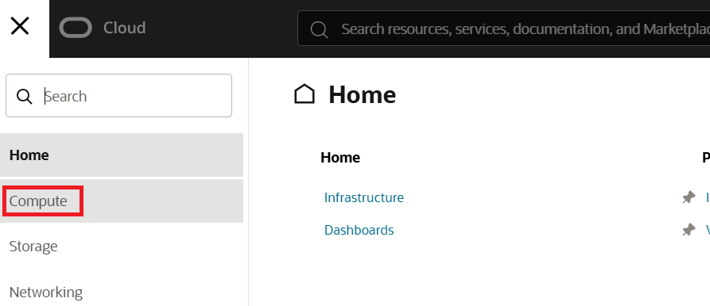

2. **Compute** 페이지에서 **Custom Images**를 클릭합니다.
+
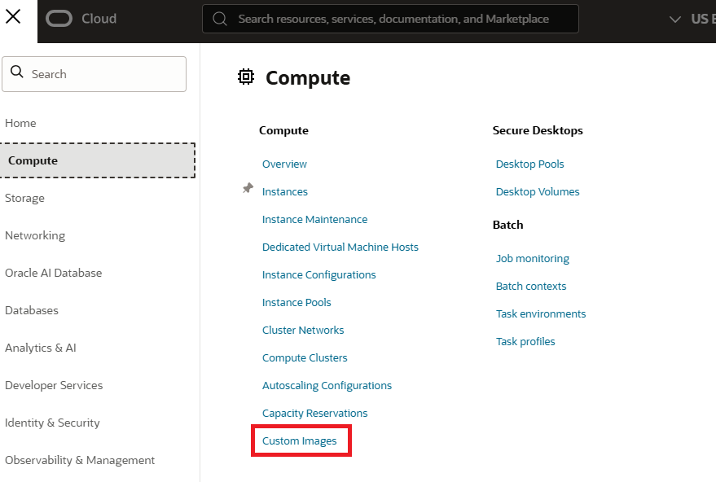

3. **Custom Images** 페이지에서 **Compartment**를 `tasks (연습 2에서 생성한 Compartment)` 로 지정합니다.
+
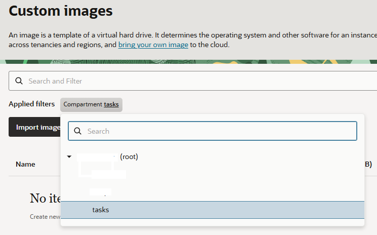

4. **Import Images** 버튼을 클릭합니다.
+
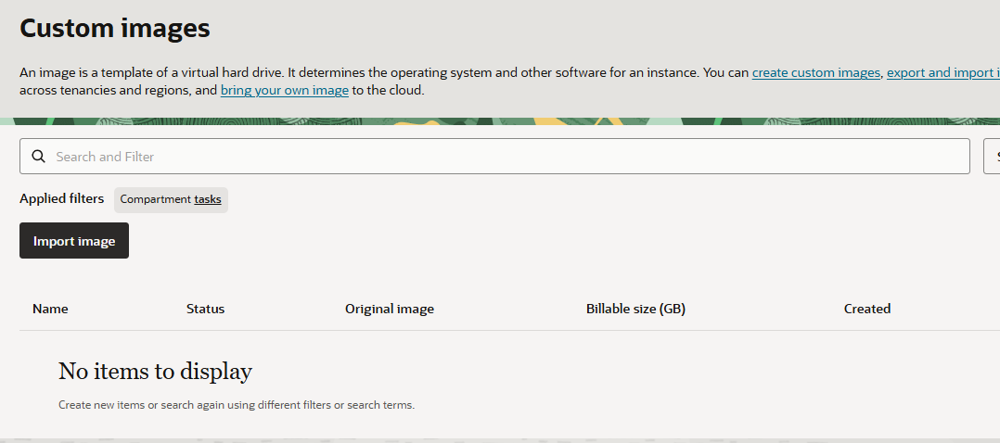

5. **Import Images** 페이지에서 아래와 같이 정보를 입력합니다.
* **Create In compartment**: `tasks (연습 2에서 생성한 Compartment)`
* **Name**: `Ubuntu-22.04-<BM Shape Name>-<image_update_date>`
* **Operating System**: `Ubuntu`

6. **Import from an Object Storage URL** 옵션을 선택합니다.
7. **Images to Use for Worker Nodes** 페이지가 열려있는 웹 브라우저 창(또는 탭)으로 이동하고, BM과 호환되는 이미지 링크를 찾아 마우스 오른쪽 클릭한 후 **링크 주소 복사**를 클릭합니다.
+
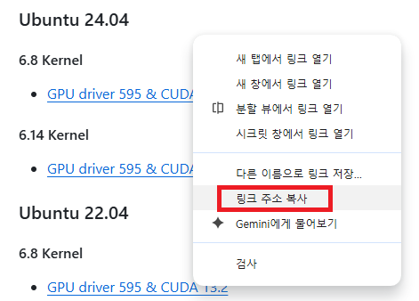

8. 복사한 링크 주소를 **Object Storage URL**에 붙여 넣습니다.
9. Image Type을 OCI로 지정합니다.
+
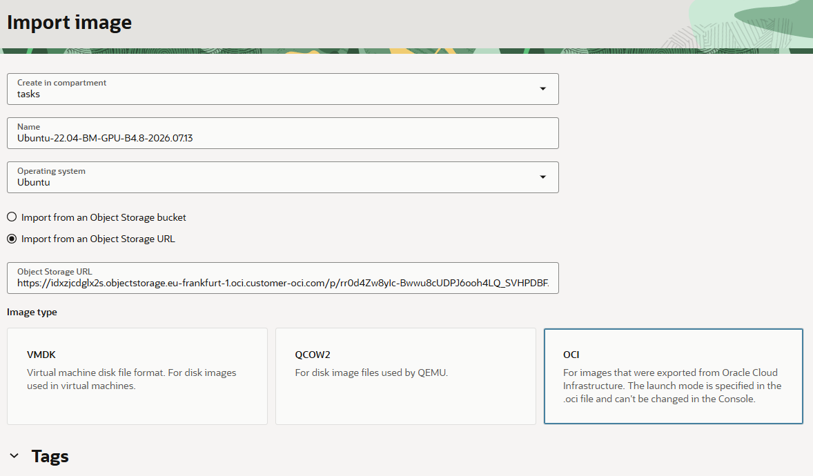

10. 오른쪽 아래의 **Import Image** 버튼을 클릭합니다.
11. 이미지 import가 시작됩니다. import가 완료되면 **Available**로 변경됩니다.
+
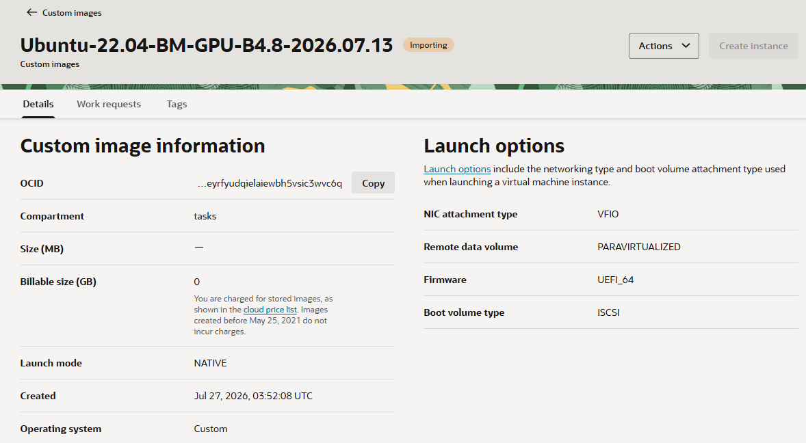

12. Import가 완료되면, 오른쪽 메뉴에서 **Custom Image**를 클릭하여 Import한 Custom Image를 확인합니다.
+
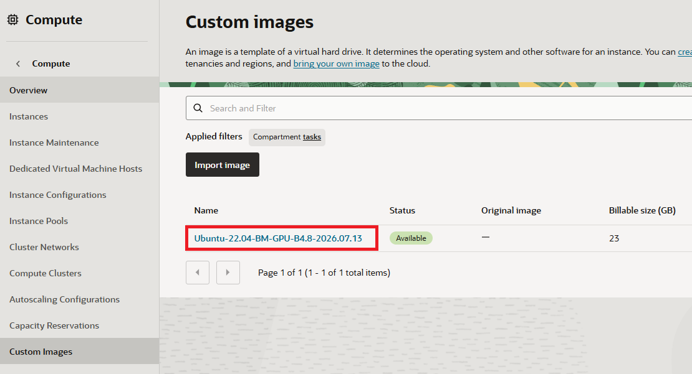

== BM 인스턴스 생성

1. 왼쪽 위의 햄버거 메뉴(≡)를 클릭하고 **Compute**를 클릭합니다.
+
2. **Compute** 페이지에서 **Instances**를 클릭합니다.
+
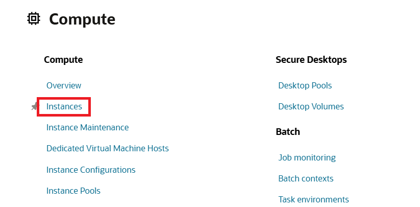

3. **Create Instance** 버튼을 클릭합니다.
+
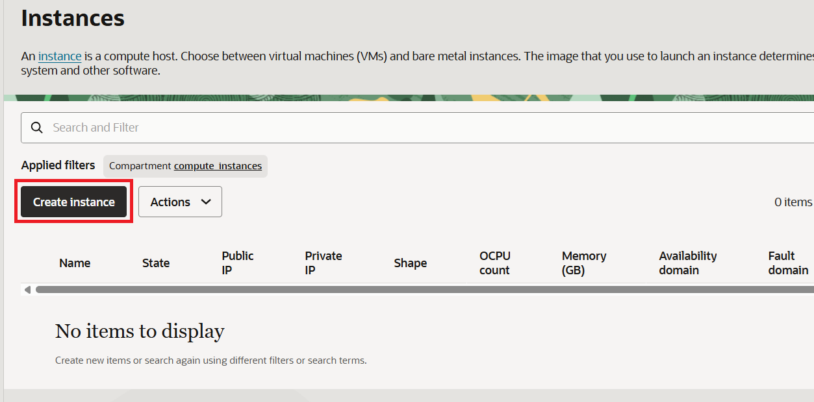

4. **Create compute instance** 페이지에서 아래와 같이 정보를 입력합니다. (이 연습에서는 Ashburn 리전을 사용합니다)
* **Name**: `bm-gpu-instance`
* **Create in compartment**: `tasks` (연습 2에서 생성한 컴파트먼트)
* **Placement** 해당 BM 리소스가 존재하는 AD 선택
+
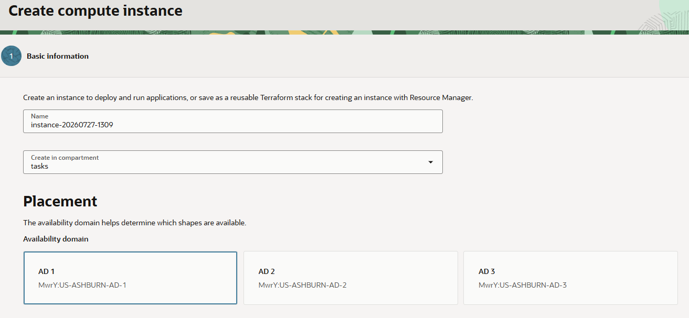

5. Image and shape 구역의 Image에서 **change** 버튼을 클릭합니다.
+
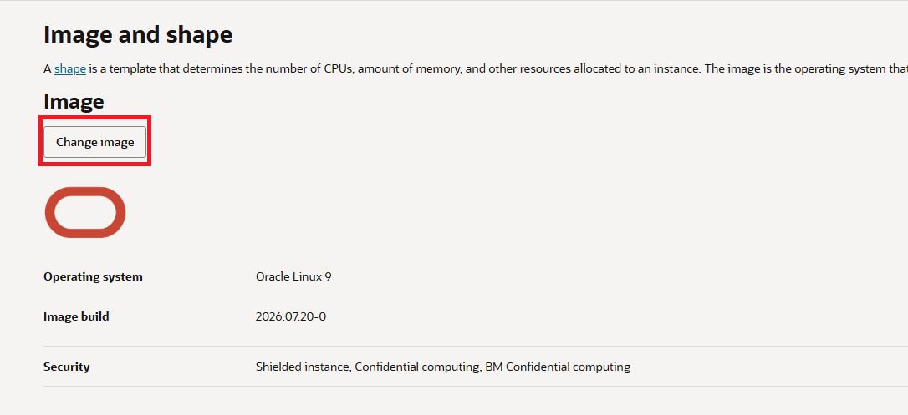

6. **Select an image** 페이지에서 **My Images**를 클릭합니다.
+
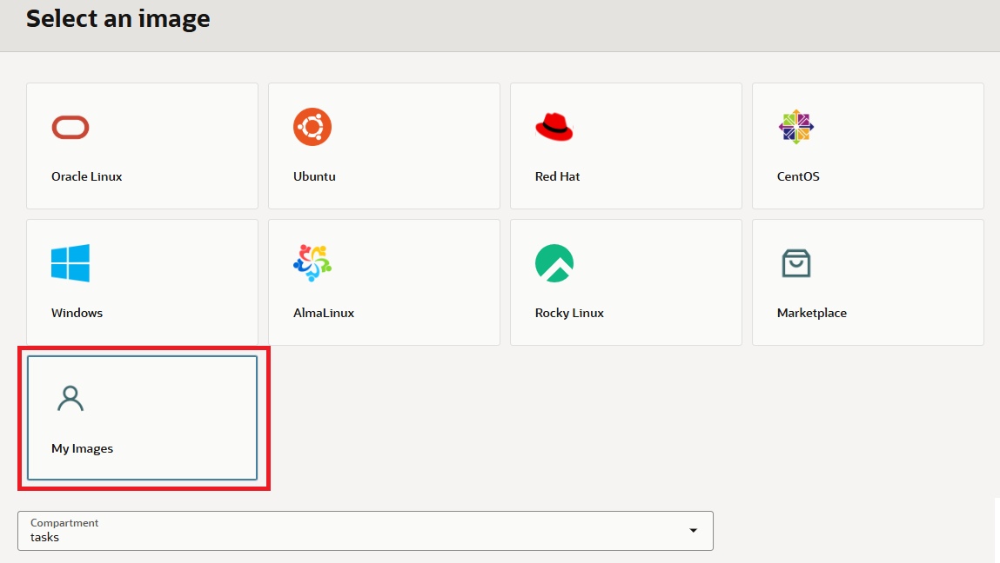

7. 아래로 스크롤하고, **Custom images** 옵션을 선택한 후, 이미지 목록에서 Import 된 이미지를 선택합니다.
+
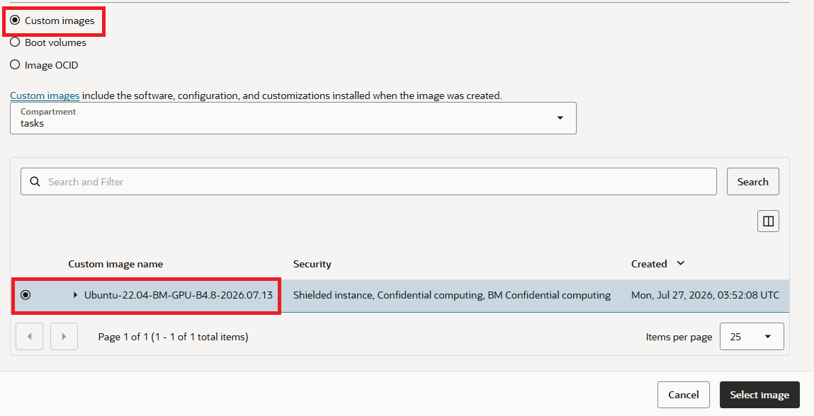

8. **Shape** 구역에서 **Change Shape** 버튼을 클릭합니다.
+
image:./images/05/image16.png[]

9. **Browse all shapes** 페이지에서, **Bare Metal machine**을 선택합니다.
10. **Oracle and Nvidia Terms of Use** 알림 창에서 **Confirm** 버튼을 클릭합니다.
+
image:./images/05/image17.png[]

11. Shape 목록에서, 생성할 Shape를 선택하고 **Select shape** 버튼을 클릭합니다.
+
image:./images/05/image18.png[]

12. 선택한 Shape로 변경된 것을 확인합니다.
+
image:./images/05/image19.png[]

13. 오른쪽 아래의 **Next** 버튼을 클릭합니다.

14. **Security** 구역에서 정보를 확인하고 **Next** 버튼을 클릭합니다.
+
image:./images/05/image20.png[]

15. **Networking**에서 아래와 같이 설정합니다.
* Primary VNIC
** Primary network
*** **Select existing virtual cloud network**: 선택
*** **Virtual cloud network compartment**: `tasks (연습 2에서 생성한 컴파트먼트)`
*** **Virtual cloud network**: `ai_infra_vcn (연습 3에서 생성한 VCN)`
** Subnet
*** **Select existing subnet**: 선택
*** **Virtual cloud network compartment**: `tasks (연습 2에서 생성한 컴파트먼트)`
*** **Virtual cloud network**: `public subnet-ai-infra_vcn (regional)`

+
image:./images/05/image21.png[width=650]

* Private IPv4 address assignment
** **Subnet IPv4 address**: `Automatically assign private IPv4 address` (기본값)
* Public IPv4 address assignment
** **기본값 유지**

+
image:./images/05/image22.png[width=650]

* Add SSH keys
** **Upload public key file (.pub)**: 선택
** **Drop a fiole or select one**을 클릭하고 위에서 생성한 공개 키 파일(`oci_instances_key.pub`) 선택

+
image:./images/05/image23.png[width=650]

16. 오른쪽 아래의 **Next** 버튼을 클릭합니다.

17. **Boot volume**에서 기본값을 유지하고 오른쪽 아래의 **Next** 버튼을 클릭합니다.
+
image:./images/05/image24.png[width=650]

18. **Review** 페이지에서 정보를 확인하고 오른쪽 아래의 **Create** 버튼을 클릭합니다.
19. 컴퓨트 인스턴스가 생성됩니다. 생성이 완료될 때 까지 기다립니다.
20. 생성이 완료됩니다.

---

link:./04_ssh_key.adoc[이전: 연습 4 - SSH 키 생성] |
