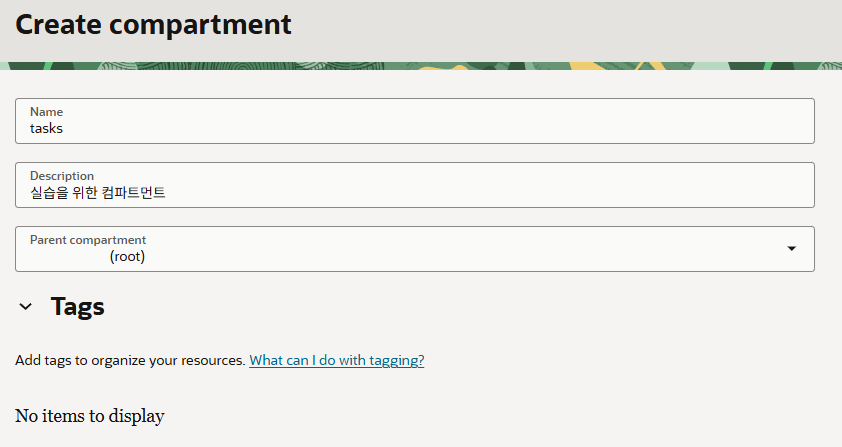
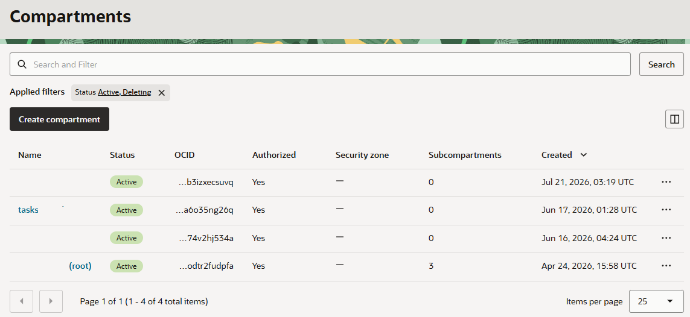

= 연습 2: 컴파트먼트 생성

이 연습에서 사용하는 모든 리소스를 한 구획(Compartment)에서 사용하기 위해, **compute_instances** 라는 이름의 컴파트먼트를 생성합니다. 아래 절차에 따릅니다.

1. 왼쪽 위의 햄버거 메뉴(≡)를 클릭하고 **Identity & Security**를 클릭합니다.
+
image:./images/02/image01.png[width=700]

2. Identity & Security 메뉴에서 **Identity** 구역의 **Compartments**를 클릭합니다.
+
image:./images/02/image02.png[width=700]

3. **Compartment** 페이지에서 **Create Compartment** 버튼을 클릭합니다.
+
image:./images/02/image03.png[width=500]

4. **Create Compartment** 페이지에서 아래와 같이 정보를 입력하고 오른쪽 아래의 **Create Compartment** 버튼을 클릭합니다.
+
* **Name**: `tasks`
* **Description**: `실습을 위한 컴퓨트 인스턴스`
* **Parent compartment**: _루트 컴파트먼트 (태넌시 이름 (root) 로 표시됨)_

+

5. 생성된 컴파트먼트를 확인합니다. 루트 컴파트먼트의 Subcompartments 숫자가 하나 증가된 것도 확인합니다.
+
