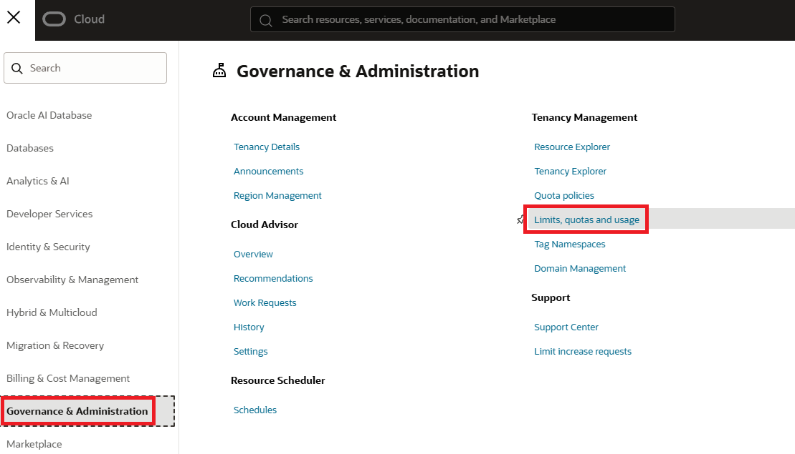
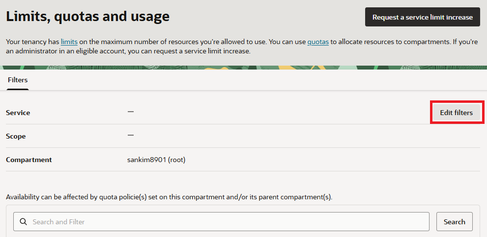
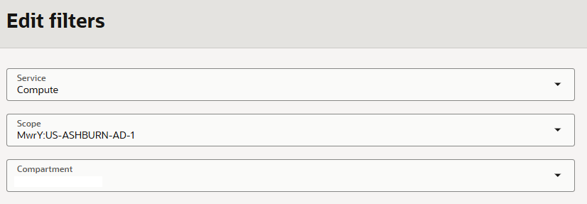
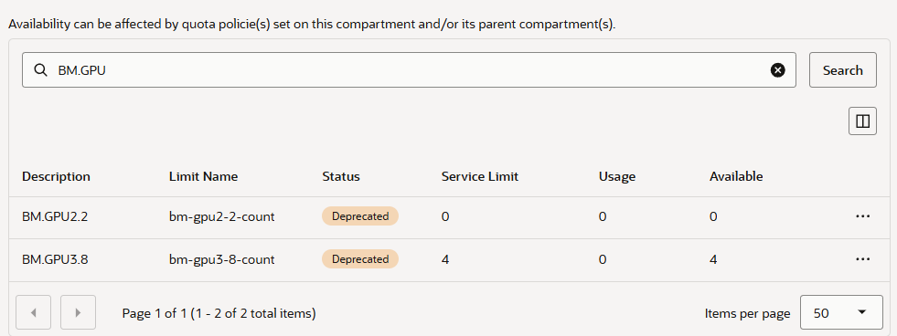
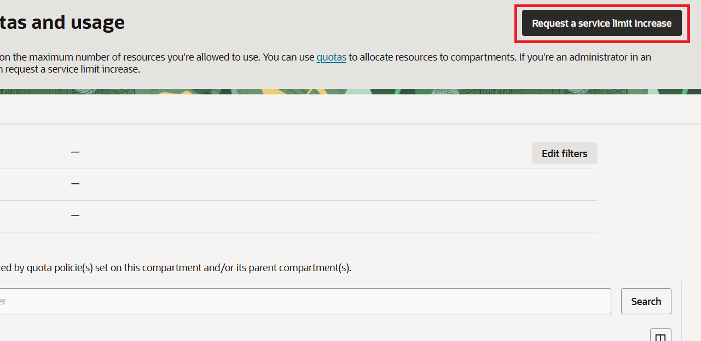
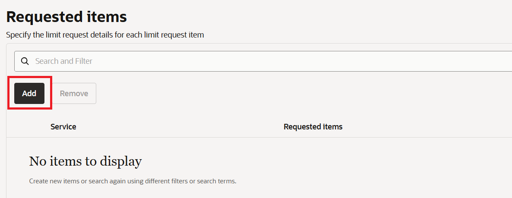
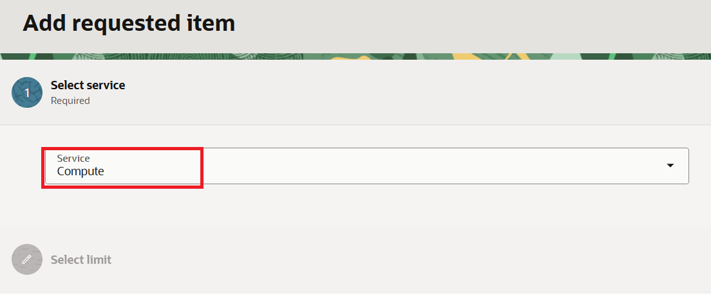
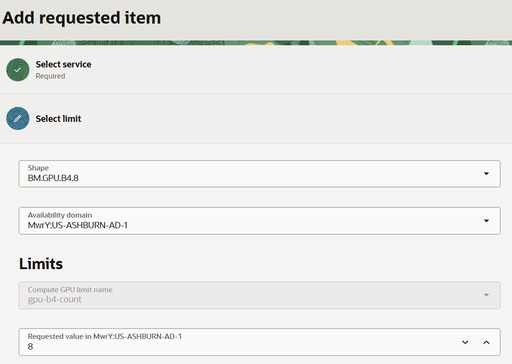

= Lab 1. Checl Service Limits
:toc:
:sectnums:

In this lab, you will check the OCI service limits to determine whether you r tenancy has sufficent limits to provision a GPU Bare Metal instance.

== OCI Service Limits

OCI Service Limits define the maximum amount of cloud resources, such as Compute OCPUs, storage Capacity, and Virtual Cloud Networks (VCNs), that can be provisioned and use within a tenancy.

Service limits help maintain the stability of the cloud infrastructure and service as a saftguard against unexpeted resource consumption and associated costs.

=== Key Characteristics

* **Defined by Oracle**: When an account is created, Oracle automatically assigns default service limits based on the subscription type, such as Pay As You Go, Annual Universal Credits or Free Trial.
* **Scope**: Service limits apply at different scopes depending on the resource type.
** **Global / Regiona**: Service Limits apply across the entire tenancy or within a specific region (e.g., number of VCNs).
** **Availability Domain (AD)**: Limits apply within a specific availability domain (for example, GPU Bare Metal resources or certain Compute OCPU limits).
* **Limit Increases**: If the default service limits are insufficient, you can request an increase through the OCI Console by providing a justification. Oracle reviews the request and may approve a higher limit.

=== Check Service Limits in the OCI Console

In this section, you will check the service limits using the OCI Console. Follow the steps below.

1. Sign in to the OCI Console with a valid account.
2. Click the hamburger menu (≡) in the upper left corner.
3. Navigate to **Governance & Administration** and click **Limits, Quotas and Usage**.
+

4. On the **Limits, Quotas and Usage** page, click the **Edit Filters** button in the lower right corner of the `Filters` section.
+

5. In the **Edit Filters** dialog, set the filters and click the **Update** button.
* **Service**: Select `Compute` from the drop-down list.
* **Scope**: Select the region where you will provision the resources.
* **Compartment**: Select the compartment where the resources will be provisioned.
+

6. On the **Limits, Quotas and Usage** page, verify that the filters have been applied. In the search box, enter `BM.GPU` to filter the resources and click the search button.
7. Review the search results. The following columns provide information about resource limits and availability:

* **Service Limit**: The maximum number of resources allowed by the configured service limit.
* **Usage**: The number of resources currently in use.
* **Available**: The number of additional resources that can be provisioned within the service limit.
+

== Request a Service Limit Increase in the OCI Console (if service limits are insufficient)

In this section, you will learn how to request a service limit increase if the existing limits are insufficient for a GPU Bare Metal instance. 

Follow the steps below.

1. Sign in to the OCI Console with a valid account.
2. Click the hamburger menu (≡) in the upper left corner.
3. Navigate to **Governance & Administration** and click **Limits, Quotas and Usage**.
4. Click the **Request a service limit increase** button in the upper right corner.
+

5. On the Request Limit Increase page, enter the Request name and Reason for request.

* **Request name**: Sydney-BM-GPU-A100-v2.8-Limit-Increase
* **Reason for Request**:
+
----
We would like to request an increase in the Compute service limit for the BM.GPU.B4.8 shape.

* Region: Australia East (Sydney), `ap-sydney-1`
* Availability Domain: `ap-sydney-1-AD-1`
* Shape: BM.GPU.A100-v2.8
* Required capacity: 1 Bare Metal instance
* Requested GPU count: 8 (if the limit is GPU-based)
* Planned start date: <expected start date>
* Expected duration: <expected duration>
* Workload: Distributed AI model training and GPU performance validation
* Capacity type: Reserved

Please confirm whether a capacity reservation is required for this shape.
----
6. Click **Next** in the lower-right corner.
7. In the **Requested Items** section, click **Add**.
+

8. On the **Add Requested Item** page, under **Select Service**, select **Compute** from the **Service** drop-down list, and click **Next** in the lower-right corner.
+

9. **Under Select Limit**, search for and select the GPU Bare Metal shape for which you want to request a limit increase. Then select the appropriate availability domain.
+
In this lab, **BM.GPU.A100-v2.8** and **Availability Domain 1 (AD-1) in the Sydney region** are used as examples.
10. Under **Limits**, enter the requested GPU limit.
+
NOTE: Enter the desired total service limit, not the number of additional GPUs you want to add to the existing limit. The requested value represents the new total limit you want Oracle to approve.
+

11. Click **Save** in the lower-right corner.

---

link:./02_create_compartment.adoc[Next: Create a Compartment]