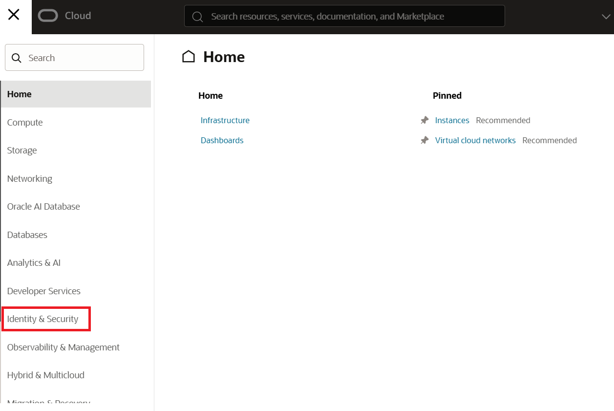
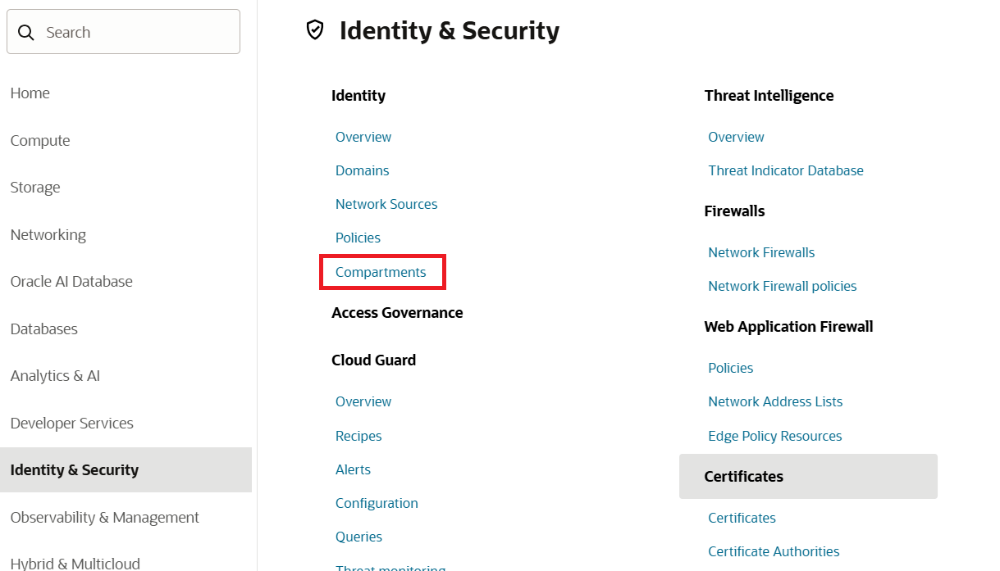
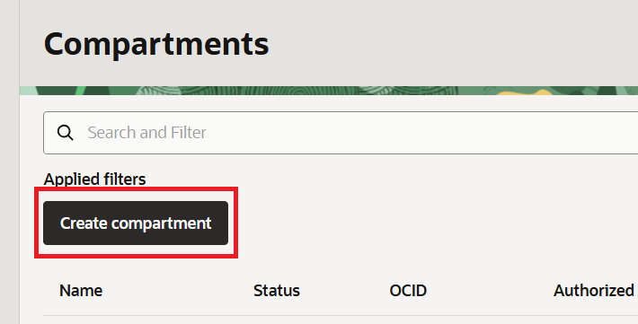
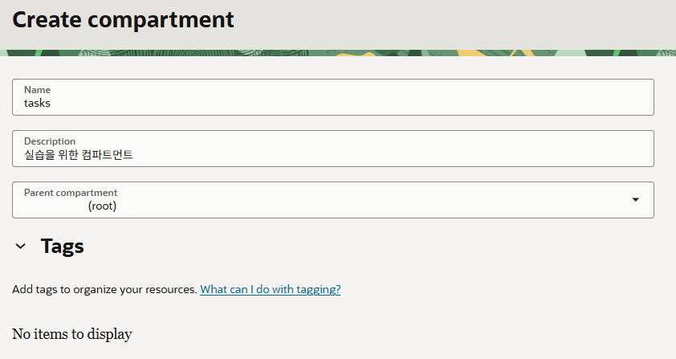
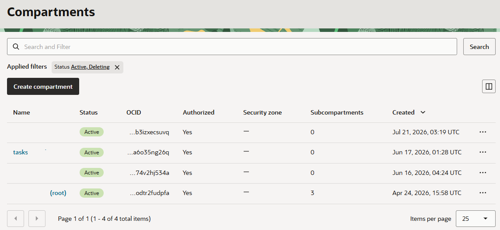

= Lab 2: Create a Compartment

In this lab, you will create a compartment named **tasks** to organize and manage all the resources used in this lab within a single compartment.

Follow the steps below:

1. Click the hamburger menu (≡) in the upper left corner and select **Identity & Security**.
+

2. Under **Identity** in the **Identity & Security** menu, click **Compartments**.
+

3. On the **Compartment** page, click the **Create Compartment** button.
+

4. On the **Create Compartment** page, enter the following information and click the **Create Compartment** button in the lower-right corner.
* **Name**: `tasks`
* **Description**: `Compute instance for the lab`
* **Parent compartment**: _Select the root compartment (displayed as <tenancy name> (root))_.

+

5. Verify that the new compartment as ben created successfully. Also, confirm that the **Subcompartments** count under the root compartment has increased by one.
+

---

link:./01_check_service_limit.adoc[Previous: Lab 1 - Check Service Limits] |
link:./03_create_vcn.adoc[Next: Lab 3 - Create a VCN]