= Lab 3. Create a Virtual Cloud Network (VCN)

In this lab, you will use the VCN Wizard to create a Virtual Cloud Network (VCN) where your Compute instance will be deployed. The VCN will include a public subnet, a private subnet, and the necessary gateways and routing tables.

Follow the steps below:

1. Click the hamburger menu (≡) in the upper left corner and select **Networking**.
+
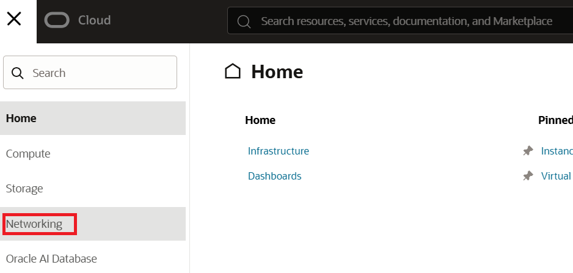

2. On the **Networking** page, click **Virtual cloud networks**.
+
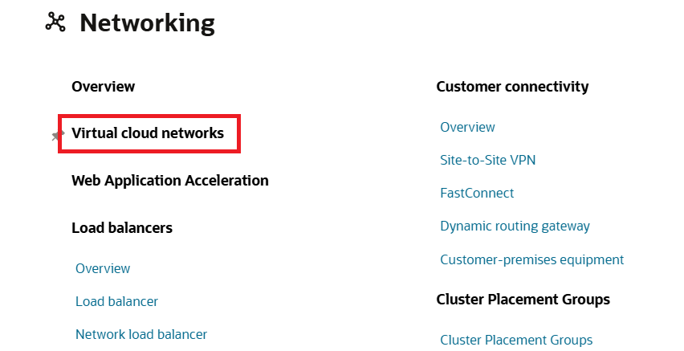

3. On the **Virtual Cloud Networks** page, click **Compartment** and select the **tasks** compartment you created in Lab 2.
+
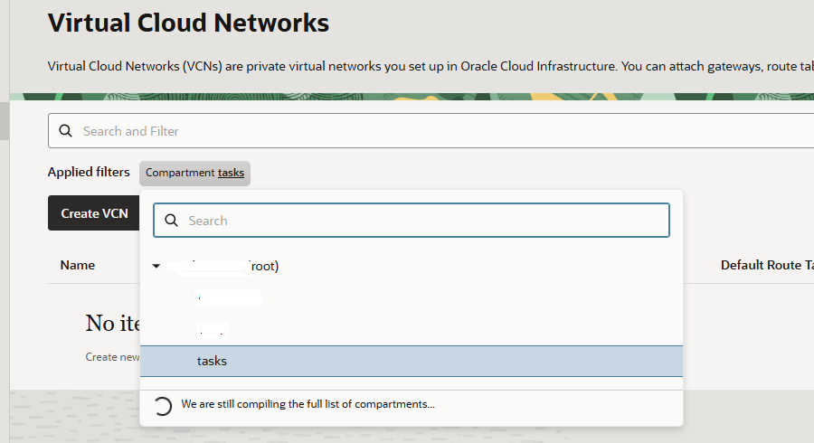

4. Click the **Actions** dropdown button and select **Start VCN Wizard**.
+
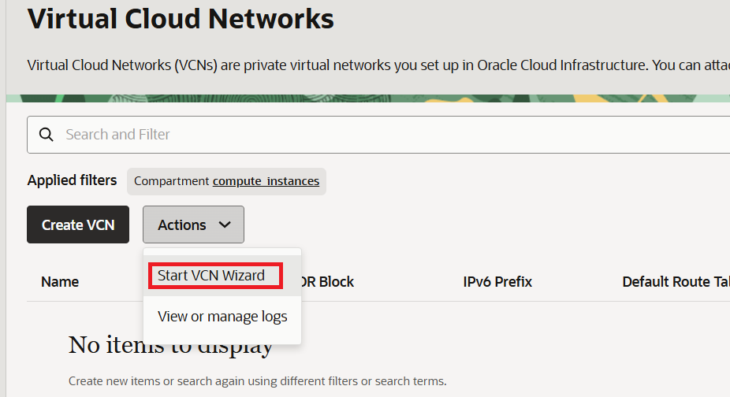

5. On the **Start VCN Wizard** page, select **Create VCN with Internet Connectivity** and click the **Start VCN Wizard** button.
+
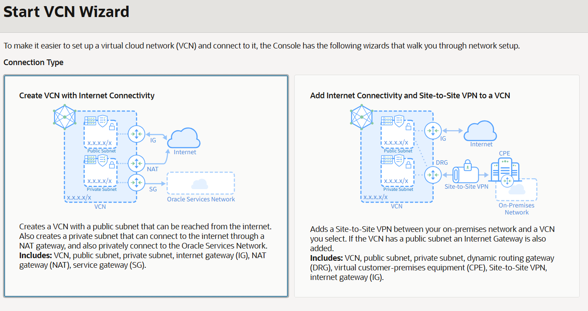

6. On the **Create VCN with Internet Connectivity** page, enter the following information and click the **Next** button.
* **VCN Name**: `ai_infra_vcn`
* **Compartment**: `tasks` (Select the compartment you created in Lab 2)
* **Configure public subnet IPv4 CIDR block**: `10.0.0.0/24` (default)
* **Configure private subnet IPv4 CIDR block**: `10.0.1.0/24` (default)

+
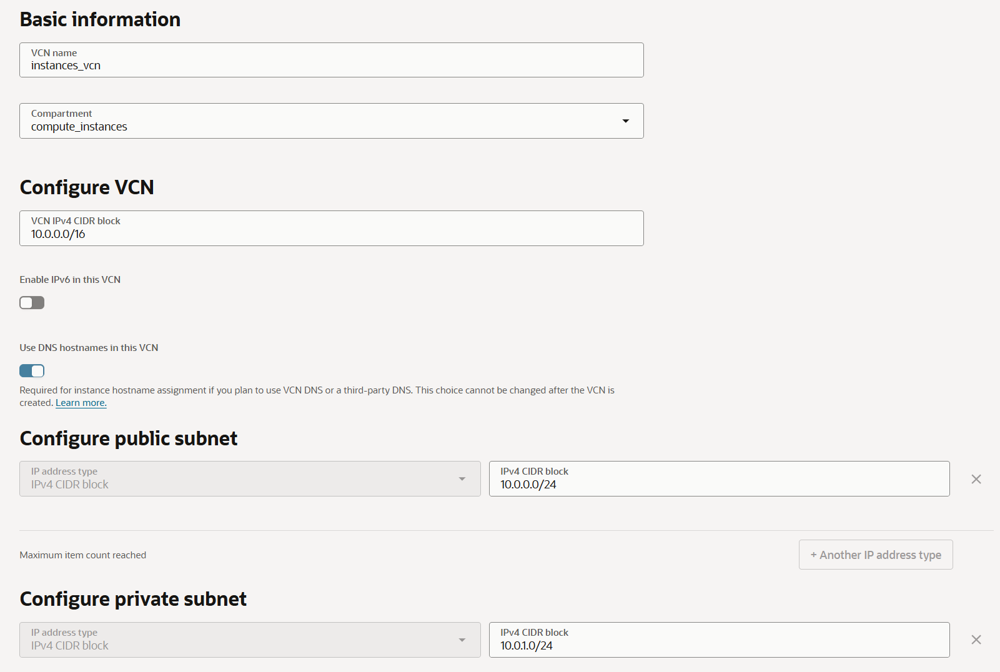

7. Review the information for the VCN to be created and click the **Create** button in the lower-right corner.
+
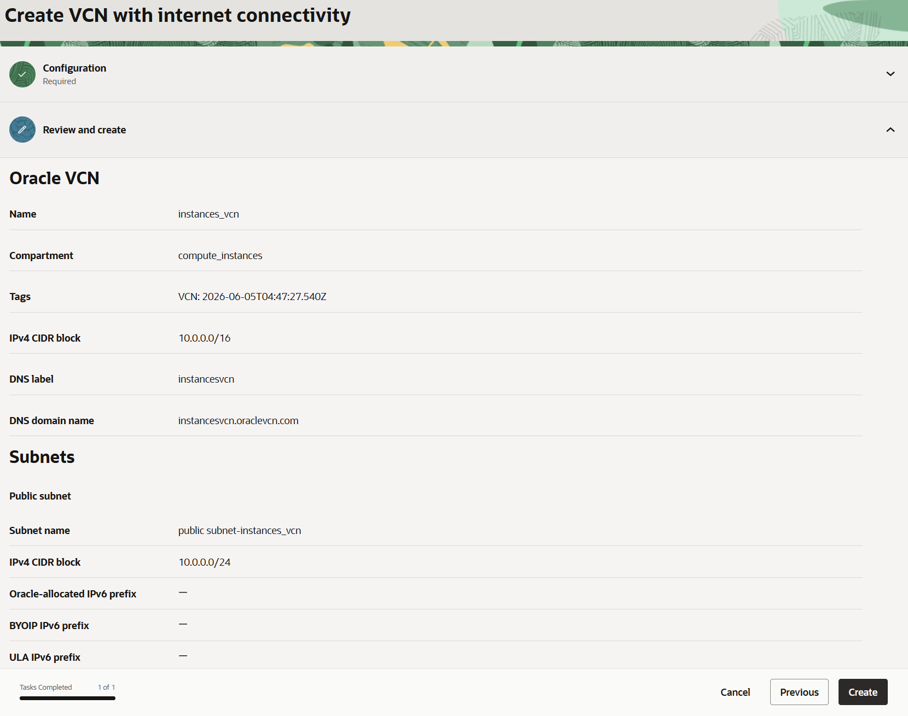

8. Wait for the VCN creation process to complete. Once the VCN has been created successfully, click **View VCN** in the lower-right corner.
+
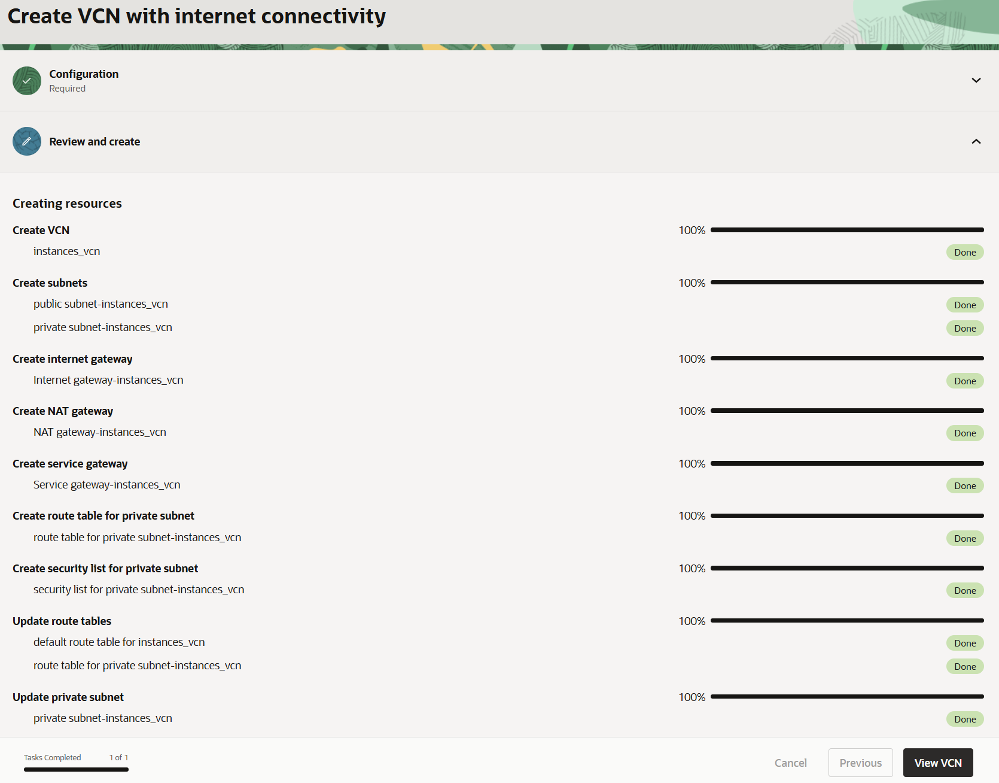

9. Verify that the VCN has been created successfully.
+
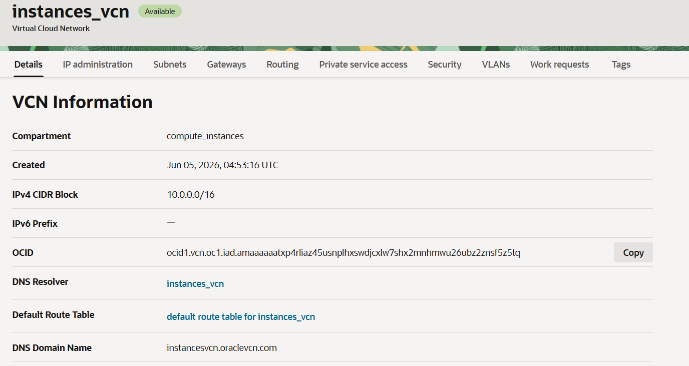

10. Click the **IP Administration** tab and the IP address information associated with the VCN.
+
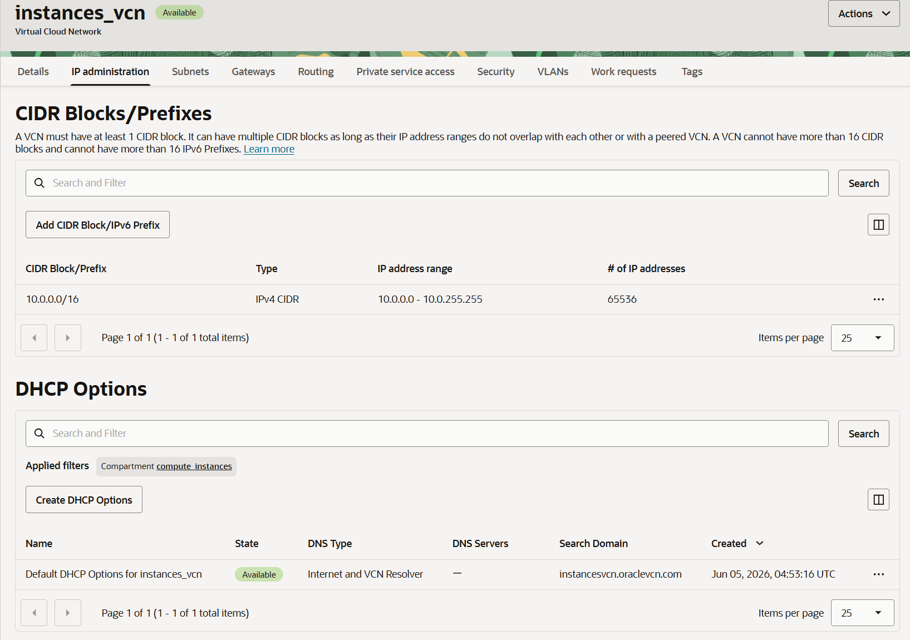

11. Click the **Subnets** tab and verify that both the public and private subnets have been created.
+
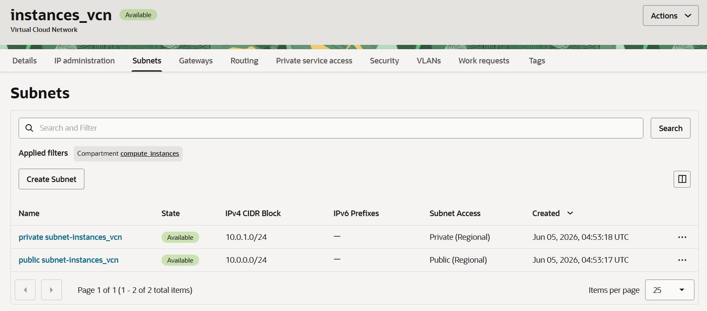

12. Click the **Gateways** tab, scroll down, and verify that the Internet Gateway, NAT Gateway, and Service Gateway have been created.
+
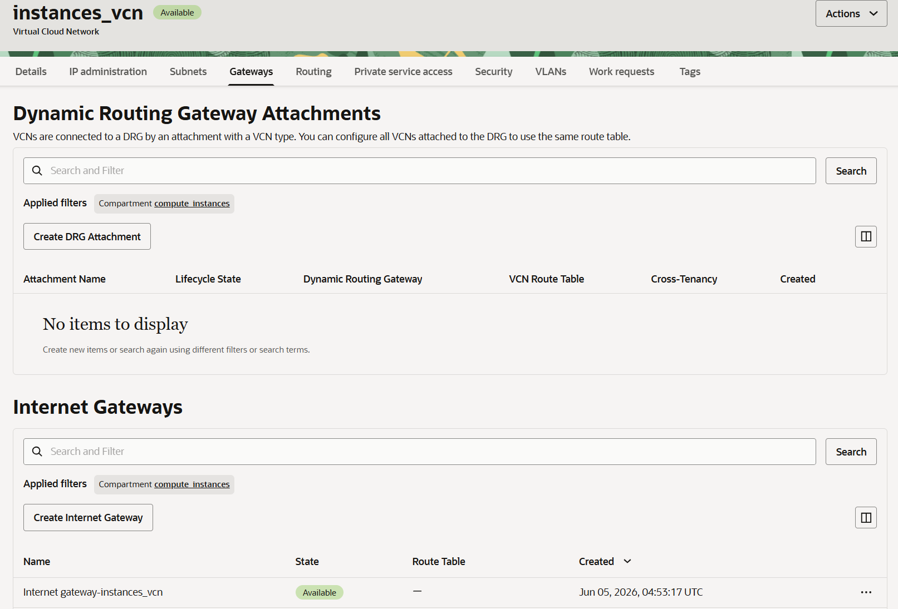

13. Click the **Routing** tab and verify that the two route tables have been created.
+
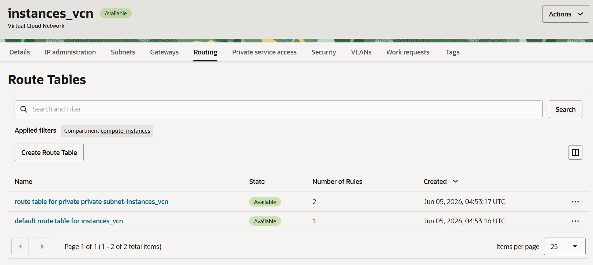

14. Click the **Security** tab and verify that the security lists have been created. Also, confirm that no Network Security Groups (NSGs) have been created.
+
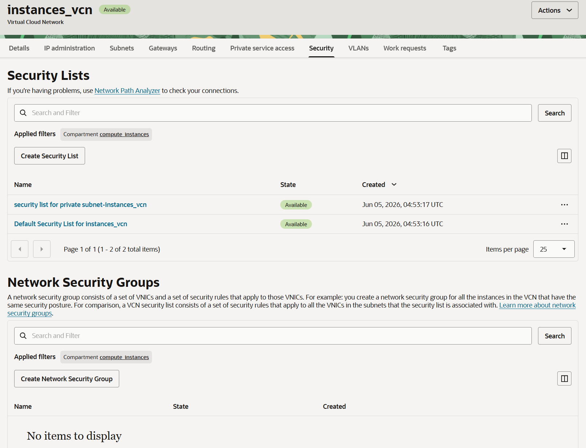

---

link:./02_create_compartment.adoc[Previous: Lab 2 - Create a Compartment] |
link:./04_ssh_key.adoc[Next: Lab 4 - Generate an SSH Key Pair]