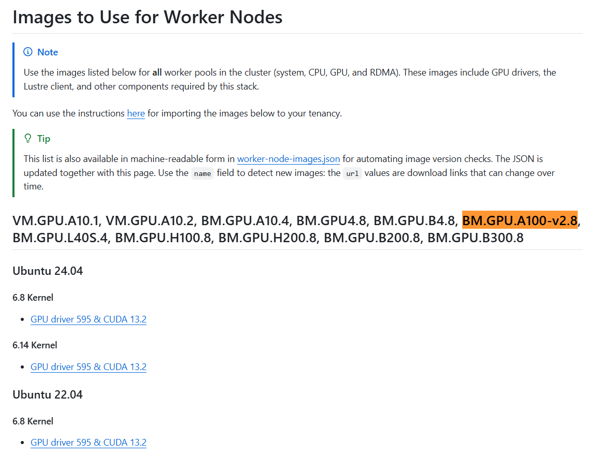
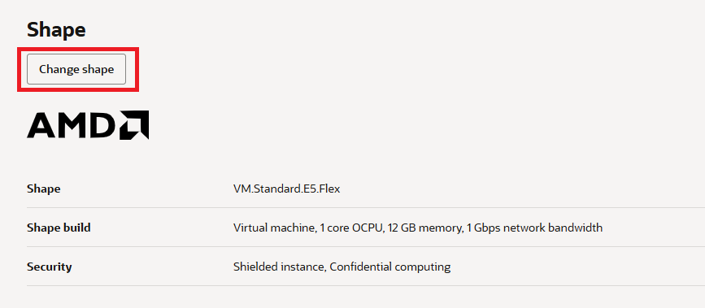
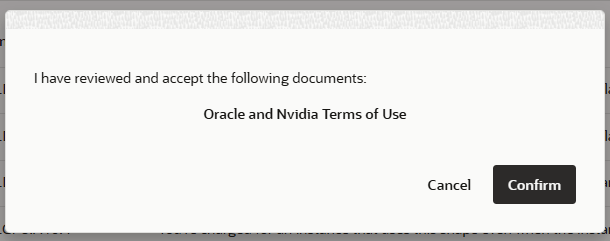
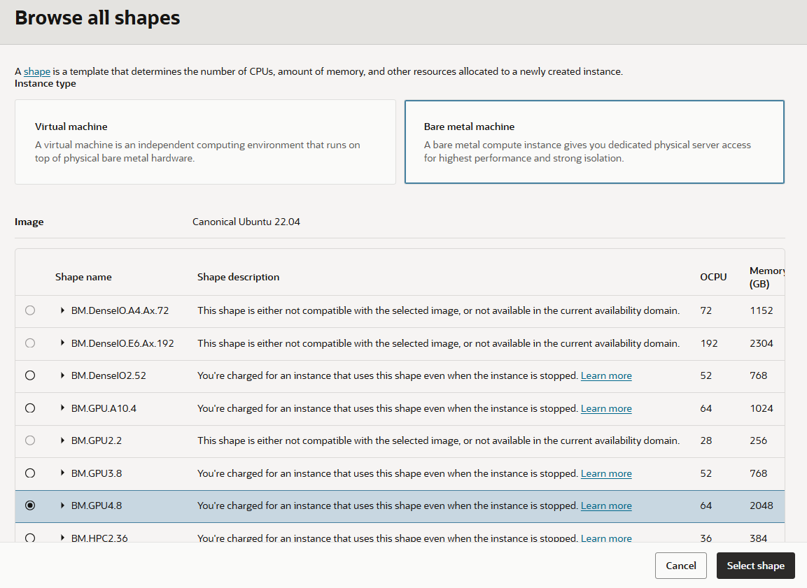
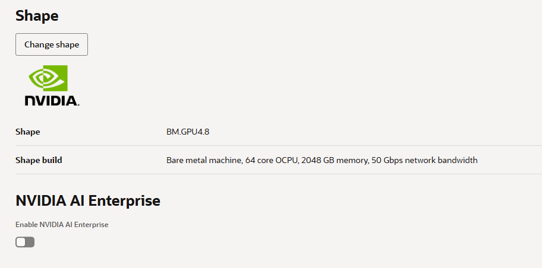
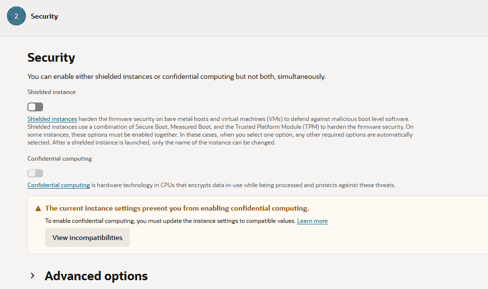
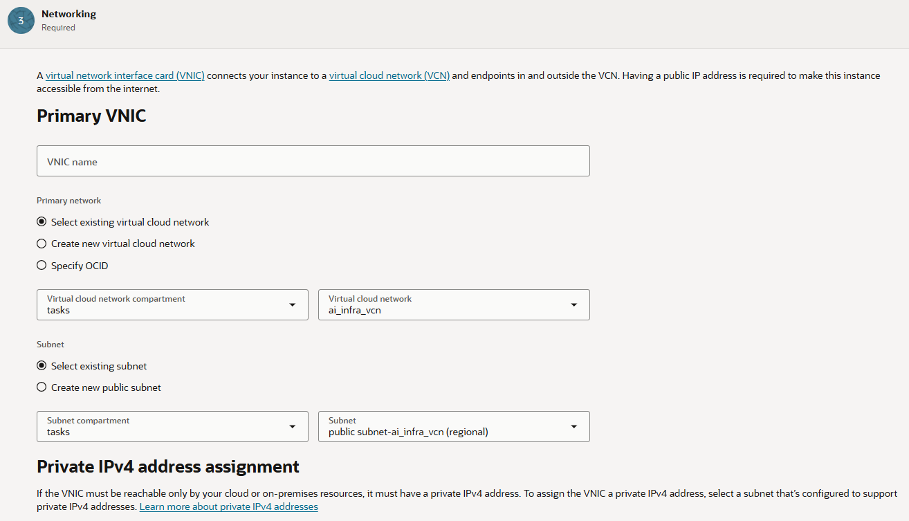
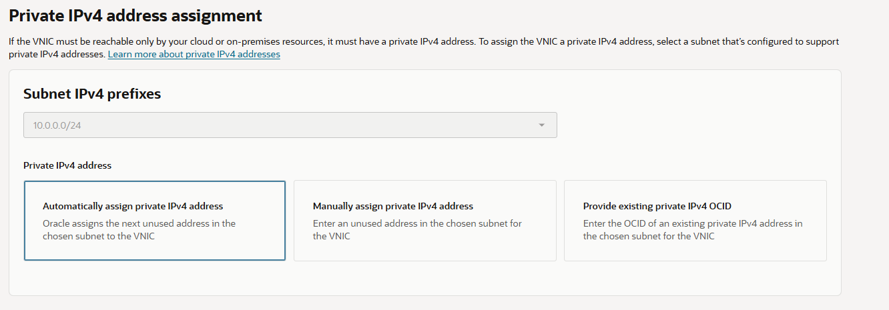
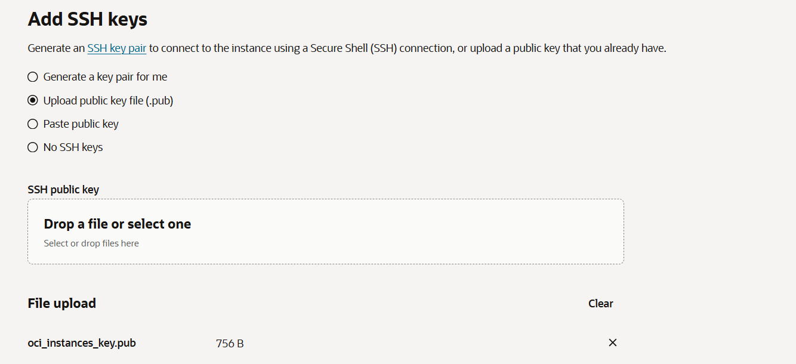
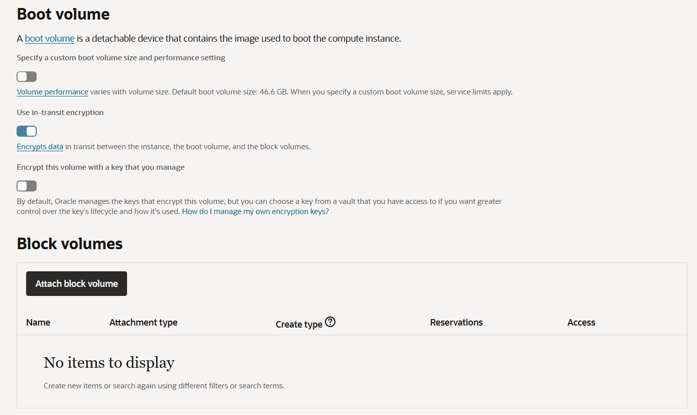

= Lab 5: Create a GPU Bare Metal Instance
:toc:
:sectnums:

In this lab, you will create a GPU Bare Metal instance using a custom image provided through Oracle's official GitHub repository.

Follow the steps below:

== Find a Compatible Image and PAR URL in Oracle's official GitHub Repository

In this section, you will locate a custom image provided through a Pre-Authenticated Request(PAR) URL in Oracle's official GitHub repository. 

Follow the steps below:

1. Open a new browser window and navigate to the following website:
+
https://github.com/oracle-quickstart/oci-hpc-oke/blob/main/docs/worker-node-images.md?utm_source=chatgpt.com[Images to Use for Worker Nodes]
2. Find an image compatible with the Bare Metal shape you plan to provision. The following example shows an Ubuntu 22.04 image compatible with the `BM.GPU.A100-v2.8` shape.
+

+
NOTE: As of July 27, 2026, when this document was written, the JSON image list was last updated on July 14, 2026. Check the latest available image list before proceeding.

== Import a Customer Image Using a PAR URL

You do not need to download the image to your local computer. OCI can import the image directly from Oracle Object Storage using a PAR URL and create a custom image in your tenancy. 

Follow the steps below:

1. Click the hamburger menu (≡) in the upper left corner and click **Compute**.
+
image:../images/05/image02.png[]

2. On the **Compute** page, click **Custom Images**.
+
image:../images/05/image03.png[]

3. On the **Custom Images** page, select the compartment `tasks` (the compartment you created in Lab 2).
+
image:../images/05/image04.png[]

4. Click the **Import Images** button.
+
image:../images/05/image05.png[]

5. On the **Import Images** page, enter the following information:
* **Create In compartment**: `tasks (the compartment you created in Lab 2)`
* **Name**: `Ubuntu-22.04-<BM Shape Name>-<image_update_date>`
* **Operating System**: `Ubuntu`

6. Select the **Import from an Object Storage URL** option.
7. Return to the browser window or tab displaying the **Images to Use for Worker Nodes** page. Locate the image link compatible with your Bare Metal shape, right-click the link, and select **Copy Link Address**.
+
image:../images/05/image06.png[]

8. Paste the copied PAR URL into the **Object Storage URL** field.
9. Specify `OCI` for the **Image Type**.
+
image:../images/05/image07.png[]

10. Click the **Import Image** button in the lower-right corner.
11. The image import process will begin. Wait until the import is complete and the image status changes to **Available**.
12. Once the import is complete, click Custom Images in the right-side menu and verify that the imported custom image appears in the list.

== Creating a GPU Bare Metal Instance

In this section, you will create a GPU Bare Metal instance using the custom image you imported in the previous section.

Follow the steps below:

1. Click the hamburger menu (≡) in the upper left corner and click **Compute**.
2. On the **Compute** page, click **Instances**.
+
image:../images/05/image10.png[]

3. Click the **Create Instance** button.
+
image:../images/05/image11.png[]

4. On the **Create Compute Instance** page, enter the following information. Note that this lab uses the Ashburn region.
+
* **Name**: `bm-gpu-instance`
* **Create in compartment**: `tasks (the compartment you created in Lab 2)`
* **Placement**: `Availability Domain 1` (or any other availability domain of your choice)

+
image:../images/05/image12.png[]

5. In the **Image and shape** section, click the **Change** button next to **Image**.
+
image:../images/05/image13.png[]

6. On the **Select an image** page, click **My Images**.
+
image:../images/05/image14.png[]

7. Scroll down and select Custom Images, From the list of available images, select the custom image you imported in the previous section.
+
image:../images/05/image15.png[]

8. In the **Shape** section, click the **Change Shape** button.
+

9. On the **Browse all shapes** page, select **Bare Metal machine**.
10. When the **Oracle and NVIDIA Terms of Use** dialog box appears, review the terms and click **Accept**.
+

11. From the list of available shapes, select the GPU Bare Metal shape you want to provision and Click **Select Shape**.
+

12. Verify that the selected shape is displayed correctly.
+

13. Click Next in the lower-right corner.
14. Review the settings in the Security section and click Next.
+

15. In the Networking section, configure the following settings.
* Primary VNIC +
** Primary Network, configure:
*** **Select existing virtual cloud network**: Select this option.
*** **Virtual cloud network compartment**: tasks (the compartment created in Lab 2)
* **Virtual cloud network**: ai_infra_vcn (the VCN created in Lab 3)
** Subnet
*** **Select existing subnet**: Select this option.
*** **Virtual cloud network compartment**: tasks (the compartment created in Lab 2)
*** **Subnet**: public subnet-ai-infra_vcn (regional)

+

* Private IPv4 address assignment
** **Subnet IPv4 address**: `Automatically assign private IPv4 address` (default)
* Public IPv4 address assignment
** **Keep the default settings**

+

* Add SSH keys
** Select **Upload public key file (.pub)**
** Click **Drop a file or select one** and select the public key file (oci_instances_key.pub) generated in Lab 4.

+

16. Click the **Next** button in the lower-right corner.
17. In the **Boot Volume** section, keep the default settings and click the **Next** button in the lower-right corner.
+

18. On the Review page, review the instance configuration and click Create in the lower-right corner.
19. OCI will begin provisioning the GPU Bare Metal instance. Wait until the provisioning process is complete.
20. Verify that the instance has been created successfully and its lifecycle state is Running.