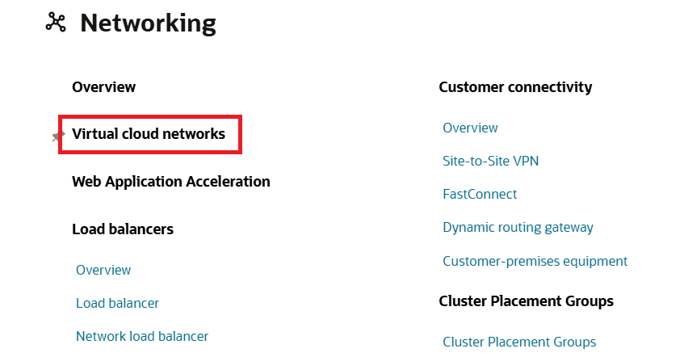
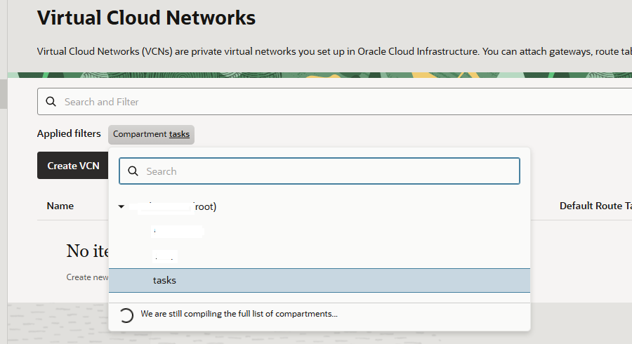
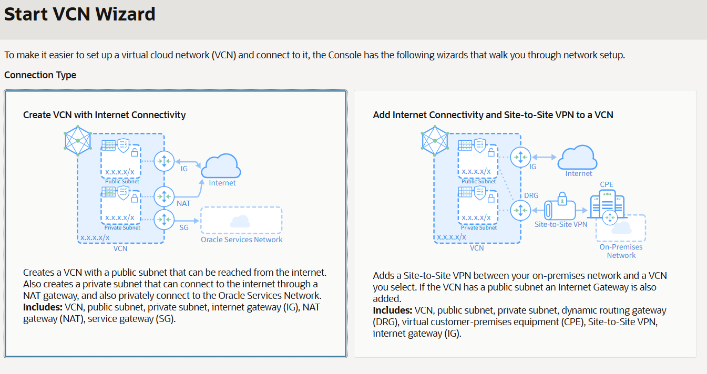
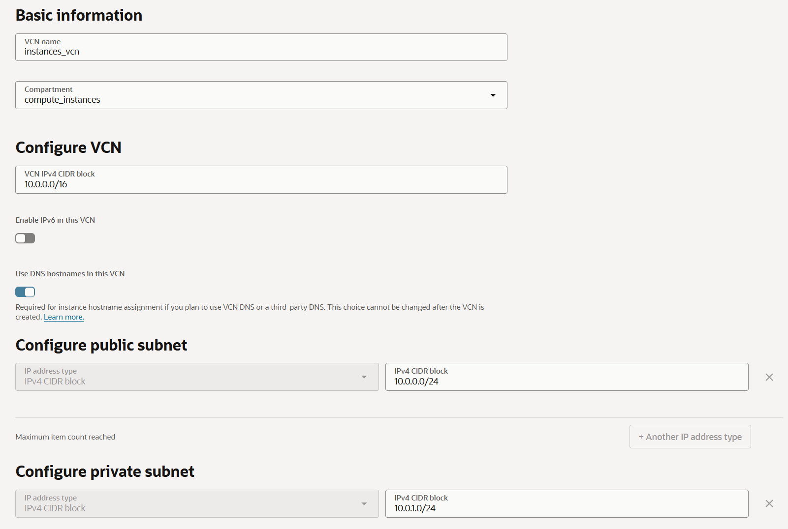
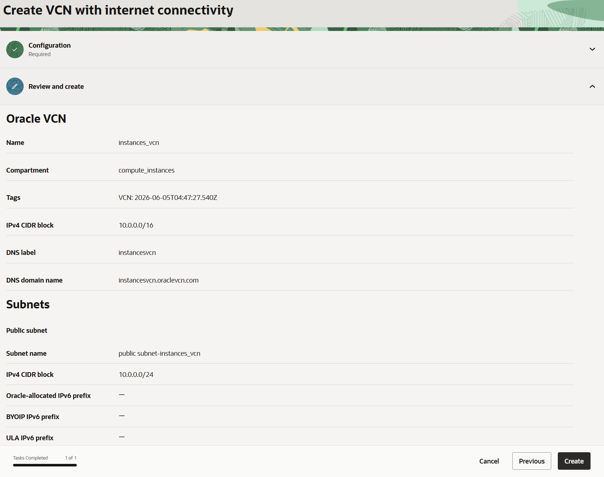
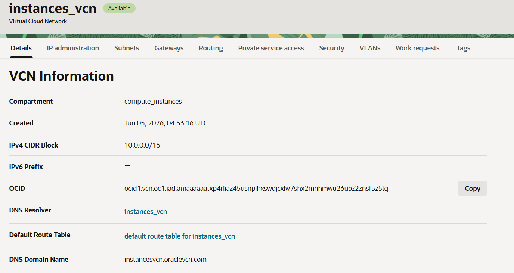
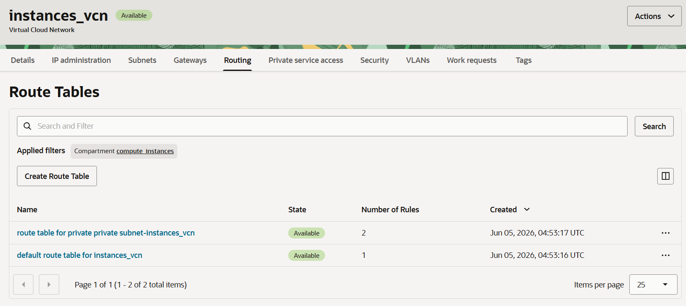

= 연습 3: 가상 클라우드 네트워크(VCN) 생성

여기에서는 컴퓨트 인스턴스가 위치할 가상 클라우드 네트워크(VCN - Virtual Cloud Network)를, VCN 마법사를 사용하여 생성합니다. 아래 절차에 따릅니다.

1. 왼쪽 위의 햄버거 메뉴(≡)를 클릭하고 **Networking**을 클릭합니다.
+
image:./images/03/image01.png[width=500]

2. **Networking** 페이지에서 **Virtual cloud networks**를 클릭합니다.
+

3. **Virtual Cloud Networks** 페이지에서, Compartment를 클릭하고 위에서 생성한 **tasks** 컴파트먼트를 선택합니다.
+

4. Actions 드롭다운 버튼을 클릭하고 **Start VCN Wizard**를 클릭합니다.
+
image:./images/03/image04.png[width=500]

5. **Start VCN Wizard** 페이지에서, **Create VCN with Internet Connectivity**를 선택하고 **Start VCN Wizard** 버튼을 클릭합니다.
+

6. **Create VCN wth internet connectivity** 페이지에서 아래와 같이 정보를 입력하고 **Next** 버튼을 클릭합니다.
* **VCN Name**: `ai_infra_vcn`
* **Compartment**: `task' (연습 2에서 생성한 VCN 선택)
* **Configure public subnet 구역의 IPv4 CIDR block**: `10.0.0.0/24` (기본값)
* **Configure private subnet 구역의 IPv4 CIDR block**: `10.0.1.0/24` (기본값)

+

7. 생성될 VCN 정보를 확인하고 오른쪽 아래의 **Create** 버튼을 클릭합니다.
+

8. VCN이 생성됩니다. 생성이 완료되면, 오른쪽 아래의 **View VCN** 버튼을 클릭합니다.
+
image:./images/03/image08.png[width=700]

9. 생성된 VCN을 확인합니다.
+

10. **IP Administration** 탭을 클릭하고 VCN에 할당된 IP 정보를 확인합니다.
+
image:./images/03/image10.png[width=700]

11. **Subnets** 탭을 클릭하고 생성된 Public/Private 서브넷을 확인합니다.
+
image:./images/03/image11.png[width=700]

12. **Gateways** 탭을 클릭하고, 아래로 스크롤하여 생성된 Internet Gateway, NAT Gateway 및 Service Gateway를 확인합니다.
+
image:./images/03/image12.png[width=700]

13. **Routing** 탭을 클릭하고, 생성된 두 라우팅 테이블을 확인합니다.
+

14. **Security** 탭을 클릭하고 생성된 Security List를 확인합니다. Network Security Groups에는 항목이 생성되지 않았음도 확인합니다.
+
image:./images/03/image14.png[width=700]